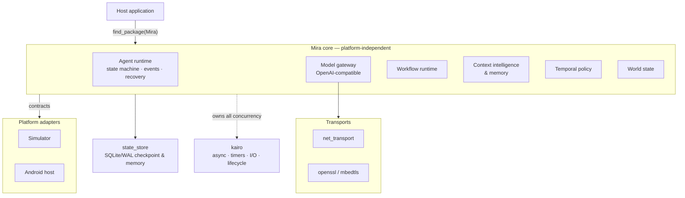

<div align="center">
  

  # Mira

  **A cross-platform native AI Agent Runtime in modern C++**

  [](https://github.com/Linductor-alkaid/mira/actions/workflows/ci.yml)
  [](LICENSE)
  
  

  [English](README.md) · [简体中文](README_zh.md)
</div>

---

Mira is a runtime for building autonomous agents that perceive an environment,
reason with an LLM/VLM, act, and verify the outcome — on a desktop process, a
simulated device, or a real Android phone. The runtime loop is explicit:

```
Observe -> Reason -> Plan -> Act -> Verify
```

- **Platform-independent core.** Host capabilities (Android, Windows, Linux,
  simulators, robots) enter only through Platform Adapters; the core never
  touches a platform SDK.
- **kairo-owned concurrency.** Every async task, timer, blocking-I/O worker,
  and shutdown path is managed by the bundled
  [kairo](third_party/kairo) (the library was named Executor before v0.6.0). Mira's own code creates no threads of its own.
- **API-first model layer.** OpenAI-compatible providers behind `IModelProvider`;
  model output is parsed and validated into structured decisions before anything
  reaches the environment.

## Architecture



Everything is consumed as one installable package: `find_package(Mira 0.1 CONFIG REQUIRED)`

| Target | Purpose |
| --- | --- |
| `Mira::core` | Agent runtime: state machine, observation, event/checkpoint stores, safety, context & memory, model gateway, tool modules, temporal policy, world state |
| `Mira::workflow` | Workflow contracts and runtime: execution, interruption patches, trajectory compilation, navigation, learning, recovery |
| `Mira::state_store` | SQLite/WAL reference persistence for checkpoints and memory |
| `Mira::simulator_adapter` | Reference `IEnvironment` implementation (simulated device) |
| `Mira::android_adapter` | Android host adapter and dispatcher (Host ABI boundary) |
| `Mira::net_transport` | Portable socket HTTP/SSE transport (POSIX + Winsock, proxy-aware) |
| `Mira::openssl_transport` | Optional OpenSSL TLS channel (Unix, where OpenSSL is found) |
| `Mira::mbedtls_transport` | Cross-platform TLS channel on pinned Mbed TLS |

The public API (~70 headers under `include/mira/`) is built on a small set of
stable conventions: a `Result<T>` error model with no exceptions across the
boundary, strongly-typed 128-bit IDs, collaborative cancellation, terminal-state
idempotency, and explicit schema versioning. Key contracts include
`IEnvironment`, `IModelProvider`, `IMemory`, `IEventStore`, `ICheckpointStore`,
`IContextCurator`, `IPolicyRuntime`, and `ITlsChannel`.

## Highlights

- **Explicit agent state machine** — each loop phase is a bounded, observable,
  interruptible work unit. Every task records ordered, versionable events;
  terminal states are idempotent, so late model responses cannot resurrect a
  cancelled task.
- **Structured model decisions** — raw model text never drives platform input.
  Decisions and actions are validated, typed, and mapped to discrete or
  continuous actions with one uniform, cancellable result semantics.
- **Workflow runtime** — declarative contracts plus an executor for them:
  interruption patches, trajectory compilation from demos, app-model navigation,
  learning from failures, and `WaitingAgent` recovery orchestration.
- **Context intelligence** — retrieval, reranking, and semantic consolidation
  layers; working-context snapshots with watermark/event-count auto-curation;
  memory promotion under a verified-only discipline; subagent fork/merge with
  schema-tracked provenance.
- **Temporal policy & world state** — reactive conditional rules over event
  history with deterministic rule induction; a bounded world-state projection
  (`Believed` / `Stale` / `Unknown` assumptions) that can be rebuilt by replay.
- **Safety & reproducibility** — permission gates, secret redaction in logs,
  observer callbacks isolated from the critical path, and replay that
  distinguishes recorded results from real side effects.

## Project status

All implementation milestones **M0–M27** of the
[implementation plan](docs/plans/mira-implementation-plan.md) are delivered, and
CI is green across the full matrix (Linux GCC/Clang, Windows MSVC, Android NDK
arm64/x86_64 cross-builds, ASAN/UBSAN/TSAN, clang-tidy/format and architecture
gates).

Still open — and honestly reported rather than claimed: on-device Android
runtime evidence, real-provider evaluation rounds (DEC-032 Stage E), and the
first stage of the unified behavior trace (DEC-038). Mira ships the runtime and
installable packages; it deliberately contains no product UI or end-user app.

## Getting started

Requirements: a C++20 compiler, CMake ≥ 3.20, Ninja. Executor, Mbed TLS, and
SQLite are provided as pinned submodules/vendored sources — nothing to install.

```bash
git submodule update --init --recursive
cmake --preset debug          # or release / asan / ubsan / tsan
cmake --build --preset debug
ctest --test-dir build/debug --output-on-failure
```

Windows uses the `windows-debug` / `windows-release` presets; Android arm64
cross-builds use `android-arm64-release` / `android-x86_64-release` (build
verification). Common CMake options: `MIRA_BUILD_TESTS`, `MIRA_WITH_OPENSSL`,
`MIRA_WITH_MBEDTLS`, `MIRA_ENABLE_CLANG_TIDY`.

### Install & consume

```bash
cmake --build --preset release
cmake --install build/release --prefix /path/to/install
```

```cmake
find_package(Mira 0.1 CONFIG REQUIRED)   # resolves executor + Threads for you

add_executable(my_app main.cpp)
target_link_libraries(my_app PRIVATE
    Mira::core                 # contracts, state machine, model gateway, loop
    Mira::state_store          # SQLite/WAL checkpoint & memory reference backend
    Mira::simulator_adapter    # Simulator reference environment
)
```

Optional targets: `Mira::workflow`, `Mira::android_adapter`, `Mira::net_transport`,
`Mira::openssl_transport`, `Mira::mbedtls_transport`. The installed-consumer path
is exercised continuously in CI.

## Examples

| Example | What it shows |
| --- | --- |
| [`minimal_consumer.cpp`](examples/minimal_consumer.cpp) | Simulator observation, discrete input, runtime lifecycle, tool-module contract smoke |
| [`stateful_agent_consumer.cpp`](examples/stateful_agent_consumer.cpp) | Durable checkpoint + memory, deterministic consolidation, supervised shutdown, analytics replay |
| [`working_context_host_consumer.cpp`](examples/working_context_host_consumer.cpp) | Reference host wiring the working-context supply seam: auto-curation signals, memory promotion, subagent fork/merge |

## Platform support

| Platform | Compilers | Level |
| --- | --- | --- |
| Linux x86_64 | GCC 13, Clang 18 | Build + runtime verified (core, transports, state store) |
| Windows x64 | MSVC (VS 2022) | Build + runtime verified (core, transports, state store) |
| Android arm64-v8a / x86_64 | NDK 26.3 (API 24) | Cross-build verified; on-device runtime pending external evidence |

Details and transport/provider interoperability:
[platform matrix](docs/compatibility/platform-matrix.md) ·
[OpenAI-compatible matrix](docs/compatibility/openai-compatible-matrix.md)

## Documentation

Documentation is mostly in Chinese:

- [API manual](docs/api/index.md) — per-module reference of the public headers
- [Runtime design](docs/design/mira_runtime_design.md) — architecture, state machine, context/memory, protocols
- [Implementation plan](docs/plans/mira-implementation-plan.md) — milestones, status, verification evidence
- [Decision records](docs/decisions/DEC-001-runtime-executor-ownership.md) — from DEC-001 to DEC-046
- [Evaluation baselines](docs/benchmarks/) — nine recorded benchmark reports
- [Security](docs/security/threat_model_and_confirmation.md) ·
  [Supply chain](docs/supply-chain/direct-dependencies.md) ·
  [Executor feedback ledger](docs/executor_feedback/ledger.md)
- [Contribution conventions](AGENTS.md) ·
  [Project management rules](docs/project/project_management_and_documentation.md)

## Third-party dependencies

| Library | Version | License | Provision |
| --- | --- | --- | --- |
| [kairo](third_party/kairo) | 0.6.0 | MIT | git submodule |
| [Mbed TLS](third_party/mbedtls) | 3.6.7 (3.6 LTS) | Apache-2.0 (chosen) | git submodule |
| [SQLite](third_party/sqlite) | 3.53.4 | Public domain | vendored amalgamation |

An SBOM is maintained at
[`docs/supply-chain/sbom.cdx.json`](docs/supply-chain/sbom.cdx.json) and enforced
by CI.

## License

Mira is licensed under the [GNU Affero General Public License v3.0](LICENSE).

Third-party dependencies under `third_party/` remain under their own licenses
(listed above) and are not subject to this repository's license.
