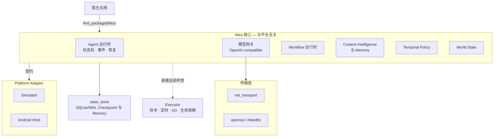

<div align="center">
  

  # Mira

  **使用现代 C++ 构建的跨平台原生 AI Agent Runtime**

  [](https://github.com/Linductor-alkaid/mira/actions/workflows/ci.yml)
  [](LICENSE)
  
  

  [English](README.md) · [简体中文](README_zh.md)
</div>

---

Mira 是一个用于构建自主 Agent 的运行时：感知环境、用 LLM/VLM 推理、执行动作并
验证结果——可以跑在桌面进程、模拟器或真实 Android 设备上。运行闭环是显式的：

```
Observe -> Reason -> Plan -> Act -> Verify
```

- **核心与平台解耦。** 宿主能力（Android、Windows、Linux、模拟器、机器人）只通过
  Platform Adapter 接入，核心层不触碰任何平台 SDK。
- **并发由 Executor 统一承载。** 所有异步任务、定时任务、阻塞 I/O worker 与关闭
  路径都由内置的 [Executor](third_party/executor) 管理，Mira 自研代码不创建私有线程。
- **API-first 模型层。** 通过 `IModelProvider` 接入 OpenAI-compatible 服务；模型输出
  先解析、验证为结构化决策，才会触达环境。

## 架构



整个运行时以安装包形式消费：`find_package(Mira 0.1 CONFIG REQUIRED)`

| 目标 | 职责 |
| --- | --- |
| `Mira::core` | Agent 运行时：状态机、Observation、事件/Checkpoint 存储、安全、Context 与 Memory、模型网关、Tool 模组、Temporal Policy、World State |
| `Mira::workflow` | Workflow 契约与运行时：执行、介入 patch、轨迹编译、导航、学习、恢复 |
| `Mira::state_store` | SQLite/WAL 参考持久化后端（Checkpoint 与 Memory） |
| `Mira::simulator_adapter` | `IEnvironment` 参考实现（模拟设备） |
| `Mira::android_adapter` | Android Host Adapter 与 dispatcher（Host ABI 边界） |
| `Mira::net_transport` | 可移植 socket HTTP/SSE 传输（POSIX + Winsock，支持代理） |
| `Mira::openssl_transport` | 可选 OpenSSL TLS 通道（Unix、找到 OpenSSL 时构建） |
| `Mira::mbedtls_transport` | 固定版本 Mbed TLS 跨平台 TLS 通道 |

公共 API（`include/mira/` 下约 70 个头文件）建立在一组稳定约定上：跨边界不抛异常的
`Result<T>` 错误模型、强类型 128 位 ID、协作式取消、终态幂等、显式 schema 版本化。
核心契约包括 `IEnvironment`、`IModelProvider`、`IMemory`、`IEventStore`、
`ICheckpointStore`、`IContextCurator`、`IPolicyRuntime`、`ITlsChannel` 等。

## 能力亮点

- **显式 Agent 状态机** —— 闭环每一步都是有界、可观测、可中断的工作单元。每个
  Task 记录有序、可版本化的事件；终态幂等，迟到的模型响应无法让已取消的任务复活。
- **结构化模型决策** —— 原始模型文本永远不直接驱动平台输入。决策与动作先经过
  验证与类型化，再映射为离散或连续动作，共享同一套可取消、可观测的结果语义。
- **Workflow 运行时** —— 声明式契约加执行引擎：介入 patch、从演示轨迹编译、
  App Model 导航、从失败学习、`WaitingAgent` 恢复编排。
- **Context Intelligence** —— 检索、重排、语义固化三层；Working Context 快照带
  watermark/事件数双轴自动 curation；Memory Promotion 遵循"仅已验证内容"纪律；
  Subagent fork/merge 带 schema 级溯源。
- **Temporal Policy 与 World State** —— 基于事件历史的反应式条件策略与确定性规则
  归纳；有界 World State 投影（`Believed` / `Stale` / `Unknown` 三态假设），支持
  重放重建。
- **安全与可复现** —— 权限门禁、日志脱敏、Observer 回调与关键路径隔离、Replay
  区分已记录结果与真实副作用。

## 项目状态

[实施总计划](docs/plans/mira-implementation-plan.md)的全部实现里程碑
**M0–M27 已交付**，CI 全矩阵通过（Linux GCC/Clang、Windows MSVC、Android NDK
arm64/x86_64 交叉构建、ASAN/UBSAN/TSAN、clang-tidy/format 与架构门禁）。

尚未完成、也不宣称完成的部分：Android 真机运行证据、真实 Provider 评估轮
（DEC-032 Stage E）、统一行为迹首阶段（DEC-038）。Mira 只交付运行时与安装包，
刻意不包含产品 UI 或面向终端用户的应用。

## 快速开始

要求：C++20 编译器、CMake ≥ 3.20、Ninja。Executor、Mbed TLS 与 SQLite 以 pinned
submodule/vendored 方式提供，无需系统安装。

```bash
git submodule update --init --recursive
cmake --preset debug          # 或 release / asan / ubsan / tsan
cmake --build --preset debug
ctest --test-dir build/debug --output-on-failure
```

Windows 使用 `windows-debug` / `windows-release` preset；Android arm64 交叉构建使用
`android-arm64-release` / `android-x86_64-release`（构建验证）。常用 CMake 选项：
`MIRA_BUILD_TESTS`、`MIRA_WITH_OPENSSL`、`MIRA_WITH_MBEDTLS`、`MIRA_ENABLE_CLANG_TIDY`。

### 安装与外部消费

```bash
cmake --build --preset release
cmake --install build/release --prefix /path/to/install
```

```cmake
find_package(Mira 0.1 CONFIG REQUIRED)   # 自动解析 executor 与 Threads 依赖

add_executable(my_app main.cpp)
target_link_libraries(my_app PRIVATE
    Mira::core                 # 契约、状态机、模型网关、闭环
    Mira::state_store          # SQLite/WAL Checkpoint 与 Memory 参考后端
    Mira::simulator_adapter    # Simulator 参考环境
)
```

可选目标：`Mira::workflow`、`Mira::android_adapter`、`Mira::net_transport`、
`Mira::openssl_transport`、`Mira::mbedtls_transport`。安装消费路径在 CI 中持续验证。

## 示例

| 示例 | 演示内容 |
| --- | --- |
| [`minimal_consumer.cpp`](examples/minimal_consumer.cpp) | Simulator 观察与离散输入、Runtime 生命周期、Tool 模组契约冒烟 |
| [`stateful_agent_consumer.cpp`](examples/stateful_agent_consumer.cpp) | 持久 Checkpoint + Memory、确定性 consolidation、supervised 关闭、分析回放 |
| [`working_context_host_consumer.cpp`](examples/working_context_host_consumer.cpp) | 参考宿主：Working Context 快照供给缝、自动 curation 信号、Memory Promotion、Subagent fork/merge |

## 平台支持

| 平台 | 编译器 | 等级 |
| --- | --- | --- |
| Linux x86_64 | GCC 13、Clang 18 | 构建 + 运行时已验证（core、传输层、state store） |
| Windows x64 | MSVC（VS 2022） | 构建 + 运行时已验证（core、传输层、state store） |
| Android arm64-v8a / x86_64 | NDK 26.3（API 24） | 交叉构建已验证；真机运行证据待补 |

细节与传输/Provider 互操作性：
[平台矩阵](docs/compatibility/platform-matrix.md) ·
[OpenAI-compatible 互操作矩阵](docs/compatibility/openai-compatible-matrix.md)

## 文档

- [API 手册](docs/api/index.md) —— 公共头文件逐模块参考
- [运行时设计](docs/design/mira_runtime_design.md) —— 架构、状态机、Context/Memory、协议
- [实施总计划](docs/plans/mira-implementation-plan.md) —— 里程碑、状态与验证证据
- [决策记录](docs/decisions/DEC-001-runtime-executor-ownership.md) —— 从 DEC-001 到 DEC-046
- [评估基线](docs/benchmarks/) —— 九份 recorded 基线报告
- [安全](docs/security/threat_model_and_confirmation.md) ·
  [供应链](docs/supply-chain/direct-dependencies.md) ·
  [Executor 反馈台账](docs/executor_feedback/ledger.md)
- [协作约定](AGENTS.md) ·
  [项目管理与文档规范](docs/project/project_management_and_documentation.md)

## 第三方依赖

| 库 | 版本 | 许可证 | 提供方式 |
| --- | --- | --- | --- |
| [Executor](third_party/executor) | 0.5.0 | MIT | git submodule |
| [Mbed TLS](third_party/mbedtls) | 3.6.7（3.6 LTS） | Apache-2.0（选用） | git submodule |
| [SQLite](third_party/sqlite) | 3.53.4 | Public Domain | vendored amalgamation |

SBOM 维护在
[`docs/supply-chain/sbom.cdx.json`](docs/supply-chain/sbom.cdx.json)，由 CI 门禁强制。

## 许可证

Mira 以 [GNU Affero General Public License v3.0](LICENSE) 发布。

`third_party/` 下的第三方依赖保留其自身许可证（见上表），不受本仓库许可证约束。
