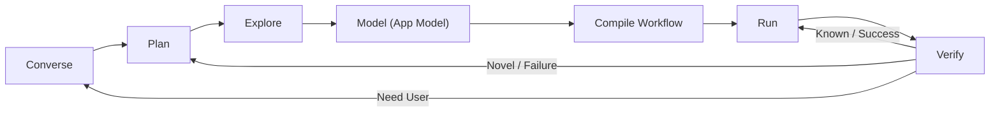
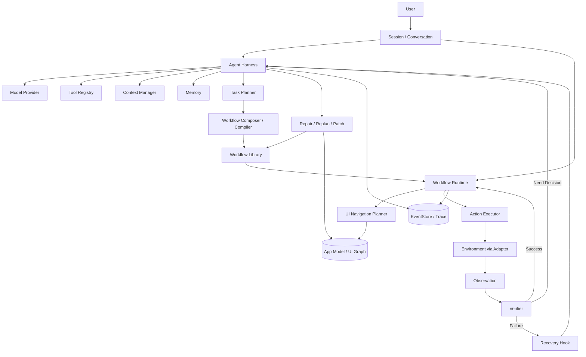
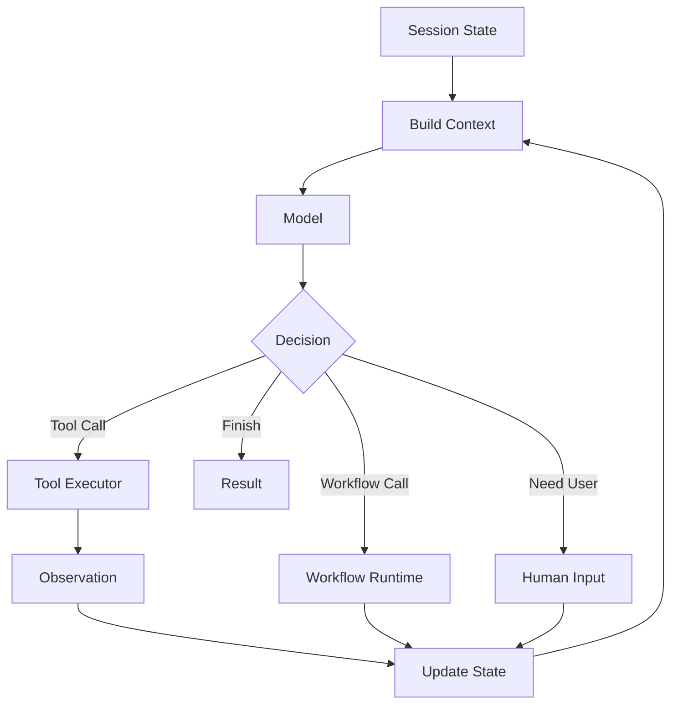
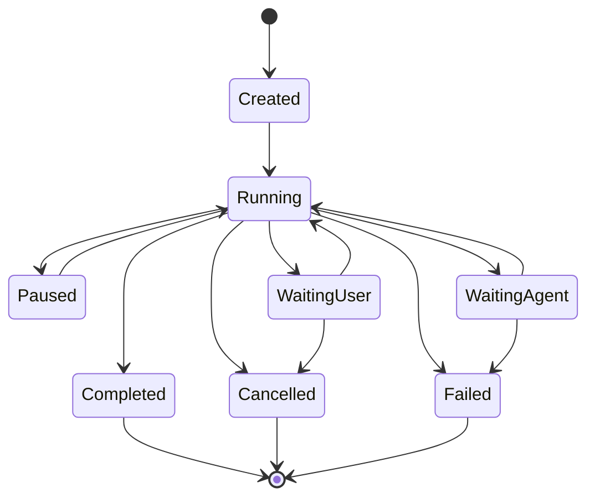
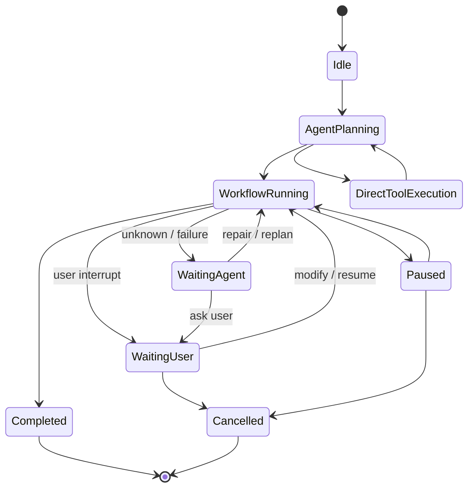
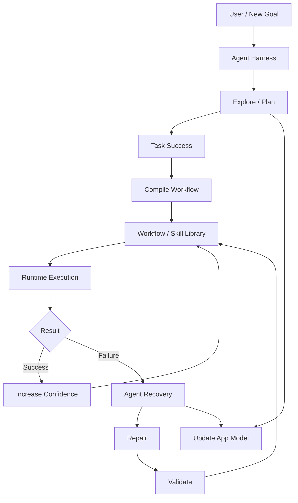

# Mira Agent Harness 与 Workflow 架构设计

> 状态：Active（目标架构方向；实施未开始）  
> 版本：0.1  
> 更新日期：2026-09-07  
> 负责人：Mira Maintainers  
> 决策依据：[DEC-014](../decisions/DEC-014-agent-harness-workflow-dual-plane.md)  
> 适用范围：Mira 长期产品定位、Agent Harness 与 Workflow 系统分解、后续里程碑重定义

## 1. 文档目的与效力

本文固化 2026-09 确立的 Mira 长期架构方向：Mira 是一个面向 GUI 环境与个人设备的
**Agent Harness + Workflow Compiler + Automation Runtime + Persistent Memory System**，
采用「Agent-native 路径 + Workflow-native 路径」的双路径模型（DEC-014）。

效力约定：

- 本文是目标架构与后续专项设计的分解依据，不是已实现行为的描述。文中接口、模块名和
  状态名均为目标草案（伪代码级别），实现前由专项设计和决策记录冻结。
- 已实现部分的现行规范仍是
  [Mira Runtime 设计](mira_runtime_design.md)及其引用的专项文档；本文与它们冲突时，以
  已接受的 DEC 和已冻结专项规范为准，并按规范流程同步修正。
- 本文不改变现有里程碑状态，不创建关键路径；落地范围由 M7 重定义或新增里程碑承载
  （见第 16 节）。
- AGENTS.md 的 Executor 强制约束、平台边界和 `RULE-01` 至 `RULE-12` 对本文全部内容
  无例外适用；本文新增的不变量见第 4 节。

## 2. 定位：双路径模型

### 2.1 产品定位

Mira 不是「每次任务都由 Agent 从头到尾逐步决策」的系统，也不是只依赖固定脚本的自动化
工具。它的长期目标是：

> Agent 负责发现和调整知识，Memory 负责保留知识，Workflow 负责固化知识，Runtime 负责
> 高效复用知识。

最终形态：它既是一个真正的 Agent Harness（完整的会话、上下文、工具调用、Agent Loop、
用户介入与恢复能力），又是一个能把成功经验编译为可编辑、可参数化、可独立执行的
Workflow，并通过 App Model、UI Navigation Graph 与 Persistent Memory 建立长期环境知识的
个人设备运行时。

### 2.2 两条执行路径

1. **Agent-native path**：用户通过会话与 Agent 交互；Agent 调用工具、观察环境、规划、
   调整任务、处理未知情况；用户可在执行过程中随时对话介入（修改、暂停、取消）。
2. **Workflow-native path**：Agent 将成功完成任务的方法结构化、参数化并固化为
   Workflow；已知任务优先通过 Workflow Runtime 确定性执行；Workflow 可脱离模型独立
   运行，异常时回到 Agent。

两条路径不是替代关系：

> Agent Harness 负责系统控制、理解、规划、交互与修复；Workflow Runtime 负责高频、
> 稳定、低成本执行。

### 2.3 控制平面与数据平面

```text
Control Plane:
Agent / Session / Context / Planning / Memory / User Interaction

Data Plane:
Workflow / UI Navigation / Tool Execution / Verification
```

关键立场：**Agent Harness 永远是控制平面，而不是只在 Workflow 失败时才出现的临时兜底。**
即使任务已 Workflow 化，用户仍可能随时说「先别发」「联系人改成李四」「这一遍执行完成后
以后默认都不加附言」。因此 Conversation、Agent、Workflow Run 三者必须持续共享状态：

```text
Conversation
    ↕
Agent
    ↕
Workflow Run
```

### 2.4 与已交付资产的关系

| 目标能力 | 现状 | 关系 |
| --- | --- | --- |
| Agent Harness 运行时（Session、Task、Agent Loop、状态机、事件、恢复、Takeover） | M0–M4 已交付核心；2026-09 维护轮补齐工具执行闭环（[DEC-015](../decisions/DEC-015-builtin-tool-execution-boundary.md)）、对话消息与投影（[DEC-016](../decisions/DEC-016-conversation-events-and-user-messages.md)）、任务完成命令（[DEC-017](../decisions/DEC-017-complete-task-command.md)）与 Loop-Runtime 集成验证 | 复用，不重写；Workflow 路径在其之上扩展 |
| OpenAI-compatible Model Provider、Decision 解析校验 | M3 已交付 | 复用；Decision/Tool 通道按第 6.5 节扩展 |
| Observation Pipeline、截图与结构化 UI、坐标与 Android Host ABI | M2 已交付 | 复用；为 App Model 与感知层级提供输入 |
| Context/Memory、EventStore 事实源、Checkpoint、Replay | M1/M4 已交付 | 复用；Memory 按第 10 节演进，EventStore 保持事实源 |
| Tool Registry / 模组体系（ITool/ToolModule，[DEC-009](../decisions/DEC-009-tool-module-boundary.md)） | **未实现**；现有的是 DEC-015 的最小 BuiltIn 执行边界（无 manifest/签名/隔离） | 模组体系随 M7 重定义落地，届时吸纳 BuiltIn 边界 |
| 本地 OCR/CV/ONNX、连续控制 | M5/M6 按 DEC-011 终止 | 是否及以何范围回归由 demo 证据重定义 |
| Workflow Compiler/Runtime、App Model、Navigation Planner、对话介入的完整语义（patch/三类目标区分） | 未实现（对话事件与步边界消息已按 DEC-016 交付最小机制） | 本方向新增，按第 16 节分阶段落地 |

## 3. 核心设计原则

以下原则（源自 DEC-014）约束所有后续专项设计：

1. **Agent Harness 永远存在。** Workflow 不是 Agent 的替代品；Agent 是控制平面。
2. **Workflow 是可独立执行的程序。** 已知任务可以 `User -> Workflow -> Runtime` 完成，
   不依赖模型调用。
3. **Agent 与 Workflow 可以任意切换。** `Agent ↔ Workflow Runtime` 的切换
   （含失败恢复、决策点交接、串联编排）是 Harness 原生能力。
4. **用户可以随时介入。** `pause / modify / resume / cancel` 均可通过 Conversation 驱动。
5. **GUI 导航与任务逻辑解耦。** Workflow 表达 What；App Model 表达 Where/How to
   navigate；Runtime 表达 How to execute。
6. **已知世界使用传统算法。** 已知 UI Graph 用图搜索；已知 Workflow 用 Runtime。
7. **未知世界交给 Agent。** 未知任务、未知 UI 状态、意外失败、歧义用户意图才升级到
   Agent。
8. **Agent 输出尽可能转化为长期资产。** Workflow、Skill、App Model、UI Transition、
   Selector、Recovery Pattern、Memory 都是沉淀目标。

核心范式：

```text
Converse -> Plan -> Explore -> Model -> Compile -> Run -> Verify -> Intervene / Repair
```



与传统 Agent Harness 相比，Mira 保留完整的 Harness 能力（Session、Conversation、Context
Management、Tool Calling、Agent Loop、Model Provider、Event System、Interrupt、
Human-in-the-loop、Retry、Recovery、Replanning、Trace、Permission、State Persistence），
并增加一条经验固化路径：

```text
Agent Execution
      ↓
Successful Trajectory
      ↓
Task Abstraction
      ↓
Workflow Compilation
      ↓
Future Runtime Execution
```

## 4. 新增架构不变量

除 `RULE-01` 至 `RULE-12` 外，本方向新增以下不变量，后续专项设计不得违反：

| 编号 | 不变量 |
| --- | --- |
| `W-01` | Workflow Runtime 的全部异步、定时、阻塞与控制工作由 Executor 管理；WorkflowRun 的状态提交遵循单写者模型，迟到完成不得复活终态（对齐 `RULE-02`/`RULE-03`）。 |
| `W-02` | Workflow 步骤的外部副作用沿用至多一次派发语义；结果不确定时必须重新观察验证，不得盲目重发（对齐 `RULE-05`）。 |
| `W-03` | Workflow、Skill、App Model 是受版本管理的衍生资产；EventStore 仍是已提交事实的唯一权威记录，App Model 与 Workflow 索引必须是可从事件重建的投影（对齐 `RULE-07`/DEC-003）。 |
| `W-04` | 模型输出不得直接成为 Workflow 变更或运行参数。编译、patch、参数绑定与默认值修改经过与 Decision 相同的 schema、capability、权限和 SafetyPolicy 校验；入库前必须通过验证（含 Dry Run）。 |
| `W-05` | 对话驱动的介入不绕过权限系统；高风险动作的确认策略在 Workflow 路径中同样生效。 |
| `W-06` | Workflow 化不引入第二套动作执行通道；Workflow 步骤最终仍经 `IEnvironment`/`IInputProvider`/`ITool` 的既有校验与执行路径。 |
| `W-07` | 同一 Session 内任意时刻仍只有一个动作租约持有者；Agent 与 Workflow Runtime 不并行操作同一环境。 |
| `W-08` | Workflow Run 可离线回放且回放不产生真实副作用；Replay 必须区分已记录外部结果与真实执行（对齐 OfflineReplay 语义）。 |

## 5. 总体架构



组件与现有实现的映射：

| 目标组件 | 职责 | 现状 |
| --- | --- | --- |
| Agent Harness | Session、Agent Loop、模型、工具、上下文、事件、中断、权限、恢复、Trace、持久化 | M0–M4 核心已交付 |
| Workflow Composer / Compiler | 从成功轨迹与相似任务归纳、参数化并编译 Workflow IR | 未实现 |
| Workflow Runtime | IR 执行、参数绑定、前置检查、导航、验证、暂停/恢复/重试、恢复钩子 | 未实现 |
| UI Navigation Planner | 目标 UI 状态上的图搜索与路径选择 | 未实现 |
| App Model / UI Graph | 应用 UI 状态图的长期知识与投影 | 未实现 |
| Memory（四类） | 环境模型、用户模型、程序性记忆、情景记忆 | M4 已含雏形（见第 10.2 节） |
| Verifier / Recovery | 执行后验证与恢复 | 已有分层验证与恢复规则，向 Workflow 路径复用 |

## 6. Agent Harness（控制平面）

### 6.1 组成

```text
Agent Harness
├── Session                    已有（扩展，见 6.2）
├── Agent Loop                 已有（2026-09 起含工具执行闭环，见 6.5）
├── Model Provider             已有（IModelProvider）
├── Tool Registry              最小 BuiltIn 执行边界已交付（DEC-015）；
│                              ITool/ToolModule 模组体系未实现，属 M7（DEC-009）
├── Context Manager            已有（扩展，见 6.4）
├── Agent State                已有（Task 状态机；2026-09 起含 complete_task，DEC-017）
├── Event Bus / EventStore     已有（2026-09 起含对话事件，DEC-016）
├── Interrupt Manager          已有（Pause/Cancel/Takeover）
├── Permission Manager         已有（SafetyPolicy / DEC-004）
├── Recovery Manager           已有（RecoveryPolicy）
├── Trace / Observability      已有
└── Persistence                已有（EventStore / CheckpointStore）
```

Agent Harness 不只是「Workflow 失败时调用一次模型」，而是整个系统的控制核心：任务理解、
规划、编排、介入处理、恢复决策、知识沉淀都由它承载。

### 6.2 Session 是一等公民

Session 不只包含聊天消息，还是共享状态的载体：

```text
Session
├── Messages                    对话历史
├── Active Task                 当前任务
├── Agent State                 Agent 状态
├── Current Workflow / Run      当前关联的 Workflow 与运行实例
├── Tool Calls / Results        工具调用与结果引用
├── User Interruptions          介入记录
├── Memory References           记忆引用
├── Observations                观察引用
└── Artifacts                   工件引用
```

示例（单次连续会话内）：

```text
User: 把这个文件发给张三。
Agent: 找到 send_file workflow，启动 Workflow Run。
User: 等一下，不要发微信，改成钉钉。
Agent: 修改当前运行参数并重新规划导航。
User: 顺便加一句下午开会。
Agent: Patch 当前 Workflow Run。
```

### 6.3 Conversation 与 Execution Trace 分离

两类记录职责不同，不得混同：

- **Conversation History**（`User ↔ Agent`）：用户意图、澄清、任务调整、自然语言结果；
  服务于 LLM Context 与用户体验。
- **Execution Trace**（EventStore）：Tool Call/Result、Workflow Step、UI Observation、
  状态转换、Verification、Failure、Recovery、Agent Patch；是完整可审计记录，不整体塞进
  LLM Context。

`Conversation Context ≠ Execution Trace`。Context Manager 负责从 Execution Trace 中提取
真正相关的部分进入模型上下文（见 6.4）。Conversation History 作为新的持久化工件按
`RULE-07` 管理：EventStore 仍是事实源，会话视图是投影。

### 6.4 Context Management

Mira 的上下文远比聊天 Agent 复杂，按来源拆分：

```text
AgentContext
├── SessionContext
├── ConversationContext
├── TaskContext
├── WorkflowContext
├── RunContext
├── EnvironmentContext
├── MemoryContext
├── ToolContext
└── PermissionContext
```

例如用户在执行中说「换成另外那个联系人」，系统必须结合 Active Task、Current Workflow、
Parameter Schema、Current Step 和 Recent Conversation，才能判断这是修改 `recipient`
参数而不是创建新任务。上下文构建沿用 M4 的预算与分区模型
（[Context 与 Memory 架构设计](context_and_memory_design.md)），Workflow/Run 上下文作为
新的分区接入，不重建一套预算机制。

### 6.5 Agent Loop 与 Decision 扩展

Agent Loop 保持既有形态：



与现有实现的差异是 Decision 的动作空间扩展：除 `tool_call` 类动作外，模型可表达
`run_workflow`、`patch_workflow`、`resume_workflow`、`pause_workflow`、`update_memory`、
`request_user_input`。落地方式遵循以下约束，具体 schema 由专项设计冻结：

- 模型可见的 Workflow 操作首选经 Tool 通道表达（注册为工具，走 `ToolIntent` 与
  DEC-009 的模组边界），避免为模型新增绕过工具校验的旁路。
- `pause/resume/cancel` 等运行控制同时是宿主与用户命令，不经模型即可触发；Agent Loop
  只负责语义解释与状态交接。
- `update_memory` 经 Tool 通道并受权限、审批与脱敏约束（User-scope 偏好默认人工审批的
  既有规则不变）。

### 6.6 Tool 层级

工具分层为一等结构：

```text
Primitive Tool（tap、swipe、type、back、wait、find_element、launch_app、verify、
               screenshot、inspect_accessibility、query_memory、query_app_model）
    ↓
Skill（search_contact、open_chat、send_message、attach_file、select_photo）
    ↓
Workflow（send_daily_report、submit_expense、backup_photos）
```

- Primitive Tool 的现有载体是 [DEC-015](../decisions/DEC-015-builtin-tool-execution-boundary.md)
  的最小 BuiltIn 执行边界（`BuiltinToolRegistry`，进程内、无模组生命周期）；完整
  `ITool`/ToolModule 模组体系（DEC-009）未实现，随 M7 重定义落地并吸纳 BuiltIn 边界，
  边界方向不变。
- Skill 是参数化、可复用的动作组合，作为 Workflow 的构件；其注册与暴露沿用 Tool 通道。
- Workflow 是受版本管理的执行程序（第 7 节），不是普通工具的简单堆叠。

## 7. Workflow 系统（执行数据平面）

### 7.1 Workflow IR

Workflow 以中间表示（IR）存储与执行，而非硬编码步骤序列。IR 至少表达：

```text
Workflow IR
├── 参数 Schema（含类型、默认值、约束）
├── 步骤序列 / 图（Skill、Primitive、子 Workflow、条件、循环）
├── 每步的前置条件（precondition / guard）
├── 每步的验证谓词（verification）
├── 导航目标（目标 UI 状态，而非写死的点击序列）
├── 恢复钩子（局部 fallback、是否允许 Agent 接管）
└── 执行策略声明（默认 policy、允许的介入集合）
```

正常情况下 `Workflow -> Runtime -> Environment` 的执行完全不调用模型。IR 的具体 schema、
序列化格式与兼容性承诺由专项 DEC 冻结（对齐 DEC-002 的公共契约版本化规则）。

### 7.2 Workflow 与 WorkflowRun 分离

```text
Workflow                 （版本化定义）
├── Version 1 / 2 / 3

WorkflowRun              （一次执行实例）
├── workflow_version
├── parameters
├── current_step
├── status
├── observations
├── failures / recoveries
└── result
```

WorkflowRun 由现有 Task 生命周期承载：复用 Task 的取消上下文、单写者控制面与
epoch/`OperationState` 结算和事件序列，不引入平行的任务管理设施（`W-01`/`W-07`）。
`W-07` 的"动作租约持有者"当前由单写者控制面 + epoch 结算等价强制；Mira 代码中不存在名为
ActionLease 的构造，若 M8 专项设计需要显式租约对象，其命名与契约在 M8 冻结。

### 7.3 WorkflowRun 生命周期与人工介入

Workflow Run 不是不可打断的批处理任务：



用户可执行：`pause`、`resume`、`cancel`、`modify parameters`、`skip step`、
`replace step`、`change execution policy`。这些介入同样遵守 Human Takeover 与输入释放
语义：介入生效时阻止新的自主动作、安全收敛连续控制、恢复前重新观察环境。

`WaitingUser`/`WaitingAgent` 与现有 Task 状态机（`Pausing`/`Paused`/`Recovering`/
`SuspendedForTakeover` 等）的精确映射由专项设计冻结；本文只固定语义要求。

### 7.4 对话驱动的 Workflow 调整

用户对运行中 Workflow 的介入直接通过聊天完成：

```text
User: 执行日报发送。        -> run_workflow(send_daily_report)
User: 联系人改成李四。       -> patch run parameter
User: 附件先不要。          -> disable / skip attachment step
User: 继续。               -> resume
User: 以后默认都不要加附言。 -> update workflow default / update preference
```

语义链 `Conversation -> Intent -> Run Patch / Workflow Patch / Memory Update` 是 Harness
的原生能力。约束：patch 是幂等、可审计、可撤销到版本边界的操作；所有 patch 经
`W-04`/`W-05` 的校验管线；「以后默认」类指令区分本次运行修改、Workflow 定义修改与用户
偏好记忆三个不同目标，歧义时向用户确认。

### 7.5 执行策略

同一 Workflow 支持不同执行策略：

| 策略 | 语义 |
| --- | --- |
| `Strict` | Agent 禁用；失败即停止 |
| `Recoverable` | 无 Agent 正常执行 -> 局部 fallback -> 仍失败才 Agent 恢复 |
| `AgentAssisted` | Agent 在选定检查点参与 |
| `Interactive` | 用户可运行时介入；重要动作请求确认 |
| `DryRun` | 规划与验证，无真实副作用 |

未来可扩展 `Fast`、`Reliable`、`LowPower`、`LowCost`、`LowRisk` 等优化目标。策略影响
导航代价权重（9.4）、恢复链与确认阈值；默认策略与切换规则由专项 DEC 冻结，未冻结前
不得宣称任何策略已实现。

### 7.6 Recovery 与 Continuation

Workflow 失败后不采用「整体重跑」，而支持从当前执行点的 continuation。Agent 获得：

```text
current workflow / version / step
bound parameters
step history
recent observations
current UI state
failure reason
available tools
relevant memory
user constraints
```

并选择：`retry / change selector / change navigation path / replace skill / patch workflow /
ask user / skip / abort`。修复后从当前执行点恢复。该恢复链复用现有
RecoveryPolicy/错误分类语义（执行不确定不重发、先观察验证），只是决策者从固定策略
升级为 Agent。

### 7.7 版本化

Agent 或用户修改 Workflow 必须产生新版本，记录 `Who / Why / What Changed /
Validation Result / Timestamp`：

```text
v12: App 更新导致 selector 失效
v13: Agent 替换 selector，验证通过
```

版本历史不可变；Workflow 定义按 `W-03` 作为受版本管理的资产存储，其索引与统计是可
重建投影。旧版本 Run 的回放引用创建时的版本，不受后续修改影响。

### 7.8 任务抽象与复用

新任务的处理顺序：

```text
Goal
-> Retrieve Similar Workflow
-> Parameter Binding
-> Partial Modification
-> Compose Existing Skills
-> Agent fills missing parts
-> Execute
```

归纳示例：`微信->张三->发日报`、`微信->李四->发日报` 归纳为
`send_daily_report(contact)`；跨渠道样本进一步归纳为 `send_daily_report(contact, channel)`。
归纳（抽象出参数）由 Agent 提议，必须经过验证（Dry Run 或真实小样本）才能固化为新
版本；归纳错误回退到既有版本。

## 8. 编译器视角

Mira 保留「编程系统」的抽象：


| Mira | 编程系统 |
| --- | --- |
| Agent | Compiler + Planner + Debugger |
| Workflow Composer | Compiler |
| Workflow | Program |
| Workflow IR | IR |
| Skill | Function |
| Primitive Tool | Instruction |
| Workflow Runtime | VM / Runtime |
| Agent Recovery | Debugger |
| App Model | Environment Model |

必须明确：Agent 不是「编译完成后消失」的角色，它仍是运行时控制平面的一部分。

## 9. App Model 与 GUI 导航

### 9.1 App Model

GUI 应用建模为带标注的有向图：

```text
App Model
Node  = UI State
Edge  = UI Transition（由动作触发）
Guard = Preconditions
Effect = State Change

G = (V, E)
```

App Model 是长期环境知识（记忆，见第 10 节），不是某个任务私有的数据结构。按 `W-03`，
它是可从 EventStore 重建的投影；App 更新导致图失效时通过置信度衰减与重新探索修正
（10.4）。

### 9.2 UIState 而非简单 Page

```text
UIState = Page + Modal State + Navigation Context + Important Local State
```

例如聊天页的 `idle / typing / attachment_panel_open / permission_dialog / error_dialog`
是同一 Page 下的不同状态；使用层次状态模型表达。UIState 的识别（relocalization）使用
9.6 的感知层级。

### 9.3 Navigation Planner

Workflow 不写死点击序列，而写目标：

```text
navigate_to(ChatPage(contact))
```

Navigator 依据 `Current UI State + App Model + Target UI State + Execution Policy`
执行图搜索（BFS / Dijkstra / A* 均为候选，由专项设计按代价模型选择）。GUI 通常是
有向图而非树；搜索失败（未知状态、边失效）按策略升级到 Agent。

### 9.4 Navigation Cost

边保存多维代价：

```text
latency / success_rate / risk / energy / model_cost / agent_required / vision_required

cost = α·latency + β·failure_probability + γ·model_cost + δ·risk + ε·energy
```

不同执行策略选择不同路径。权重是配置而非硬编码；在目标平台实测前不得宣称任何性能
优势（`RULE-10`）。

### 9.5 GUI Mapping：Agent 作为 Mapper

Agent 对 App Model 的作用类似机器人系统中的 Mapper：

| Robotics | Mira |
| --- | --- |
| Physical Space | GUI State Space |
| Map | UI Graph |
| Pose | Current UI State |
| Navigation | Graph Search |
| Exploration | Agent Exploration |
| Relocalization | UI State Recognition |

探索循环：未知 UI -> Agent Explore -> 发现 UI 状态与动作 -> 观察迁移 -> 更新 App Model。

### 9.6 感知与 Target Resolver 优先级

```text
Accessibility -> OCR -> CV / Detector -> VLM
```

原则：优先低成本、稳定、确定性的感知方式，必要时再升级到 VLM。该层级与现有验证分层
（receipt -> 结构化谓词 -> screen diff -> 本地感知 -> VLM）同构，实现上共用证据与降级
机制；OCR/CV 能力本身按 DEC-011 由 demo 证据决定是否回归。

## 10. Memory 架构

### 10.1 四类记忆

```text
Memory
├── Environment Model    设备、应用、桌面拓扑、目录、已知导航路径、UI landmark
├── User Model           偏好、习惯、联系人、常用应用、个人约定（授权范围内）
├── Procedural Memory    Workflow、Skill、Recovery Pattern、Navigation Pattern、Selector Strategy
└── Episodic Memory      历史运行、失败、纠正、Agent 恢复、上下文事件
```

### 10.2 与现有 MemoryScope / MemoryKind 的映射

M4 已交付的记忆体系已含四类雏形，本方向将其组织为显式的记忆系统而非散落的记录类型：

| 目标记忆 | 现有雏形（MemoryKind） | 演进 |
| --- | --- | --- |
| Environment Model | `EnvironmentFact`、`ApplicationFact` | 聚合为 App Model 与环境结构，支持图级查询 |
| User Model | `Preference` | 保持人工审批默认；与权限系统绑定（10.5） |
| Procedural Memory | `Procedure`、`SkillHint`、`RecoveryLesson` | Workflow/Skill 本体作为版本化资产，索引入 Memory |
| Episodic Memory | `Episode` | 服务失败检索、恢复复用、Workflow 改进 |

演进不改变 `IMemory` 契约的事实源地位：Memory 仍不是 Task 状态的唯一事实源。

### 10.3 存储模型

- 结构化事实：`Entity / Relationship / Property / Timestamp / Confidence / Source /
  PermissionScope`，存结构化存储（现有 SQLite + FTS5 路径）。
- 自然语言历史与模糊经验：Embedding / 语义检索（现有向量索引按启用阈值扩展）。
- 三类存储由统一 Memory API 服务；EventStore 仍是事实源（`W-03`）。

### 10.4 Confidence

环境事实不能永久可信，至少维护：

```text
confidence / observed_at / last_verified / verified_count / source
```

成功验证提升置信度；执行失败降低置信度；低置信度触发重新探索并更新记忆。置信度影响
导航边代价（9.4）与检索排序；具体衰减函数由专项设计冻结并测试。

### 10.5 User Model 与权限

User Model 只在用户明确授权范围内构建，必须与权限系统（DEC-004）绑定：授权范围外的
个人信息不采集、不检索、不进入模型上下文；授权变更传播到检索过滤与既有 Erasure 语义。

## 11. 用户侧信息结构

产品信息结构（不承诺具体 UI；产品 UI 由独立 demo 仓库承载，DEC-011）：

```text
Chats       会话、新任务、任务调整、Workflow 生成与修改、运行中介入
Workflows   Workflow Library、参数配置、手动运行、编辑、Policy、版本
Runs        Execution Trace、Step、Tool Call、Observation、失败、恢复、用户介入
Memory      User Model、Environment Model、App Knowledge、Permission、Memory 检查
```

## 12. 任务级状态关系

任务可以在 Agent 与 Workflow 之间多次切换：



该图是任务级交互视图；底层执行仍由现有 Task 状态机（`Observing`/`Reasoning`/
`Planning`/`Acting`/`Verifying`/`Recovering` 及暂停、取消、Takeover 族）承载，两层视图的
映射由 Workflow Runtime 专项设计冻结。串联形态（`Agent -> Workflow A -> Agent
Decision -> Workflow B -> Tool -> Workflow C`）是合法且被支持的：Workflow 是 Harness 可
调用的高级执行单元。

## 13. 目标模块边界

目标分解（与现目录的迁移关系由里程碑重定义确定，不做一次性重组）：

```text
mira-core            session / context / event / state / persistence / permission   （≈现有）
mira-agent           agent_loop / model_provider / tool_registry / planner / recovery / interrupt
mira-workflow        ir / compiler / composer / runtime / versioning / verifier      （新增）
mira-app-model       ui_state / ui_transition / navigator / graph / mapper           （新增）
mira-perception      accessibility / ocr / cv / detector / vlm                       （按 DEC-011 重定义）
mira-memory          user_model / environment_model / procedural / episodic / retrieval
mira-platform-*      screenshot / input / app_control / accessibility                （Adapter 层，边界不变）
```

依赖方向沿用现有规则：Core 依赖抽象；`mira-workflow` 与 `mira-app-model` 依赖 Core
接口与 Memory 抽象，不得反向依赖 Agent 决策层；平台能力只经 Adapter 注入
（`RULE-01`）。

## 14. 长期学习闭环



Mira 的长期成长体现在 Workflow Library、App Model、Skill Library、User Model、
Environment Model、Recovery Pattern 与执行经验的持续积累，而不是必须通过神经网络训练
获得。学习闭环中的每次资产变更都受 `W-03`/`W-04` 约束（版本化、验证后入库）。

## 15. 与既有决策和规则的一致性

| 既有约束 | 本方向的遵守方式 |
| --- | --- |
| `RULE-02`/DEC-001（Executor 所有权） | Workflow Runtime 与 Navigator 的全部工作经 Executor 路由；不新增私有并发设施 |
| `RULE-03`（单写者状态机） | WorkflowRun 状态由控制面提交；迟到模型或步骤完成不得复活终态 |
| `RULE-05`（至多一次副作用） | Workflow 步骤与导航动作沿用同一副作用门禁 |
| `RULE-07`/DEC-003（EventStore 事实源） | App Model、Workflow 索引、Conversation 视图均为可重建投影 |
| DEC-004（权限与确认） | Workflow 路径的高风险动作、对话 patch、User Model 访问走同一权限与确认协议 |
| DEC-002（公共契约版本化） | Workflow IR、Conversation 工件、App Model schema 是版本化公共契约 |
| DEC-009（工具模组） | Primitive Tool 边界不变；Workflow 操作入口经 Tool 通道 |
| DEC-011（demo 优先验证） | 本方向是 M7 重定义的方向输入，不自动恢复 M5/M6 范围 |

## 16. 分阶段落地

落地顺序与范围由里程碑重定义（M7 或新增 M8+）承载；以下阶段划分作为重定义的输入。
每个阶段进入实施前需先完成对应专项设计与 DEC：

| 阶段 | 内容 | 前置冻结 |
| --- | --- | --- |
| A 契约冻结 | Workflow IR schema、Decision/Tool 扩展、WorkflowRun 状态映射、对话 patch 语义 | 专项 DEC + 设计 |
| B Runtime 最小闭环 | `Strict`/`DryRun` 策略下 IR 执行、验证、暂停/取消（复用 Task 生命周期） | 阶段 A |
| C 介入与策略 | 对话驱动 patch、执行策略全集、Human Takeover 交互 | 阶段 B |
| D 编译与抽象 | 成功轨迹 -> Workflow 编译、任务归纳、版本化 | 阶段 B |
| E App Model 与导航 | UI 状态图、Navigation Planner、GUI Mapping、置信度 | 阶段 B；感知能力按 DEC-011 |
| F Memory 与学习闭环 | 四类记忆组织、失败检索、恢复复用、长期闭环 | 阶段 D/E |

## 17. 风险与开放问题

- **过早 Workflow 化的脆弱性**：selector 与 UI 假设随 App 更新失效。缓解：版本化 +
  验证后入库 + Dry Run + Agent 恢复；编译入库必须有验证证据。
- **归纳错误**：从少量样本抽象出错误参数化（如把渠道误固化）。缓解：归纳是提议而非
  事实，验证失败回退。
- **App Model 维护成本**：图规模、失效与重建成本未知。缓解：置信度衰减 + 按需探索 +
  投影可重建；以真实 App 的维护性度量后再扩大。
- **对话 patch 的歧义**：自然语言介入可能被误解释为参数修改、步骤修改或新任务。缓解：
  上下文绑定 + 歧义确认；patch 幂等且可撤销。
- **范围风险**：本方向显著扩大长期范围。缓解：阶段化落地（第 16 节），不改变 v1 现有
  边界，不自动恢复已终止里程碑。
- **开放问题**：Workflow IR 的具体表达（图 vs 线性 + 条件）；导航搜索算法与代价权重
  校准；Conversation 工件的脱敏与保留策略；执行策略默认值；`WaitingUser/WaitingAgent`
  与 Task 状态机的精确映射；多设备/多环境 App Model 的命名空间。

## 18. Harness 设计参考

后续专项设计前应研究以下参考（研究输入，不构成承诺）：

- **Pi**：minimal agent loop、tool abstraction、session、event、extension、model
  abstraction——学习如何保持 Agent Core 足够小。
- **Codex**：thread、context management、tool execution、permission、sandbox、
  interrupt、state persistence、long-running loop——学习成熟 Agent Platform 如何围绕
  Harness 构建完整运行时。
- **LangGraph**：state、checkpoint、interrupt、resume、conditional edge、long-running
  execution——学习如何表达可恢复、可中断、有状态的任务。
- **OpenAI Agents SDK 等**：run lifecycle、tool、handoff、trace、guardrail、agent
  state——学习 Harness API 的抽象边界。

对 Pi 与 LangGraph 的首轮机制研究（含映射到 Mira 缺口与有意分歧清单）见
[Agent Harness 参考研究](harness_reference_study.md)（2026-09-07，研究输入）。

## 19. 测试策略（方向级）

各阶段实施时至少覆盖以下测试族（具体矩阵由里程碑定义）：

- WorkflowRun 状态机：全部合法/非法转换、取消竞态、终态幂等、迟到完成隔离。
- 对话 patch：幂等、权限拒绝、版本边界回退、「本次/默认/偏好」三类目标区分。
- 编译与归纳：编译产物通过 Dry Run 才可入库；归纳回退；版本历史不可变。
- 导航：图搜索确定性、策略切换下的路径选择、未知状态升级 Agent、边失效降级。
- App Model：投影可从 EventStore 重建；置信度随验证/失败单调变化；低置信触发探索。
- 副作用与回放：Workflow 执行的至多一次派发；OfflineReplay 不产生真实输入或网络；
  版本化 Run 回放引用创建时版本。
- 介入与安全：Run 中 pause/cancel/Takeover 的输入安全释放；高风险步骤确认；
  patch 不绕过 SafetyPolicy。

## 20. 关联文档

- 决策：[DEC-014](../decisions/DEC-014-agent-harness-workflow-dual-plane.md)、
  [DEC-002](../decisions/DEC-002-public-contract-versioning.md)、
  [DEC-003](../decisions/DEC-003-event-sourced-persistence.md)、
  [DEC-004](../decisions/DEC-004-security-authority-confirmation.md)、
  [DEC-009](../decisions/DEC-009-tool-module-boundary.md)、
  [DEC-011](../decisions/DEC-011-demo-first-external-validation.md)
- 现行规范：[Mira Runtime 设计](mira_runtime_design.md)、
  [核心公共契约与状态机](core_contracts_and_state_machine.md)、
  [Context 与 Memory 架构设计](context_and_memory_design.md)、
  [工具模组设计](tool_module_design.md)
- 计划：[Mira 实施总计划](../plans/mira-implementation-plan.md)
- 规范：[项目管理与文档规范](../project/project_management_and_documentation.md)、
  [`AGENTS.md`](../../AGENTS.md)
