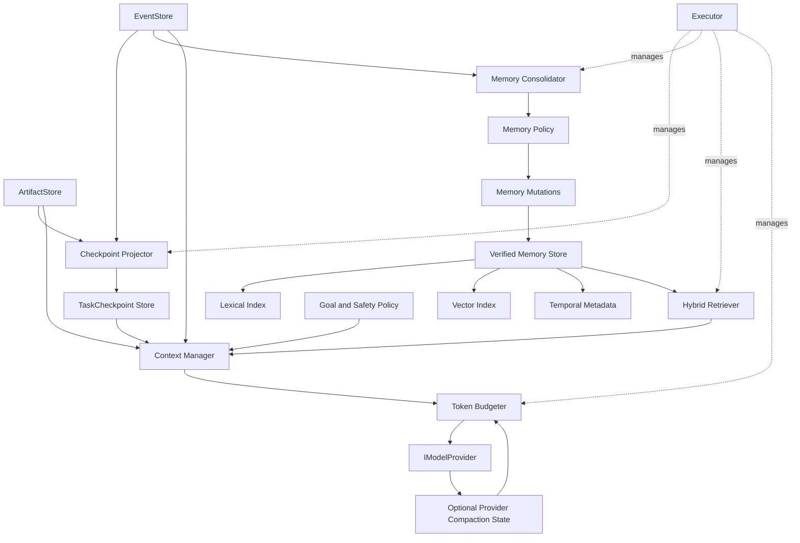

# Mira Context 与 Memory 架构设计

> 状态：Active  
> 版本：0.3  
> 更新日期：2026-08-30  
> 上位设计：[Mira Runtime 设计](mira_runtime_design.md)

## 1. 文档目的

本文定义 Mira 如何管理模型上下文、Task 工作记忆、Session 历史和跨任务长期记忆，重点解决：

- 模型请求即将超过 context window 时如何降载、压缩或拒绝。
- Task 暂停、恢复、崩溃或切换模型后如何继续执行。
- 哪些信息可以写入长期记忆，如何更新、失效、检索和删除。
- 如何保证摘要、向量索引和供应商 conversation state 不取代可回放的事实源。
- 如何通过 Executor 管理 token count、checkpoint、持久化、embedding、consolidation 和清理任务。

本文不规定某一个向量数据库或云服务。所有后端通过接口替换，首期提供适合本地 C++ Runtime
的参考实现。

## 2. 设计结论

Mira 采用以下组合，而不是直接绑定某一个 Agent Memory 框架：

```text
Event-sourced Truth
    + Structured Task Checkpoint
    + Verified Long-term Memory
    + Hybrid Retrieval
    + Provider-specific Context Optimization
```

五项原则为：

1. EventStore 和 ArtifactStore 是发生过的事实与外部结果的权威记录。
2. TaskCheckpoint 是可重建的任务恢复投影，不是另一份聊天记录。
3. Long-term Memory 只保存值得跨步骤或跨任务复用的信息，并保留来源、有效时间和置信度。
4. ContextWindow 是每次推理临时组装出的有界视图，不等同于任何持久化存储。
5. OpenAI/Anthropic 等供应商压缩仅是 Provider Adapter 优化，不能成为 Mira 的通用状态。

## 3. 非目标

- 不把全部 Event Log 无限制发送给模型。
- 不把向量数据库当作 Task 当前状态的事实源。
- 不允许模型直接改写 system/safety policy。
- 不保存模型隐藏推理过程作为 Memory。
- 不把未验证的模型猜测自动提升为长期事实。
- 不在 realtime Controller 中进行摘要、embedding、检索或持久化。
- 不将 Runtime Memory 自动用作 ONNX 或其他模型的训练数据集。

## 4. 总体架构



数据流分为两条：

- 推理热路径：Event/Checkpoint/Memory -> ContextManager -> TokenBudgeter -> ModelProvider。
- 记忆冷路径：Verified Event -> MemoryConsolidator -> MemoryPolicy -> MemoryStore/Indexes。

冷路径失败不能导致已经执行的 Action 重放；热路径失败必须以明确 Error 返回 TaskCoordinator。

## 5. 记忆层级

| 层级 | 范围 | 典型内容 | 生命周期 | 权威性 |
| --- | --- | --- | --- | --- |
| Request Context | 一次 Model Request | policy、goal、当前观察、检索结果 | 单次请求 | 临时视图 |
| Working Memory | 一个活动 Task | 当前计划、未决问题、最近步骤 | Task 生命周期 | Coordinator 快照 |
| TaskCheckpoint | Task 恢复 | 已完成步骤、约束、未决副作用 | 按 retention | Event 派生投影 |
| Episodic Memory | Task/Session 历史 | 已验证任务经历和结果 | 中长期 | 带来源的派生记录 |
| Semantic Memory | User/Environment/App | 偏好、环境事实、稳定知识 | 长期/带 TTL | 带来源的派生记录 |
| Procedural Memory | Agent/TaskSkill | 已验证操作经验和恢复步骤 | 长期/版本化 | 带来源的派生记录 |
| Event/Artifact | Runtime/Session | 原始事件、大型截图和响应 | retention policy | 权威事实源 |

Working Memory 不直接暴露为共享可变对象。TaskCoordinator 是唯一 writer，其他组件读取不可变
`TaskSnapshot` 或版本化 checkpoint。

## 6. 身份、Scope 与命名空间

### 6.1 MemoryScope

```cpp
enum class MemoryScopeKind {
    Task,
    Session,
    Environment,
    Application,
    User,
    Agent,
    TaskSkill,
};

struct MemoryScope {
    MemoryScopeKind kind;
    std::string subject_id;
    std::optional<std::string> tenant_id;
};
```

Scope 是访问控制和检索的第一层过滤条件，不只是 ranking 特征。调用方必须显式提供允许查询的
scope 集合；Retriever 不能通过相似度把其他用户或 tenant 的 Memory 带入上下文。

宿主提供的 user/tenant ID 应使用稳定的内部标识或不可逆映射，不在事件中复制外部账号信息。

### 6.2 MemoryKind

```cpp
enum class MemoryKind {
    Preference,
    EnvironmentFact,
    ApplicationFact,
    Episode,
    Procedure,
    RecoveryLesson,
    SkillHint,
};
```

MemoryKind 决定默认 TTL、最低验证等级、允许的 scope 和检索方式。例如用户偏好可跨 Session，
屏幕元素位置不能作为长期 ApplicationFact 保存。

## 7. 核心数据契约

### 7.1 ContextLimits

```cpp
struct ContextLimits {
    std::uint64_t context_window_tokens;
    std::uint64_t reserved_output_tokens;
    std::uint64_t safety_margin_tokens;
    std::uint64_t max_image_tokens;
    std::uint64_t max_tool_schema_tokens;
    double trim_watermark = 0.70;
    double checkpoint_watermark = 0.85;
    double hard_watermark = 0.95;
};
```

水位是 `ModelProfile` 配置，不是 Core 编译常量。Runtime 初始化时必须验证：

```text
0 < trim_watermark < checkpoint_watermark < hard_watermark < 1
reserved_output + safety_margin < context_window
```

### 7.2 TokenEstimate

```cpp
enum class TokenCountQuality {
    ExactProviderCount,
    ExactLocalTokenizer,
    ConservativeEstimate,
};

struct TokenEstimate {
    std::uint64_t lower_bound;
    std::uint64_t upper_bound;
    TokenCountQuality quality;
    ModelProfileId profile_id;
};
```

所有水位判断使用 `upper_bound`。供应商返回实际 usage 后，TokenBudgeter 记录估算误差并更新该
ModelProfile 的保守 margin；不能把一个模型的 tokenizer 结果复用于另一个模型。

### 7.3 ContextItem

```cpp
enum class ContextAuthority {
    SystemPolicy,
    UserConstraint,
    VerifiedState,
    RetrievedMemory,
    UntrustedExternalData,
};

struct ContextItem {
    ContextItemId id;
    ContextItemKind kind;
    ContextAuthority authority;
    ContextPriority priority;
    StructuredContent content;
    std::vector<EventId> provenance;
    TokenEstimate estimated_tokens;
    bool pinned;
    bool replaceable_by_reference;
};
```

从网页、UI Tree、OCR、Tool 和 Memory 检索出的文本默认是 `UntrustedExternalData`，不能以消息
角色或拼接方式获得 SystemPolicy 权限。

### 7.4 TaskCheckpoint

```cpp
struct TaskCheckpoint {
    CheckpointId id;
    TaskId task_id;
    TaskEpoch epoch;
    std::uint64_t through_event_sequence;
    TimePoint created_at;
    Goal goal;
    std::vector<Constraint> constraints;
    std::vector<VerifiedFact> verified_facts;
    std::vector<CompletedStep> completed_steps;
    std::vector<PendingObjective> pending_objectives;
    std::vector<UnresolvedIssue> unresolved_issues;
    std::vector<UncertainSideEffect> uncertain_side_effects;
    std::optional<ObservationRef> current_observation;
    std::vector<ActionSummary> recent_actions;
    std::vector<MemoryRef> relevant_memories;
    CheckpointSchemaVersion schema_version;
};
```

`uncertain_side_effects` 是 pinned 字段。恢复时只要存在未解决的副作用，就必须先 Observe/Verify，
不能根据摘要重新执行 Action。

### 7.5 MemoryRecord

```cpp
enum class MemoryVerification {
    Unverified,
    Observed,
    Verified,
    HumanConfirmed,
};

enum class MemoryStatus {
    Active,
    Superseded,
    Tombstoned,
};

struct ValidityInterval {
    TimePoint valid_from;
    std::optional<TimePoint> valid_until;
};

struct MemoryRecord {
    MemoryId id;
    MemoryScope scope;
    MemoryKind kind;
    StructuredContent content;
    ValidityInterval validity;
    TimePoint recorded_at;
    std::vector<EventId> provenance;
    MemoryVerification verification;
    float confidence;
    SensitivityLevel sensitivity;
    MemoryStatus status;
    std::optional<MemoryId> supersedes;
    std::optional<TimePoint> expires_at;
    MemorySchemaVersion schema_version;
};
```

`validity` 表示事实在环境中何时成立，`recorded_at` 表示 Mira 何时获知。两者分开可以表达：
“应用版本在昨天已经变化，但 Agent 今天才观察到”。

## 8. 核心组件接口

### 8.1 ITokenCounter

```cpp
class ITokenCounter {
public:
    virtual ~ITokenCounter() = default;
    virtual Result<TokenEstimate> count(
        const ModelRequestDraft& request,
        const ModelProfile& profile,
        const OperationContext& context) = 0;
};
```

实现按 capability 选择：供应商 exact count endpoint、本地 tokenizer、保守估算。远程 count 是
网络工作，必须允许取消和 deadline；失败时降级到保守估算，不得默认记为 0。

### 8.2 ICheckpointStore

```cpp
class ICheckpointStore {
public:
    virtual Result<void> put(
        const TaskCheckpoint&, const OperationContext&) = 0;
    virtual Result<std::optional<TaskCheckpoint>> latest(
        TaskId, const OperationContext&) = 0;
    virtual Result<void> erase_task(
        TaskId, const ErasureContext&) = 0;
};
```

### 8.3 IMemory

```cpp
class IMemory {
public:
    virtual ~IMemory() = default;
    virtual Result<MemoryQueryResult> query(
        const MemoryQuery&, const OperationContext&) = 0;
    virtual Result<std::optional<MemoryRecord>> get(
        MemoryId, const OperationContext&) = 0;
    virtual Result<MemoryMutationResult> apply(
        const MemoryMutation&, const OperationContext&) = 0;
    virtual Result<MemoryCompactionResult> compact(
        const MemoryScope&, const OperationContext&) = 0;
    virtual Result<ErasureResult> erase(
        const ErasureRequest&, const ErasureContext&) = 0;
};
```

`apply()` 必须支持幂等 mutation ID 和 optimistic version。重复完成消息不能生成两条相同长期
Memory。

### 8.4 IContextManager

```cpp
class IContextManager {
public:
    virtual Result<PreparedModelContext> prepare(
        const ContextRequest&,
        const OperationContext&) = 0;
};
```

ContextManager 只生成模型请求上下文，不负责 Task 状态转换。它组合 checkpoint、recent events、
Memory 和 Artifact，并给出被保留、压缩、引用或移除的审计清单。

## 9. Context 预算模型

### 9.1 可用预算

```text
input_budget =
    context_window
  - reserved_output
  - safety_margin
  - provider_required_overhead
```

Token count 必须覆盖消息边界、图片、文件、tool schema、structured output schema 和供应商格式
开销。字符数除以常量只能作为 `ConservativeEstimate` 的输入，不能标记为 exact。

### 9.2 Context 分区

ContextManager 按以下分区构建：

| 分区 | 内容 | 裁剪策略 |
| --- | --- | --- |
| P0 | System/Safety Policy | pinned，不可裁剪 |
| P1 | Goal、用户约束、Task limits | pinned，不可裁剪 |
| P2 | 当前 Observation、未决副作用、最近 Verification | 保留最低可执行集合 |
| P3 | 当前 checkpoint、最近动作和错误 | 结构化压缩 |
| P4 | 检索的长期 Memory | 按相关性和预算选取 |
| P5 | 较早事件、已消费 Tool Result | 引用、摘要或移除 |

如果 P0 + P1 + 最低 P2 已超过 input budget，Runtime 返回 `ContextMinimumSetTooLarge`，不能为了
发出请求删除安全约束。

### 9.3 水位动作

| 上限使用率 | 默认动作 |
| --- | --- |
| `< trim_watermark` | 正常组装 |
| `trim..checkpoint` | 移除已消费大载荷，用 ArtifactRef 替代 |
| `checkpoint..hard` | 生成/更新 TaskCheckpoint，裁剪旧事件 |
| `>= hard` | 重建最小上下文、减少 Memory、缩减视觉载荷 |
| 最小集合仍超限 | 拒绝或路由到显式配置的大 context model |

模型路由是策略决策，不能自动把敏感数据发送给另一个未授权 Provider。

## 10. Context 构建算法

一次 `prepare()` 按如下顺序执行：

1. 固定 ModelProfile、TaskEpoch 和当前 Event sequence，形成一致性边界。
2. 加入 P0/P1 pinned items。
3. 从当前 TaskSnapshot 和 Observation 构造最低 P2。
4. 加载 `through_event_sequence <= current_sequence` 的最新 checkpoint。
5. 读取 checkpoint 之后的增量事件，构造 P3。
6. 根据 Goal、当前状态、错误和环境元数据生成 MemoryQuery。
7. 进行 scope 过滤和混合检索，形成候选 P4。
8. 选择当前步骤真正可用的 Tool schema，避免暴露全部 Tool。
9. 将大型截图、UI Tree、Tool Result 替换为引用、ROI 或结构化摘要。
10. 估算 token；越过水位时执行相应 context edit。
11. Provider 支持 exact count 时，对最终 draft 做一次准确计数。
12. 固化 `PreparedModelContext`，记录选入/排除项和预算报告。

在步骤 1 之后到请求提交之前，如果 TaskEpoch 或 environment epoch 改变，则放弃该上下文并返回
`StaleContextBuild`。

## 11. 多模态与 Tool Context

### 11.1 Screenshot

当前视觉任务需要的 screenshot/ROI 不能仅用文本摘要替代。预算不足时按以下顺序降载：

1. 移除历史截图，只保留 ArtifactRef 和已验证结构化结果。
2. 对当前截图使用任务相关 ROI。
3. 在不破坏识别需求的前提下降采样或调整压缩质量。
4. 使用本地 OCR/检测结果代替不必要的全图 VLM 输入。
5. 如果当前任务最低视觉证据仍放不下，拒绝请求或换用已授权 profile。

每次变换产生新的 ArtifactRef，并记录来源 hash、尺寸、变换和使用的 ObservationId。

### 11.2 Tool Result

Tool Result 分为：

- 未消费：模型尚未对结果产生后续 Decision，必须保留。
- 已消费且仍影响当前状态：转成结构化事实或摘要。
- 已消费且仅用于历史诊断：从 context 移除，保留 Event/ArtifactRef。

不得删除 tool call 而保留无法关联的 result，也不得破坏供应商要求的消息配对格式。

## 12. TaskCheckpoint 设计

### 12.1 生成触发

- Context 达到 `checkpoint_watermark`。
- Task 进入 Paused 或 Takeover。
- Session/Runtime 正常 shutdown。
- 完成一段明确子目标且增量事件超过配置阈值。
- EventStore 恢复后需要重建缺失投影。

每一步都生成 checkpoint 会产生不必要 I/O；它是阶段性恢复点，不是事件替代品。

### 12.2 生成方式

CheckpointBuilder 先通过确定性 reducer 从结构化事件构造必需字段。可选的模型摘要只能补充
`narrative_summary`，不能决定 TaskState、uncertain side effect 或安全约束。

模型摘要必须：

- 输出固定 schema。
- 引用来源 EventId。
- 通过事实一致性校验。
- 失败时允许退回纯结构化 checkpoint。

新 checkpoint 从原始 Event 和上一 checkpoint 的 `through_event_sequence` 增量构造；周期性 full
rebuild 从 EventStore 验证投影，避免摘要链累积漂移。

### 12.3 恢复

1. 读取 EventStore 最后 durable sequence。
2. 选择 `through_event_sequence <= durable_sequence` 的最新兼容 checkpoint。
3. 重放 checkpoint 之后的结构化事件。
4. 校验 TaskEpoch、终态和未决副作用。
5. 非终态 Task 恢复到 Observing/Verifying，不直接恢复到 Acting。

## 13. 长期 Memory 写入

### 13.1 可写入内容

- 用户明确表达且允许保存的偏好。
- Observation/Verification 证实的稳定环境或应用事实。
- 已完成 Task 的结构化 Episode。
- 多次验证有效的 Procedure、RecoveryLesson 或 TaskSkill hint。
- Human Takeover 后明确授权保存的纠正信息。

### 13.2 禁止自动写入

- API key、密码、Authorization header 和敏感输入。
- 模型隐藏推理、未验证猜测或仅出现一次的推断。
- 当前屏幕瞬时坐标等不稳定信息。
- 来自网页、OCR 或 Tool 的指令性文本，除非经过明确 policy 转换。
- 仅因模型声称“请记住”而产生的高权限规则。

### 13.3 Consolidation Pipeline

```text
Verified Event Range
  -> Candidate Extractor
  -> Scope and Sensitivity Classifier
  -> Retrieve Conflicting Memories
  -> Mutation Planner
  -> Deterministic Policy Validation
  -> Optional Human Approval
  -> IMemory.apply()
  -> Index Update
```

候选提取可以使用模型，但最终 mutation 必须通过 Core policy。高风险 user preference、跨 tenant
共享和安全策略相关内容默认要求 HumanConfirmed。

### 13.4 MemoryMutation

```cpp
enum class MemoryMutationType {
    Add,
    Update,
    Supersede,
    Tombstone,
    Noop,
};

struct MemoryMutation {
    MutationId id;
    MemoryMutationType type;
    MemoryScope scope;
    std::optional<MemoryId> target;
    std::optional<std::uint64_t> expected_version;
    MemoryRecord proposed;
    std::vector<EventId> evidence;
    MutationReason reason;
};
```

普通事实变化使用 Supersede，保留历史和有效时间。Tombstone 表示不再参与检索。隐私 Erasure
走独立的物理删除/crypto-shredding 流程，不能只用 Tombstone 冒充删除。

## 14. 混合检索

### 14.1 检索阶段

1. 强制 tenant/user/session/environment scope 和 ACL 过滤。
2. 过滤 status、TTL、validity、schema version 和 sensitivity。
3. 对 ID、应用包名、TaskSkill 等字段做 exact match。
4. 使用 BM25/FTS 召回关键词候选。
5. 可用时使用 embedding 召回语义候选。
6. 合并去重并按时间、置信度、来源和当前 Task 相关性重排。
7. 做多样性选择，避免多个近重复 Memory 占满预算。
8. 按 token budget 打包，并附 provenance 和 authority 标记。

### 14.2 排名模型

不冻结具体权重，但评分输入至少包含：

```text
semantic_similarity
lexical_similarity
scope_specificity
temporal_validity
recency
verification_level
confidence
provenance_quality
duplication_penalty
sensitivity_penalty
```

Safety/System memory 不依赖检索排名，而由 P0 pinned policy 管理。

### 14.3 首期后端

- SQLite/WAL：MemoryRecord、mutation、checkpoint 和 metadata。
- SQLite FTS5：关键词/字段检索。
- Content-addressed ArtifactStore：截图、UI Tree、模型原始响应。
- 小数据量使用有界线性 cosine 检索。
- 数据量达到基准阈值后，引入静态编译的 HNSW/USearch 类索引。
- 后续可用本地 ONNX embedding model，仍通过 `IEmbeddingProvider` 隔离。

Graphiti 类双时态图后端只作为可选远程实现。首期不要求 Android 设备运行图数据库。

## 15. Provider Context 管理

### 15.1 Capability

```cpp
struct ProviderContextCapabilities {
    bool exact_input_token_count;
    bool server_auto_compaction;
    bool standalone_compaction;
    bool opaque_continuation;
    bool selective_tool_result_clearing;
};
```

Mira 先执行本地 ContextManager，再按 Provider capability 使用服务端功能。供应商压缩不能省略
本地 pinned item、scope、privacy 和副作用校验。

### 15.2 Opaque Provider State

OpenAI 等 Provider 可能返回不可读的 compaction/continuation item。Mira 将其视为：

```cpp
struct ProviderContinuation {
    ProviderId provider;
    ModelProfileId profile;
    ConversationId conversation;
    OpaqueRef payload;
    Hash payload_hash;
    TimePoint created_at;
};
```

它只能在相同 Provider、模型兼容范围和 conversation 中复用。切换 Provider、Replay 或状态恢复
必须使用 Mira 自己的 checkpoint 和 Memory，不能解析或假设 opaque item 内容。

如果使用供应商 conversation object，Mira 仍保存自己的 ModelRequest/Response 元数据和事件序列；
远端 conversation ID 不是 TaskId，也不是事实源。

Continuation 还必须绑定 Task/Session/epoch、profile digest、model兼容范围、prompt/Decision schema/Tool
snapshot digest、data policy、`store` 模式和有效期。任一绑定变化、到期、取消、Takeover或进程恢复都
使其失效；恢复使用本地 checkpoint 重建上下文。具体 wire lifecycle、远端 retention 和 deletion 见
[LLM API 协议设计](llm-api-protocol-design.md)。

## 16. 持久化与一致性

### 16.1 写入顺序

```text
External result
 -> durable EventStore append
 -> TaskCoordinator state commit
 -> optional TaskCheckpoint projection
 -> optional MemoryMutation projection
 -> lexical/vector index update
```

Checkpoint 和 Memory 可以最终一致，因为它们都能从 Event 重建。Action 是否可能已执行等关键
事实必须先进入 EventStore，不能只存在 Memory。

### 16.2 SQLite 参考 schema

```text
task_checkpoints
memory_records
memory_versions
memory_provenance
memory_mutations
memory_embeddings
memory_erasure_log
```

SQLite 使用单 writer 策略和 bounded request channel；读取可以使用独立只读连接/快照。数据库
迁移在 Runtime 接受 Task 前完成，不能由第一个随机请求隐式触发。

### 16.3 Schema Migration

- Event、Checkpoint、Memory 和 embedding model 分别版本化。
- Reader 至少支持当前和上一兼容版本。
- Migration 是显式、可取消、可诊断的 Runtime 初始化任务。
- 无法迁移时以只读诊断模式打开，不静默清空数据。
- Vector index 可删后重建；Event provenance 和 MemoryRecord 不能因索引损坏丢失。

## 17. Executor 映射

| 工作 | Executor 路径 | 约束 |
| --- | --- | --- |
| Context item 选择和结构化压缩 | `submit_auto()` | 有限 CPU 工作，保留 future |
| 本地 token 估算 | `submit_auto()` | 不阻塞 realtime |
| 远程 exact token count | 可中断 blocking I/O | deadline 和取消 |
| SQLite checkpoint/memory I/O | blocking I/O worker | bounded queue、单 writer |
| Embedding/索引更新 | 普通有限任务或受控本地推理路径 | 可延迟、可重建 |
| Memory consolidation | delayed/低优先级普通任务 | Task 终态不等待非关键候选 |
| Retention/GC | soft periodic timer | 不与 realtime 混用 |
| Full projection rebuild | 显式 maintenance task | 可暂停、可取消、报告进度 |

任何工作都不能创建私有线程池。SQLite、embedding/ONNX 或其他第三方库内部线程必须在 Provider
边界显式配置和记录；Mira 发起的任务、Session 生命周期和 shutdown 仍由 Executor 管理。

### 17.1 Backpressure

- Context build completion、checkpoint 写入和 Erasure：不得静默丢弃。
- 普通 Memory candidate：队满时合并相同 scope 的请求或推迟，不阻塞 TaskCoordinator。
- Embedding/index update：允许落后于 authoritative MemoryRecord，但记录 lag。
- GC/重建：在过载时让位于 Task 热路径。
- 检索超过 deadline：返回部分结果和 quality，不能无限等待。

### 17.2 Shutdown

1. 停止接受新 Context/Memory 操作。
2. 取消远程 token count、embedding 和 consolidation producers。
3. 为需要可恢复的活动 Task 提交最终 checkpoint。
4. 完成已接纳的 Memory/Checkpoint critical writes。
5. 停止 indexer/GC，刷新 SQLite/WAL 和 Artifact metadata。
6. 关闭 store worker，再进入 MiraRuntime 最终 Executor shutdown。

非关键 Memory consolidation 超时可以放弃并记录；已接纳的隐私 Erasure 不能被当作普通后台任务
静默放弃。

## 18. 故障语义

| 故障 | 默认处理 |
| --- | --- |
| Token counter 不可用 | 使用 conservative estimate，增加 margin |
| Provider 返回 context too large | 更严格重建一次；仍失败则 `ContextOverflow` |
| Checkpoint 模型摘要失败 | 使用确定性结构化 checkpoint |
| Checkpoint 持久化失败 | Pause/Shutdown report 标记不可恢复风险 |
| Memory consolidation 失败 | Task 结果不回滚，记录并有界重试 |
| MemoryStore 暂时不可用 | 无长期 Memory 继续当前 Task，并降低 context quality |
| Vector index 损坏 | 回退 FTS/exact，安排重建 |
| Memory 冲突 | optimistic version 拒绝，重新读取后规划 mutation |
| Provider opaque state 丢失 | 用本地 checkpoint 重建，不伪造 continuation |
| Erasure 部分失败 | 保持请求 Pending，阻止该 scope 再进入模型上下文 |

所有降级都进入 `ContextQuality`/`MemoryQueryQuality`，Reasoner 可以决定继续、请求 Human 或失败。

## 19. 安全、隐私与记忆污染

- Memory 进入模型前经过与 Observation 相同的 RedactionPolicy。
- Memory 内容始终作为 data block，不作为 system instruction 拼接。
- 每条 Memory 保留来源 Event 和 verification，无法追溯的导入数据默认低置信度。
- 用户可以查询、导出和删除其 scope 下的 Memory。
- Retention 到期后删除 payload、embedding、索引和 Artifact 引用。
- 加密 key、salt 和 secret reference 不写入普通事件。
- 外部导入 Memory 必须带 source namespace，不能伪装成 HumanConfirmed。
- 共享 Memory 需要显式 tenant ACL；相似度不能绕过权限。
- 训练数据导出使用独立授权、脱敏、去重和审计流程，默认关闭。

## 20. 可观测性

新增事件：

- `ContextBuildStarted/Finished/Failed`
- `ContextBudgetEstimated/ExactCounted`
- `ContextItemTrimmed/ReplacedByReference`
- `ContextCheckpointRequested/Stored/Failed`
- `ProviderCompactionRequested/Received/Failed`
- `MemoryQueryStarted/Finished/Degraded`
- `MemoryMutationProposed/Applied/Rejected`
- `MemorySuperseded/Tombstoned/Erased`
- `MemoryIndexLagged/Rebuilt`
- `MemoryConsolidationStarted/Finished/Failed`

预算事件记录分区 token、估算质量、水位、选入/排除数量和 provider usage，不记录敏感正文。

建议指标：

- context utilization 和 overflow 次数。
- token estimate 误差。
- checkpoint 大小、生成耗时和恢复成功率。
- Memory query p50/p95/p99、召回数量和 index lag。
- mutation ADD/UPDATE/SUPERSEDE/NOOP 比例。
- 检索 Memory 的实际使用率和任务成功增益。
- stale/poisoned memory 拦截数量。

## 21. 测试与评估

### 21.1 单元测试

- P0/P1 在任何预算下不可被裁剪。
- 最低上下文超限返回明确错误。
- upper_bound 水位选择和 exact count 回填。
- checkpoint reducer、schema migration 和 Event replay 等价性。
- Mutation 幂等、optimistic conflict、Supersede 有效时间。
- Scope/ACL、TTL、Tombstone 和 Erasure。
- FTS/vector 合并去重和 token packing。
- TaskEpoch 改变时 Context build 结果变 stale。

### 21.2 集成测试

1. 长 Task 多次 checkpoint 后仍保留 Goal、安全约束和未决副作用。
2. Context too large 经一次重建成功；第二次失败后停止重试。
3. Provider compaction item 丢失时通过 Event/Checkpoint 恢复。
4. MemoryStore 不可用时 Task 可在降级模式运行。
5. 新事实 Supersede 旧事实，历史 Replay 仍能查询当时状态。
6. 用户删除后 payload、embedding、FTS 和 Artifact 引用均不可检索。
7. shutdown 中 consolidation 被取消但 critical checkpoint 成功落盘。
8. 恶意网页文本不能变成高权限长期 Memory。

### 21.3 Benchmark

采用 LongMemEval 的五类能力：信息提取、跨 Session 推理、时间推理、知识更新和 abstention。
Mira 额外测试：

- 压缩后 Goal/constraint 保真率。
- 恢复后副作用重复执行次数，目标为零。
- 旧环境事实正确失效率。
- Human Takeover 后上下文恢复正确率。
- Context token/成本/延迟与任务成功率。
- Memory 检索相对无 Memory baseline 的成功率增益。

第三方文档公布的 benchmark 结果只作为调研依据，Mira 必须在自身任务和目标设备上复测。

## 22. 分阶段实现

### CM0：Context Safety

- ContextLimits、ContextItem、保守 TokenEstimator。
- P0-P5 分区、最低集合和水位裁剪。
- 确定性 TaskCheckpoint、内存 CheckpointStore。
- Context overflow、pause/resume 和 replay 测试。

### CM1：Durable Memory

- SQLite/WAL CheckpointStore 与 IMemory。
- Scope、MemoryRecord、Mutation、FTS5、TTL 和 Erasure。
- Verified Event -> deterministic Memory candidate。
- 完整 shutdown 和 schema migration。

### CM2：Model-assisted Consolidation

- Candidate extractor、conflict retrieval 和 mutation proposal。
- Human approval、敏感等级和 Memory poisoning 防护。
- 本地或外部 embedding、混合检索和质量指标。

### CM3：Provider Optimization

- Provider exact token count capability。
- OpenAI-compatible compaction/continuation adapter。
- Tool result selective clearing、opaque state 生命周期。
- 跨 Provider fallback 测试。

### CM4：Temporal/Skill Memory

- 双时态查询和可选 graph backend。
- Procedure/RecoveryLesson 与 TaskSkill 集成。
- LongMemEval 和 Mira 长任务 benchmark harness。

## 23. 明确不采用的方案

- 只保留最近 N 条消息：会丢失早期 Goal、安全约束和未决副作用。
- 只使用递归自然语言摘要：会累积事实漂移且难以恢复。
- 只使用向量数据库：无法可靠处理 ACL、时间失效、精确标识和否定约束。
- 只依赖供应商 conversation ID：破坏跨供应商、Replay 和本地可控性。
- 让模型直接修改 system memory：存在权限提升和持久化 prompt injection 风险。
- 每个 Event 都同步写 embedding：增加热路径延迟且 embedding 是可重建投影。
- 自动把 Memory 用作训练语料：违反数据授权和训练数据治理边界。

## 24. 调研方案映射

| 来源 | Mira 采用 | Mira 不直接采用 |
| --- | --- | --- |
| OpenAI Compaction | 阈值/显式压缩、exact token count capability | opaque item 作为事实源 |
| Anthropic Context Editing | 先清旧 Tool Result、客户端保存完整历史 | 供应商专用消息格式进入 Core |
| LangGraph | checkpoint 与 long-term store 分离 | Python graph runtime |
| Letta/MemGPT | 分层上下文、版本化记忆、后台 consolidation | 模型自行改写高权限 memory |
| Mem0 | scope、候选冲突检索、mutation pipeline | 直接依赖其 memory type 抽象 |
| Graphiti | 双时态事实、provenance、hybrid retrieval | 首期端侧图数据库 |
| LongMemEval | indexing/retrieval/reading 评估维度 | 用对话 QA 替代 Agent 行为测试 |

## 25. 参考资料

- [Mira Runtime 设计](mira_runtime_design.md)
- [核心公共契约与状态机](core_contracts_and_state_machine.md)
- [EventStore、ArtifactStore 与崩溃一致性](event_artifact_crash_consistency.md)
- [本地感知与任务 ONNX 模型](local_perception_and_task_models.md)
- [威胁模型与权限确认协议](../security/threat_model_and_confirmation.md)
- [评估与基准体系](evaluation_and_benchmark_design.md)
- [LLM API 协议设计](llm-api-protocol-design.md)

- [OpenAI Compaction](https://developers.openai.com/api/docs/guides/compaction)
- [OpenAI Conversation State](https://developers.openai.com/api/docs/guides/conversation-state)
- [OpenAI Token Counting](https://developers.openai.com/api/docs/guides/token-counting)
- [LangGraph Memory](https://docs.langchain.com/oss/python/langgraph/add-memory)
- [Letta MemFS](https://docs.letta.com/concepts/memfs/index)
- [MemGPT: Towards LLMs as Operating Systems](https://arxiv.org/abs/2310.08560)
- [Anthropic Context Editing](https://platform.claude.com/docs/en/build-with-claude/context-editing)
- [Anthropic Memory Tool](https://platform.claude.com/docs/en/agents-and-tools/tool-use/memory-tool)
- [Mem0 Memory Types](https://docs.mem0.ai/core-concepts/memory-types)
- [Graphiti Overview](https://help.getzep.com/graphiti/graphiti/overview)
- [LongMemEval](https://arxiv.org/abs/2410.10813)
- [LoCoMo](https://arxiv.org/abs/2402.17753)
