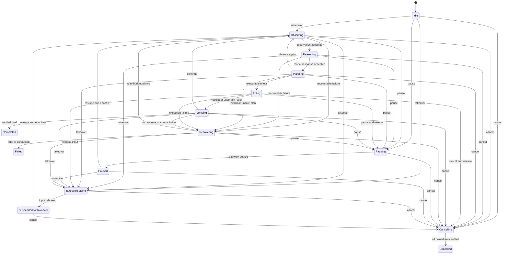

# Mira 核心公共契约与状态机设计

> 状态：Active  
> 版本：1.0  
> 更新日期：2026-08-30  
> 适用范围：Mira Core 公共类型、Runtime/Session/Task 生命周期和 Executor 控制面  
> 上位决策：[DEC-001](../decisions/DEC-001-runtime-executor-ownership.md)、[DEC-002](../decisions/DEC-002-public-contract-versioning.md)

## 1. 目的与规范边界

本文冻结 Mira v1 的基础公共类型、命令语义、状态机和串行协调方式。字段布局可以在不改变
语义的前提下调整；以下内容属于不可静默改变的契约：

- ID、版本、时间、错误和结果的含义。
- 命令 submission、receipt 与 settlement 的三阶段语义。
- Runtime、Session、Task 的合法状态转换和终态幂等。
- 唯一状态提交者、completion 新鲜度和取消层级。
- Executor 控制平面的所有权与关闭顺序。

Event/Artifact 持久化、安全授权、Observation/坐标和平台 ABI 由专项设计定义，本文只规定它们
与状态机相交的稳定边界。

## 2. 公共类型规则

### 2.1 命名空间与依赖

公开 C++ API 位于 `mira` 命名空间，使用 C++20。公共头文件不得暴露：

- Android/JNI、Windows、Linux 或其他平台类型。
- Executor 的 `TaskHandle`、future、channel 或实现类型。
- HTTP、JSON、SQLite、ONNX Runtime、OpenCV 等具体依赖类型。
- 从共享库边界逃逸的第三方异常。

首版不承诺跨编译器稳定 C++ ABI。Host ABI 使用单独的版本化 C 边界；C++ API 保证在同一
发布系列内按发布说明维护源兼容。

### 2.2 强类型 ID

以下 ID 是不可互换的强类型 128-bit 值：

```cpp
RuntimeId       SessionId       TaskId          CommandId
StepId          OperationId     ObservationId   ActionId
EventId         ArtifactId      ConfirmationId  ModelPackageId
LeaseId         FrameId         EvidenceId      ControllerId
PointerSessionId ControlIngressId TenantId       UserId
```

约束如下：

- 新 ID 使用安全随机或单调时间混合生成器，进程重启后仍保持实际上唯一。
- 二进制比较按无符号字节序；文本使用固定小写、无歧义编码，不接受宽松截断。
- 空值只用于尚未分配的 builder，不得进入已接纳命令、Event 或持久化记录。
- ID 不携带用户、设备、tenant 或时间等敏感明文。
- 外部传入 ID 在进入控制面前完成长度和格式校验。

`TaskEpoch`、`EnvironmentEpoch`、`ControlSequence`、`SessionSequence` 和 `TaskSequence` 是独立的
64-bit 单调计数器，不是 ID：

- `TaskEpoch` 在 pause/resume、Takeover、恢复所有权或其他使旧工作失效的边界增加。
- `EnvironmentEpoch` 在坐标或输入有效域变化时由 Environment/Host 增加。
- `ControlSequence` 是 Runtime 串行控制面实际提交状态的顺序。
- `SessionSequence`/`TaskSequence` 是 EventStore durable event 顺序。
- 计数溢出是致命内部错误，不允许回绕。

### 2.3 时间

```cpp
struct Timestamp {
    std::chrono::system_clock::time_point wall;
    std::chrono::steady_clock::time_point monotonic;
};
```

- wall time 用于展示、审计和跨进程粗略关联，不能决定进程内 deadline。
- monotonic time 用于 duration、deadline、重试和 watchdog，不能持久化后跨启动比较。
- 持久化 deadline 同时记录原 wall deadline 和写入时剩余 duration；恢复后按更保守的结果处理。
- Adapter 提供的设备/帧时间必须声明 clock domain，并在 Observation 中附转换质量。

### 2.4 SchemaVersion

```cpp
struct SchemaVersion {
    std::uint16_t major;
    std::uint16_t minor;
};
```

- 新增具有安全默认值、旧 reader 可忽略的字段提升 minor。
- 删除字段、改变含义、放宽权限默认值或改变副作用语义提升 major。
- 未知 major 返回 `UnsupportedVersion`；安全相关未知 enum 返回拒绝，不映射为宽松默认值。
- reader 至少维护当前和上一受支持 major 的显式 migration fixture。

## 3. Error 与 Result

### 3.1 稳定错误分类

```cpp
enum class ErrorCode : std::uint16_t {
    Cancelled,
    DeadlineExceeded,
    ResourceExhausted,
    Unavailable,
    PermissionDenied,
    InvalidArgument,
    InvalidState,
    NotFound,
    AlreadyExists,
    UnsupportedCapability,
    UnsupportedVersion,
    InvalidObservation,
    StaleObservation,
    InvalidModelOutput,
    ContextOverflow,
    SafetyRejected,
    ConfirmationRequired,
    ExecutionUncertain,
    DataLoss,
    PlatformError,
    Internal,
};

struct Error {
    ErrorCode code;
    std::string domain;          // 稳定领域，如 mira.runtime
    std::int32_t domain_code;    // 可选实现/平台代码
    bool retryable;
    std::string safe_message;    // 可向普通日志暴露
    DiagnosticRef diagnostic;    // 受保护的详细诊断引用
    std::optional<OperationId> operation_id;
};
```

`retryable` 是机制提示，不是自动重试许可。RecoveryPolicy 仍需结合副作用、预算、新鲜度和安全
策略决定是否重试。`safe_message` 不包含密码、token、输入文本、完整 URL query 或截图内容。

`Result<T>` 是值或一个 `Error`，不得同时包含两者。异常可以在实现内部使用，但跨 Provider、
Adapter、Observer 和公共 API 前必须映射为 `Error`；`std::bad_alloc` 等无法安全恢复的进程级错误
不承诺转换后继续运行。

### 3.2 结果质量

Observation、Memory query、Detection 等允许部分结果的接口还必须携带 `Quality`：完整性、
新鲜度、来源错误和降级原因。`Result<T>` 成功不等于数据完整；调用方必须检查 quality。

## 4. Handle、Snapshot 与所有权

公共对象以不可伪造的轻量 handle 引用 Runtime 内部状态。handle：

- 不延长 Runtime 的 Executor 或平台资源生命周期。
- Runtime 停止后查询返回最后稳定 snapshot 或 `InvalidState`，不能触发懒初始化。
- 可跨普通宿主线程复制；是否可并发调用由具体方法声明。
- 不暴露内部指针、future 或 Executor handle。

`TaskSnapshot` 至少包含：

```cpp
struct TaskSnapshot {
    TaskId id;
    SessionId session_id;
    TaskState state;
    TaskEpoch epoch;
    std::optional<StepId> active_step;
    std::optional<OperationId> active_operation;
    std::uint32_t completed_steps;
    Timestamp updated_at;
    std::optional<TaskOutcome> terminal_outcome;
    ContextQuality context_quality;
    std::vector<PendingEffect> uncertain_effects;
};
```

Snapshot 是一次完整不可变复制，并带产生它的 `ControlSequence`。调用方不能通过连续读取多个
字段拼装状态。

## 5. 命令三阶段协议

### 5.1 阶段定义

每个公共命令经历三个不同阶段：

1. `Submitted`：命令已获得 `CommandId` 并成功送入 Executor 串行入口。只说明控制面 admission，
   不说明当前状态允许该命令。
2. `Accepted` 或 `Rejected`：串行控制面在一个确定状态上完成权限、参数和状态校验。
3. `Settled`：命令要求的状态效果已经完成，或以明确失败结束。例如 pause 只有在输入释放、
   相关 operation 已停止或失效后才 settled。

公共调用返回 `Result<CommandHandle>`。`Result` 失败表示连控制面都未接纳，例如 Runtime stopping、
队列拒绝或参数在边界解码时无效。成功的 handle 提供非阻塞查询/订阅，并允许外部非 Executor
owner 进行有界等待：

```cpp
struct CommandReceipt {
    CommandId id;
    CommandKind kind;
    ReceiptStatus status;        // Accepted | Rejected
    ControlSequence sequence;
    std::optional<Error> error;
};

struct CommandOutcome {
    CommandId id;
    SettlementStatus status;     // Applied | NoOp | Failed | Superseded
    std::optional<Error> error;
    std::optional<TaskSnapshot> task;
};
```

禁止在 Runtime 所拥有的 Executor default worker、blocking worker、realtime callback、串行控制回调
或 Observer callback 内等待 receipt/outcome。内部逻辑只使用 completion 消息推进。

### 5.2 幂等与去重

- 同一 scope 中重复 `CommandId` 返回原 receipt/outcome，不重复应用。
- 相同内容但不同 ID 是两个命令；Policy 可将第二个命令结算为 `NoOp`。
- Command dedup 记录至少保留到所属 Task/Session 终态 retention 结束。
- 接纳后因 shutdown 无法完成的命令必须 settled 为 `Failed` 或 `Superseded`，不能永远 pending。

### 5.3 命令语义矩阵

| 命令 | 接纳条件 | Settled 条件 | 幂等 NoOp |
| --- | --- | --- | --- |
| `OpenSession` | Runtime Running、身份/配置有效、配额允许 | Environment ready、Session 进入 `Autonomous` 并持久化 opened fact | 相同 CommandId |
| `SubmitTask` | Runtime Running、Session Autonomous、配额允许、TaskId 未占用 | Task 进入 `Idle` 并持久化 started fact | 相同 CommandId |
| `PauseTask` | Task 非终态且非 Takeover suspension | 所有会推进 Task 的旧 epoch completion 已失效，输入安全释放，进入 `Paused` | 已 Paused/Pausing |
| `ResumeTask` | Task `Paused` 且 Session Autonomous | epoch 增加并进入 `Observing` | 已处于活动状态但仅限相同 CommandId |
| `CancelTask` | Task 存在 | owned work 结算、输入释放、终态事件 durable，进入 `Cancelled` | 已终态 |
| `RequestTakeover` | Session 未关闭 | 停止发放 lease、活动 Task 安全挂起、输入释放，Session 进入 `HumanControlled` | 已 pending/controlled |
| `ReleaseTakeover` | Session `HumanControlled` | environment epoch 更新、Full Observation 已安排，Session 进入 `Autonomous` | 已 Autonomous |
| `CloseSession` | Session 存在 | 子 Task 终态/挂起策略完成、环境释放、Session `Closed` | 已 Closed |
| `ShutdownRuntime` | Runtime 未 `Quiesced/Stopped` | 所有业务、I/O、持久化和控制 producer 已结算，Runtime 进入 `Quiesced` | 已 Stopping/Quiesced/Stopped |

权限拒绝、无对应状态转换或未知目标产生 `Rejected` receipt；已经达到请求目标的状态通常
`Accepted + NoOp`，以支持清理命令幂等。

`OpenSession` 返回 `SessionSubmission`，同时给出 Session ID 和创建命令 handle；Session 只有在
outcome settled 后才可被视为 ready。Runtime shutdown 分为 `request_shutdown()` 与外部 owner 的
`finish_shutdown()`：前者进入串行停止协议并在 `Quiesced` 结算，后者在非 Executor worker 上
关闭串行上下文和 Executor、将外部生命周期标为 `Stopped` 并返回最终 `ShutdownReport`。这样命令
outcome 不依赖一个已经关闭的 Executor 回传。`Stopped` 是 Executor 关闭后的对象生命周期标记，
不是新的业务状态提交。

## 6. 生命周期状态机

### 6.1 Runtime

```text
Constructed -> Initializing -> Running -> Stopping -> Quiesced -> Stopped
                    |             |
                    v             v
                  Failed ------> Stopping
```

- `Constructed` 只允许 initialize 或 shutdown。
- `Initializing` 完成配置校验、Executor 初始化、store migration、Provider/Adapter 注册。
- 任一步失败进入 `Failed`，只接受诊断和 shutdown，不接纳 Session。
- `Stopping` 首次进入后不可返回 Running；所有新业务 submission 被拒绝。
- `Quiesced` 表示全部业务、平台、timer、realtime、blocking I/O 和 store producer 已停止，关键事实
  已刷新，shutdown command 已结算；串行上下文与 Executor facade 尚待外部 owner 最终关闭。
- `Stopped` 是外部 finalizer 在 Executor 已关闭后设置的终态标记，所有资源 handle 已结算，析构只
  做无抛异常校验。它不触发 Event、Observer 或 Task/Session 状态变化。

### 6.2 Session

```text
Opening -> Autonomous -> TakeoverPending -> HumanControlled -> Resuming -> Autonomous
   |            |                |                 |               |
   +----------> Closing <--------+-----------------+---------------+
                    |
                 Closed

Opening/Autonomous/TakeoverPending/Resuming -> Failed -> Closing
```

- `Autonomous` 才能发放新的 `ActionLease`。
- `TakeoverPending` 已停止发放 lease，但仍在等待 Controller/Adapter 确认释放。
- `HumanControlled` 期间 Core 不发出输入；只允许安全诊断和经策略允许的被动观察。
- `Resuming` 递增 environment epoch 并取得 Full Observation；旧元素/坐标全部失效。
- `Failed` 保留诊断但不能继续动作，必须 close 或由明确恢复协议重建新 Session。

### 6.3 Task



`Completed`、`Failed` 和 `Cancelled` 是业务终态。终态后只允许追加持久化/诊断结算事实，不允许
任何 completion 改变 TaskOutcome。Task 不从 `Failed` 恢复；创建新 Task 或显式 retry Task 才能
重新运行，避免历史 outcome 被覆盖。

### 6.4 Step 与副作用边界

- `StepId` 在每次从 `Observing` 开始新闭环时生成；一个 Step 最多派发一个外部副作用组。
- 短局部动作序列必须声明原子性。平台无法保证原子时拆成多个 Step，每个副作用后 Verify。
- `FinishTask` 只有 Verification evidence 满足策略时才能进入 `Completed`；模型声明完成不是证据。
- 达到 max steps/wall/deadline 后进入 `Cancelling` 或 `Failed`，取决于停止原因；都必须安全释放。

## 7. 串行控制协议

### 7.1 单写者

每个 Runtime 持有一个 Executor 公共 `SerialExecutionContext`。只有运行在该上下文中的
`RuntimeCoordinator` 可以：

- 改变 Runtime、Session、Task state/epoch。
- 发放或撤销 `ActionLease`。
- 接纳 Command/Operation completion。
- 生成下一步 operation descriptor。
- 提交 Event 草案并在 durable ack 后确认关键状态。

唯一例外是外部 owner 的 `finish_shutdown()` 在串行上下文和 Executor 已关闭后将 Runtime 对象的
生命周期标记从 `Quiesced` 原子设为 `Stopped`。该标记不属于可回放业务状态，不能修改 Session、
Task、epoch、lease 或产生任何新工作。

每个 TaskCoordinator 是 RuntimeCoordinator 内的逻辑状态对象，不拥有线程、Executor 或 event
loop。串行上下文内部确实有一个 Executor 提供的线程；“Task 不拥有专用线程”不能误写为“串行
上下文没有线程”。

### 7.2 ControlEnvelope

```cpp
using ControlPayload = std::variant<
    HostCommand,
    OperationCompletion,
    DurableEventAck,
    TimerFired,
    ExecutorFailureNotice,
    InternalShutdownNotice>;

struct ControlEnvelope {
    ControlIngressId ingress_id;
    Timestamp enqueued_at;
    ControlPayload payload;
};
```

不同线程同时 submission 的先后不作外部保证。真正的全序是在串行回调开始时分配的
`ControlSequence`，并写入由此产生的 Event。相同 producer 必须保持程序顺序；Replay 使用 durable
event sequence，而不是尝试复现 OS 线程竞态。

控制回调预算由配置给出，默认目标不超过 1 ms，但这是待 benchmark 的工程目标而非实时承诺。
回调中禁止：

- 等待 future、condition、I/O、模型、平台或用户回调。
- JSON/图片处理、embedding、ONNX 推理或大对象复制。
- 同步持久化；只产生 bounded request 并等待后续 durable ack。
- 递归调用公共命令入口。

### 7.3 Operation registry

每个外部工作先在控制面创建 `OperationRecord`：

```cpp
struct OperationKey {
    TaskId task_id;
    TaskEpoch epoch;
    StepId step_id;
    OperationId operation_id;
};

enum class OperationState {
    Created, Submitted, Running, CancelRequested, CompletionReceived, Settled
};
```

ExecutionSupervisor 将 descriptor 路由到普通、blocking、timer 或 realtime Executor 能力，保存
handle/future，并把 completion 投回控制面。控制面依次检查：

1. Runtime/Session/Task 仍存在且允许接收内部结算。
2. `TaskEpoch` 与当前 epoch 一致。
3. `StepId` 是当前或明确允许的清理 step。
4. `OperationId` 已注册且未 settled。
5. completion 类型与 operation descriptor 匹配。

失败的业务 completion 记录为 `StaleCompletionIgnored` 或 `DuplicateCompletionIgnored`；但
ExecutionSupervisor 仍消费其 future/异常并释放资源，不能以 stale 为由遗忘生命周期。

### 7.4 关键事件的 durable ack

普通状态观测事件可异步写入；会打开副作用门禁或完成命令的关键事件需要 `DurableEventAck`：

- `TaskStarted`
- `ActionDispatchStarted`
- `ConfirmationConsumed`
- Task terminal event
- Session terminal event、Runtime `QuiescePrepared` report

等待 ack 时 Task 保持显式中间状态，不阻塞串行线程。EventStore 拒绝或失败作为 completion 返回，
由状态机决定失败、暂停或只读降级。

## 8. 取消与超时

取消分层为 Runtime -> Session -> Task -> Operation。父级取消传播到所有非终态子级；子 operation
失败不能隐式取消无关 Session。

- Mira `CancellationToken` 是稳定包装，内部可桥接 Executor task cancellation 和 Provider interrupt。
- Executor 排队 soft timeout 只表示任务未开始，不是运行中取消。
- 运行中工作必须检查 Mira token，并让 socket、平台等待、模型 stream 和循环具有解除阻塞路径。
- cancel/pause/takeover 都增加或准备增加 epoch，使旧 completion 失效；取消不能替代输入释放确认。
- deadline 到达触发协作停止；若副作用状态不确定，TaskOutcome 必须保留 uncertain effects。

## 9. ActionLease

同一 Session 任意时刻最多一个 active lease：

```cpp
struct ActionLease {
    LeaseId id;
    SessionId session_id;
    TaskId task_id;
    TaskEpoch task_epoch;
    EnvironmentEpoch environment_epoch;
    TimePoint expires_at;
};
```

- lease 仅在 Session `Autonomous` 且 Task 将进入 `Acting` 时发放。
- Planner/Reasoner 不需要 lease；执行前必须重新校验 lease 和 environment epoch。
- lease 不是线程锁，不跨进程共享；它是控制面授权记录。
- pause、cancel、Takeover、Session close、epoch 改变和 watchdog 都撤销 lease。
- lease 撤销不等于平台输入已释放，必须等待 Controller/Adapter receipt。

## 10. Shutdown 契约

Runtime shutdown 分为：

1. 控制面将 Runtime 置为 `Stopping`，拒绝新 Session/Task/Provider operation。
2. 停止外部 command、Observer subscription 和周期 producer。
3. 对所有 Task 发出取消，停止 realtime target，调用 Environment interrupt/release。
4. 分别停止并结算普通 Provider、Tool、timer、realtime 和非 store blocking worker；它们不由默认
   pool wait 自动覆盖。
5. 完成 Task/Session 关键写入、投影和删除请求，停止 Memory/Checkpoint/Artifact producer 与
   worker；EventStore 保持可用，所有 completion 仍返回串行控制面。
6. 确认除 EventStore shutdown 外没有新的 control producer，持久化 `RuntimeQuiescePrepared` 并取得
   durable ack，生成 pre-final `ShutdownReport`。
7. 刷新并关闭 EventStore worker；其最终 completion 回到控制面后进入 `Quiesced`、结算 shutdown
   command。此后不再提交 Event 或其他 Executor 工作。
8. 外部 owner 的 `finish_shutdown()` 观察命令 outcome，关闭 `SerialExecutionContext`，消费全部
   submit-on future。
9. 同一外部非 worker owner 调用 `executor.shutdown(true)`，将其结果合并到报告并把外部生命周期
   原子状态标为 `Stopped`。`Stopped` 不依赖 Executor 再调度 callback 或写 Event。

`ShutdownReport` 必须区分 clean、degraded 和 unsafe：任何输入释放未确认、critical write 失败、
worker 未结算或 wait timeout 都不能报告 clean。`request_shutdown()` outcome 只证明 Quiesced；只有
`finish_shutdown()` 返回才证明 Executor 已完成最终关闭。

## 11. 可观测性

至少记录：command submitted/accepted/rejected/settled、ControlSequence、状态转换、operation
submitted/cancelled/completed/stale、lease acquire/revoke、queue rejection、control callback latency、
Executor failure snapshot 和 shutdown resource counts。

指标有界聚合，不能为每个高频 trajectory sample 写普通事件。Observer 永远不在串行上下文或
realtime 线程执行。

## 12. 契约测试

- 表驱动覆盖每个 Runtime、Session、Task 状态和非法转换。
- 多 producer 并发提交命令/completion，验证 durable sequence 可解释实际结果。
- 同一 CommandId 重放不重复应用，不同 ID 的幂等命令正确 NoOp。
- accepted 与 settled 分离；pause/takeover/cancel 在输入释放前不得 settled。
- 错 epoch、错 step、重复和终态后的 completion 不改变 snapshot，但 future 均被消费。
- 小线程池、控制回调异常、submission rejection、context shutdown 和 Runtime shutdown 风暴。
- blocking/realtime 未停止时 ShutdownReport 不得 clean。
- 公共头独立包含、unknown enum fail closed、当前/上一 schema migration。

## 13. 明确不采用

- 在任意 worker 上加 mutex 直接修改 Task 状态。
- 每个 Task 一个线程、Executor 或 `SerialExecutionContext`。
- 在 Coordinator 中调用 `.get()`、同步 I/O 或 Observer。
- 把 queue admission、Command accepted、operation completion 或目标完成混为一个“成功”。
- 依赖析构或进程退出代替显式 shutdown。

## 14. 关联文档

- [M1 核心契约里程碑](../plans/m1-core-contracts.md)
- [事件、资产与崩溃一致性设计](event_artifact_crash_consistency.md)
- [威胁模型与权限确认协议](../security/threat_model_and_confirmation.md)
- [Executor 反馈台账](../executor_feedback/ledger.md)
