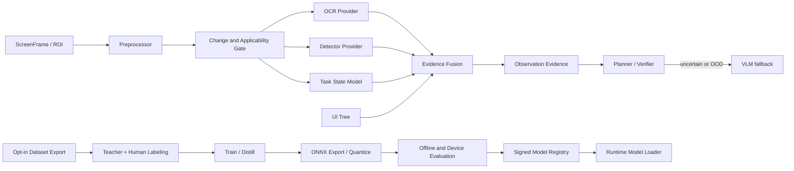

# Mira 本地感知与任务 ONNX 模型设计

> 状态：Active  
> 版本：1.1  
> 更新日期：2026-08-31  
> 适用范围：OCR、目标/元素检测、状态识别、模型蒸馏、ONNX 推理、模型包与评估  
> 上位决策：[DEC-006](../decisions/DEC-006-local-perception-task-models.md)

## 1. 目标与边界

Mira 通过本地低延迟模型承担可重复、窄任务的视觉理解和状态判断，减少 VLM 调用并为连续控制
提供高频反馈。设计同时覆盖两条独立路径：

- 在线 Runtime：加载已批准模型包，对当前 Observation/ROI 进行有界推理，输出可追溯 evidence。
- 离线训练工具链：在明确授权的数据上完成标注、teacher 蒸馏、训练、ONNX 导出、评估和发布。

训练工具链不是 Mira Core 的后台任务。Core 不包含训练框架，不自动上传 Event/Memory，不允许在线
模型在未验证情况下自我替换。

首期模型用途：

- OCR 与文字区域。
- UI/游戏目标检测、图标与元素定位。
- 屏幕/任务状态分类。
- 关键点、分割或局部几何（任务需要时）。
- Verification predicate 的低成本证据。

首期不让任务 ONNX 模型绕过 Planner/Policy 直接驱动平台输入。Policy model 只能产生候选 Intent，
仍需 Observation freshness、SafetyPolicy、权限、ActionLease 和 Verify。

## 2. 架构



本地 evidence 与 VLM、UI Tree 是可组合来源。Fusion 不把低置信度合并成虚假高置信度；来源冲突
时保留各自结果和冲突标记，由 Planner/Verifier 按任务策略处理。

## 3. Provider 契约

### 3.1 通用感知接口

```cpp
struct PerceptionRequest {
    PerceptionTaskId task;
    ObservationId observation_id;
    FrameRef frame;
    std::vector<RegionRef> regions;
    ModelSelector selector;
    PerceptionBudget budget;
    OutputRequirements outputs;
};

struct PerceptionResult {
    PerceptionRequestId request_id;
    ObservationId observation_id;
    FrameId source_frame;
    ModelExecutionIdentity model;
    CaptureSpan input_capture;
    std::vector<PerceptionEvidence> evidence;
    ApplicabilityResult applicability;
    PerceptionQuality quality;
    InferenceMetrics metrics;
};

class IPerceptionProvider {
public:
    virtual ~IPerceptionProvider() = default;
    virtual PerceptionCapabilities capabilities() const = 0;
    virtual Result<PerceptionResult> infer(
        const PerceptionRequest&, const OperationContext&) = 0;
};
```

Provider 调用表现为同步、可取消 operation，由 ExecutionSupervisor 调度。Provider 不创建脱离
Runtime 的任务生命周期；推理库内部线程按模型 profile 显式限制。

### 3.2 专用 facade

上层可以通过专用 request/output 类型提高可读性：

- `IOcrProvider` -> `TextRegion`、line/word/character、language、normalized text。
- `IDetectorProvider` -> `Detection`、class、box/mask/keypoints。
- `IElementLocator` -> query 与候选 `ElementRef`，融合 UI Tree/OCR/detector。
- `ITaskStateProvider` -> task-defined state distribution、transition evidence、OOD score。
- `IEmbeddingProvider` -> image/text embedding，仅作为检索投影，不是安全事实。

专用接口最终使用相同模型 registry、provenance、Executor 和质量语义。

## 4. Evidence schema

```cpp
struct EvidenceHeader {
    EvidenceId id;
    ObservationId observation_id;
    FrameId source_frame;
    ModelPackageId model_id;
    Sha256 model_digest;
    std::string output_head;
    CoordinateSpaceId space;
    EnvironmentEpoch environment_epoch;
    float confidence;
    CalibrationId calibration;
    EvidenceQuality quality;
};

struct Detection {
    EvidenceHeader header;
    LabelId label;
    RectF bounds;
    std::optional<MaskRef> mask;
    std::vector<Keypoint> keypoints;
};

struct TextRegion {
    EvidenceHeader header;
    RectF bounds;
    std::string text;
    std::string language;
    float recognition_confidence;
    TextSensitivityHint sensitivity;
};

struct StateEstimate {
    EvidenceHeader header;
    TaskStateLabel top_state;
    std::vector<ClassProbability> distribution;
    float out_of_distribution_score;
};
```

要求：

- 坐标绑定 source frame/space/epoch，使用 Observation 设计的变换链。
- confidence 必须说明校准集/方法；不同模型裸 score 不能直接比较或相乘。
- OCR 文本是不可信外部数据，不能作为 system instruction。
- 模型版本、digest、pre/postprocess version 都进入 execution identity。
- NMS 后也可按调试配置保留受限 raw output Artifact，但默认不写普通 Event。
- 质量标记包含 truncated、quantized degradation、fallback backend、partial ROI、OOD 和 deadline cut。

## 5. ModelPackage

### 5.1 Manifest

```yaml
schema_version: 1.0
model_id: task.settings.network-icon.v1
version: 1.2.0
format: onnx
model_sha256: "..."
signature:
  key_id: "release-key-2026"
  algorithm: "ed25519"
task:
  kind: object_detection
  domain: android-settings
  labels_version: 3
inputs:
  - name: image
    dtype: float32
    layout: nchw
    shape: [1, 3, 640, 640]
preprocess:
  color_space: srgb
  resize: letterbox
  normalization: {mean: [0.0, 0.0, 0.0], std: [255.0, 255.0, 255.0]}
outputs:
  schema: mira.detection.v1
postprocess:
  score_threshold: 0.35
  nms_iou: 0.5
compatibility:
  onnx_opset: 18
  required_operators: []
  min_mira_model_abi: 1
resources:
  max_input_bytes: 4915200
  max_workspace_bytes: 67108864
  max_threads: 2
  deadline_ms: 40
applicability:
  display_aspect_range: [0.4, 2.6]
  allowed_app_signatures: []
evaluation:
  report_digest: "..."
  calibration_id: "..."
license:
  model: "..."
  data_summary: "..."
```

模型文件、manifest、labels、pre/postprocess、校准、license/SBOM 和评估摘要共同组成签名 package。
不能只校验 `.onnx` hash 后从本地未签名 JSON 读取预处理。

### 5.2 版本规则

- Patch：权重或实现修复，输入输出与语义兼容，但仍需回归。
- Minor：兼容增加 label/metadata；consumer 对未知 label 必须安全处理。
- Major：输入、输出、label 含义、坐标、预处理或任务语义破坏性改变。
- Runtime pin 到完整 package digest；“latest”只能由部署策略解析，Task/Event 记录实际 digest。

### 5.3 Registry 与状态

模型状态：`Discovered -> Verified -> Staged -> Active -> Deprecated -> Revoked`；验证失败进入
`Quarantined`。同一 task/profile 可配置 primary、fallback 和 shadow model。

- Verified：签名、digest、manifest/schema、opset/operator 和资源上限通过。
- Staged：可在 shadow/canary 推理，不用于自主动作证据。
- Active：满足发布门禁，可被 selector 使用。
- Revoked：安全/数据/质量问题，立即不用于新 operation，活动推理完成结果标 stale/revoked。

模型切换不会改变在途 operation 的 execution identity；下一次推理读取新的不可变 Registry snapshot。

## 6. ONNX Runtime Provider

### 6.1 后端隔离

ONNX Runtime 是首期实现细节，隐藏在 `mira_onnx_perception_provider` target。Core 只依赖
`IPerceptionProvider`。Execution Provider（EP）候选：CPU、CUDA、DirectML、NNAPI/CoreML 等，实际
支持以兼容性验证为准，不因 ONNX 模型可加载就宣称各 EP 输出/性能等价。

### 6.2 Session cache

- key 为 package digest、EP、device ID、线程/优化 profile。
- cache 有最大模型数、权重 bytes、workspace 和 idle TTL。
- load/warm-up 是显式可取消 maintenance/initialization operation，不在 realtime callback 懒加载。
- eviction 不影响仍在使用的 lease；Runtime shutdown 停止新 acquire、等待/取消 inference、释放
  session，再关闭 Executor。

### 6.3 线程与 Executor

- Mira inference operation 由 Executor 管理并保留 future/result。
- ORT intra/inter-op thread 数显式配置；首期默认关闭 per-session spin 和并行 execution，具体值经
  设备 benchmark 决定。
- 不把 ORT 内部线程说成 Executor task；它们是第三方库内部执行资源，必须在 Provider boundary
  记录、限制并随 session 释放。
- 长 CPU inference 不能占用 Runtime 串行控制或 realtime 路径；按资源 profile 使用普通有限任务
  或专用但仍由 Executor 管理的受控后端。
- EP 无法协作取消时，deadline 只使结果 stale；Provider 必须有最大 tensor/模型资源边界，shutdown
  报告未按期结算，而不是假装强杀。

### 6.4 可重复性与数值容差

- golden tests 固定 package/input/preprocess 并记录 EP、ORT、compiler、device/driver。
- 浮点/量化后端按任务定义容差，不要求 bitwise identical。
- 检测比较使用 label、IoU、score tolerance；OCR 使用 text/box/CER；state model 使用 distribution/
  decision threshold。
- 非确定 kernel 必须记录，发布门禁看任务级指标和安全错误，而不仅是 tensor diff。

## 7. 在线 Perception Pipeline

### 7.1 路由

1. 根据 VerificationPlan/Planner query 选择任务模型，不默认跑全部模型。
2. 检查 manifest applicability：app/window、分辨率、色彩、ROI、版本和环境状态。
3. 使用 screen diff/change gate 跳过无变化区域，但任务安全条件要求时强制 full inference。
4. 预处理并保存 transform（letterbox/crop/scale）到 evidence provenance。
5. 有界推理、后处理、score calibration 和 OOD/applicability 判断。
6. 与 UI Tree/历史 track 融合，生成 ElementRef/StateEstimate。
7. 置信度不足、冲突、OOD 或模型 unavailable 时按策略回退 OCR、VLM、重新 Observe 或 Human。

### 7.2 VLM 回退

回退策略由任务和风险决定：

- 本地 evidence 高质量且满足 predicate：不调用 VLM。
- evidence 能证明无变化/目标缺失：按 no-progress/re-observe 策略处理。
- 局部不确定：只发送必要 ROI 加结构化 evidence。
- OOD、冲突或高风险 action：使用 VLM/结构化 UI/Human 交叉验证。
- 本地与 VLM 冲突：不因 VLM 更通用就自动胜出；保留证据并使用验证规则或 Human。

每次路由记录 `PerceptionRouteDecision`：使用/跳过的模型、理由、成本、fallback 和最终 evidence。

### 7.3 Tracking 与实时控制

目标 tracking 可以在连续控制中提供较高频状态，但必须：

- 绑定初始 detection/Observation 和 environment epoch。
- 有最大无重新检测时长、漂移/遮挡/OOD阈值。
- 丢失目标立即产生安全停止 signal，不凭预测无限延伸。
- realtime loop 只消费预分配、固定大小 `LatestMailbox` state；ONNX 推理本身不默认运行在硬实时
  callback。

## 8. 数据导出治理

### 8.1 默认关闭

Runtime Event、Artifact、Memory 和 Human Takeover 数据默认不进入训练。训练导出要求：

- `training.export` capability。
- 明确目的、数据范围、模型/任务、保留期限和接收位置。
- user/tenant policy 与必要 consent。
- 可审计 export request/receipt 和删除传播标识。

### 8.2 ExportManifest

```cpp
struct ExportManifest {
    DatasetExportId id;
    DatasetPurpose purpose;
    ScopeFilter scope;
    ConsentEvidence consent;
    RedactionPolicyVersion redaction;
    LabelPolicyVersion label_policy;
    TimeRange source_range;
    std::vector<EventId> source_events;
    std::vector<ArtifactDescriptor> artifacts;
    LicenseMetadata license;
    RetentionPolicy retention;
    DeletionPropagationId deletion_id;
};
```

导出前：scope/ACL filter、去除 Secret/认证码/secure field、截图/UI Tree redaction、去重、恶意/敏感
文本标注、不允许导出 Erasure Pending。导出后再进行人工抽检；仅自动模糊并不证明匿名化。

### 8.3 数据拆分

- train/validation/test 按 user、session、environment/application group 切分，避免相邻帧泄漏。
- 同一任务轨迹的 screenshot/ROI/label 必须进入同一 split。
- benchmark/test 集禁止被 teacher prompt tuning 或 hard-negative mining 回流。
- 每个 dataset version immutable，变更生成新 digest；删除使用新版本和 tombstone，不原地悄改报告。

## 9. 标注与 Teacher 蒸馏

### 9.1 标签来源

| 来源 | 用途 | 默认权重/要求 |
| --- | --- | --- |
| Human expert | gold label、冲突裁决 | 双人/抽样一致性 |
| User correction | hard examples | 需要训练授权和脱敏 |
| UI Tree/platform fact | weak/strong label | 记录平台/节点质量 |
| Teacher VLM/通用模型 | pseudo label/soft target | 固定 model/prompt/schema，抽检 |
| Runtime verification outcome | sequence-level label | 防止把偶然成功当定位真值 |
| Existing model disagreement | active learning candidate | 不能直接成为标签 |

每个 label 带 provenance、annotator/teacher version、时间、confidence 和审核状态。

### 9.2 蒸馏方式

- Detection：teacher boxes/masks/soft class distributions，加 Human 修正和 hard negatives。
- OCR：teacher transcription/boxes，结合语言词典但保留原始/规范化文本两列。
- State model：teacher explanation 不作为 target；使用固定 state schema、概率/transition label。
- Policy candidate：可蒸馏 action distribution/价值，但必须对安全反例和 abstain 单独训练，且上线仍经
  Planner/Policy。产出 ToolIntent 候选的 policy 包必须在 manifest 声明 `bindings.tool_modules`，
  Runtime 只接受绑定模组内且当前协商可用的工具，越权候选拒绝；绑定与协商契约见
  [工具模组设计](tool_module_design.md)与[DEC-009](../decisions/DEC-009-tool-module-boundary.md)。
- Feature/logit distillation 需要 teacher 输出许可和可复现版本；只保存必要输出，不保存隐藏推理。

### 9.3 Active learning

采样优先级来自低置信度、模型/VLM/UI Tree 冲突、Verification 失败、Human correction、OOD 和新
应用版本。采样器不得只收集成功/高置信度样本。数据预算、每 user 上限和公平覆盖有界。

## 10. 训练、导出与量化

离线 pipeline：

```text
validate ExportManifest
 -> materialize immutable dataset version
 -> deterministic preprocessing
 -> train baseline/student
 -> evaluate native checkpoint
 -> export ONNX with fixed opset/dynamic-axis policy
 -> ONNX checker + shape/schema validation
 -> optional PTQ/QAT quantization
 -> compare native vs ONNX vs quantized outputs
 -> target-device benchmark
 -> build/sign ModelPackage
```

要求：

- 保存代码 commit、容器/环境、seed、依赖、teacher、dataset digest、hyperparameters 和 checkpoint。
- 模型无法仅凭 training loss 晋级。
- PTQ calibration set 与 test 分离，覆盖目标设备/场景分布。
- 动态 shape 只在有明确上限时允许；batch 首期默认 1。
- 自定义 ONNX op 默认禁止；确需使用时列入 package compatibility 和供应链，失去通用 EP fallback。
- preprocess/postprocess 使用 golden vectors 验证训练与 C++ Runtime 一致。

## 11. 评估体系

### 11.1 模型级

| 模型 | 指标 |
| --- | --- |
| Detection | mAP、per-class precision/recall、IoU、small-object recall、false positive/action region |
| OCR | CER/WER、exact match、box recall、语言/字体/模糊分层、敏感字段误读 |
| State | macro F1、calibration/ECE、transition error、abstention/OOD AUROC/FPR |
| Locator | top-k hit、center/edge error、最终可点击率、stale reference rejection |
| Policy candidate | task success、unsafe proposal、abstention、recovery、distribution shift |

### 11.2 Agent 级

模型级指标之外必须评估：

- 任务成功率与相对 VLM-only baseline。
- 错误动作率、R3/R4 错误提议和 Verify 捕获率。
- VLM 调用/图像 token/费用下降。
- 本地 fallback/abstain/OOD 和 Human request 率。
- 恢复、屏幕变化、应用版本变化和长期运行 drift。
- 取消、Takeover、shutdown 下推理和 Controller 安全结算。

### 11.3 设备级

记录每模型/EP/设备的 cold load、warm P50/P95/P99、pre/infer/post 分解、峰值 RSS、workspace、CPU/
GPU/NPU utilization、功耗/thermal throttling、并发干扰和 Executor 配置。

“比 VLM 快”不是可发布指标；必须有目标 profile 预算，例如 deadline miss rate、内存上限和任务级
收益。阈值由里程碑/模型卡冻结，不在总设计写死。

### 11.4 安全与 OOD

- 新应用版本、不同分辨率/主题/语言、overlay、动画、遮挡、压缩和对抗性相似元素。
- 高置信度错误进入危险区域的 rate 单独统计。
- OOD/abstain 阈值以成本敏感方式选择，不能仅最大化平均准确率。
- 对本地/VLM/UI Tree 冲突保存受治理 hard cases。

## 12. 发布、灰度与回滚

晋级：

```text
Quarantined/Discovered
 -> Verified (signature/schema/compatibility)
 -> Staged (offline + device gates)
 -> Shadow (no action authority)
 -> Canary (limited scope, fallback active)
 -> Active
```

- Shadow 比较新旧 evidence，不改变 Planner 输入或动作。
- Canary 按 tenant/device/task allowlist，不能随机跨授权边界。
- 自动回滚信号包括 unsafe proposal、错误动作、OOD/abstain/drift、deadline/memory、crash 和 fallback
  激增；回滚决定由部署 Policy，不由模型自己做。
- Event 记录实际 package digest、EP 和 route；回滚不改写历史。
- Revocation 可因安全、许可证、数据删除或质量问题触发。

## 13. 删除传播与模型治理

删除请求依次影响：raw export、redacted artifact、label store、dataset materialization、cache、未发布
checkpoint 和模型包 provenance。对于已发布模型：

- 记录受影响 dataset/version、风险评估和 owner。
- 按政策撤回、重训或证明数据不在范围；不能声称仅删除源文件就从权重“删除”。
- 若法规/合同要求 machine unlearning，作为独立可验证流程和报告，不由 Runtime 隐式完成。
- Revoked package 保留最小 digest/tombstone 防止重新加载，payload 按政策删除。

## 14. 故障与降级

| 故障 | 默认处理 |
| --- | --- |
| package 签名/digest/schema 失败 | quarantine，不加载 |
| EP 不支持 operator | 尝试已验证 CPU fallback，否则 unavailable |
| load/warm-up 超预算 | 不在热路径阻塞，使用 fallback/VLM |
| inference deadline | 结果 stale，取消若支持；不用于动作 |
| output NaN/shape/label 非法 | InvalidModelOutput，隔离该 execution/model |
| confidence/OOD 不满足 | abstain/fallback，不强行选 top-1 |
| transform/epoch 失效 | 丢弃 evidence，重新 Observe |
| model revoked during operation | completion 标 revoked，不进入新 plan |
| resource pressure | 按 priority eviction/skip，实时安全信号优先 |
| training deletion pending | 阻止相关 dataset/package 晋级 |

## 15. Executor 与生命周期

- 模型发现/验证、load、warm-up、inference、benchmark 和 cache eviction 均是 Executor 跟踪 operation。
- Runtime 控制面只接收小型 result descriptor，不执行图像/张量工作。
- fixed-period realtime Controller 不同步等待 ONNX；感知以最新完整 snapshot 通过 LatestMailbox 交付。
- queue/capacity 按任务和模型 profile 配置；旧 ROI inference 可在开始前取消/替换，但运行中不能假装
  强杀。
- shutdown 先停 request producer，取消 pending inference，停止 session cache acquire，等待有界完成，
  释放 ORT session/EP，再关闭 Executor。

若第三方推理库无法满足可诊断、有界 shutdown 或线程配置需求，先记录兼容性限制；只有确属
Executor 公开能力缺口时才登记 `EXE-*`，不能把 ORT 内部行为误报成 Executor 缺陷。

## 16. 测试

### 16.1 契约与一致性

- manifest/schema/signature/digest/unknown fields/unknown labels。
- preprocessing golden vectors、letterbox/crop transform round-trip。
- native framework、ONNX CPU、量化和目标 EP 的任务级容差。
- result 始终绑定正确 frame/model/epoch/space。

### 16.2 生命周期与并发

- cold/warm load、cache eviction、concurrent request、resource exhaustion。
- deadline、cancel、model switch/revoke、Runtime shutdown 和 late completion。
- ORT thread/profile 符合配置且没有隐藏 Mira producer。

### 16.3 数据与训练

- 未授权 export 失败；Secret、跨 tenant、Erasure Pending 不进入 dataset。
- group split 无 user/session/trajectory 泄漏。
- teacher/Human/weak label provenance 完整。
- 删除传播覆盖 artifact、labels、dataset、cache、checkpoint 和 registry state。

### 16.4 Agent 回归

- Local-only、VLM-only、hybrid、model unavailable/OOD 四种路线。
- 错误 detection/OCR/state 不绕过 Verify 或 Policy。
- 应用升级、主题/语言/分辨率变化和 Human correction hard cases。

## 17. 分阶段实施

### LM0：Perception contracts

- Evidence schema、Provider、ModelPackage/Registry、Fake model。
- 坐标/epoch/provenance contract tests。

### LM1：OCR/Detector baseline

- ONNX Runtime CPU Provider、pre/postprocess golden tests。
- OCR、YOLO 类 detector、Element fusion 和 VLM fallback。

### LM2：Task state models

- 状态 schema、OOD/abstain、Verification integration。
- 目标设备性能和长期 drift benchmark。

### LM3：Training/distillation toolchain

- opt-in export、label provenance、teacher pipeline、group split。
- ONNX export/quantize/package/sign/evaluate。

### LM4：Deployment governance

- Shadow/canary/rollback/revoke、model cards、删除传播。
- 多 EP compatibility matrix。

## 18. 关联文档

- [Observation、坐标与 Android Host ABI](observation_coordinate_android_host.md)
- [Context 与 Memory](context_and_memory_design.md)
- [工具模组设计](tool_module_design.md)
- [威胁模型与确认协议](../security/threat_model_and_confirmation.md)
- [Mira 实施总计划](../plans/mira-implementation-plan.md)：M5

