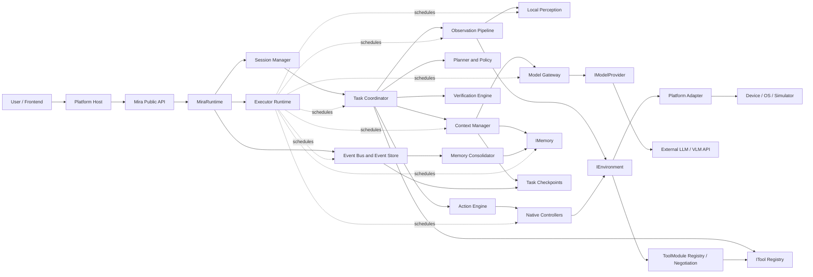
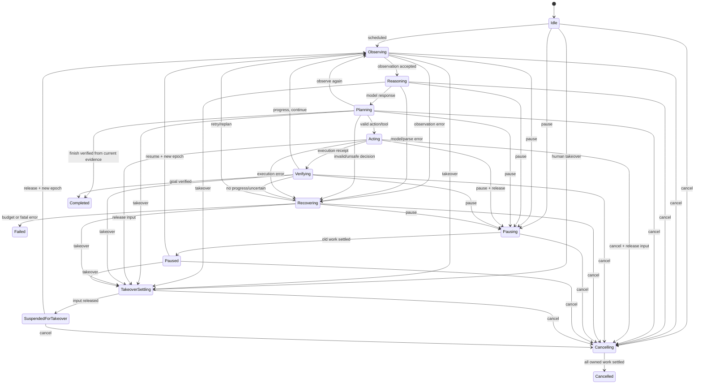
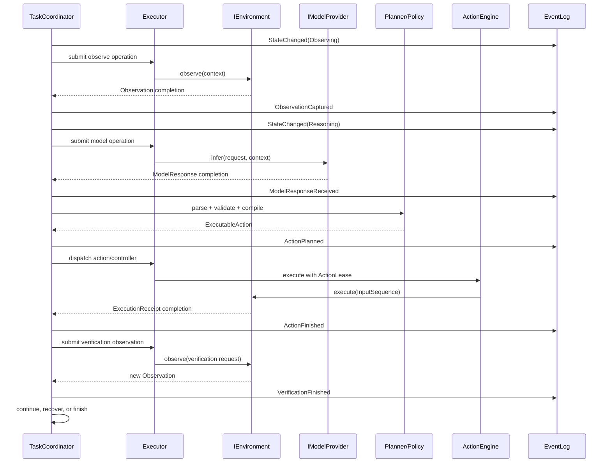

# Mira Runtime 设计文档

> 状态：Active  
> 版本：0.6  
> 更新日期：2026-08-31  
> 适用范围：Mira Core、Provider、Controller、Platform Adapter 及其宿主集成

## 1. 文档目的

本文给出 Mira 第一阶段可实施的整体设计。它定义模块边界、核心数据结构、Runtime 状态机、
Executor 生命周期、模型与环境接口、离散和连续动作、事件日志、回放、安全策略与测试方案。

本文中的“必须”“不得”是实现约束；C++ 代码片段用于表达接口语义，首个可编译版本可以调整
命名和字段布局，但不能在没有设计评审的情况下改变所有权、取消、错误和线程语义。

本文给出总架构；公共类型、状态机、持久化、安全、坐标/Android、本地模型、实时控制、Provider/
Tool 和评估的专项文档是相应主题的详细规范。摘要与专项规范冲突时，以已接受的 DEC 和专项规范
为准，并同步修正本文。

## 2. 目标与非目标

### 2.1 目标

Mira 要提供一个跨平台、原生、高性能、可扩展的 AI Agent Runtime，使 Agent 能够围绕用户
目标持续执行：

`Observe -> Reason -> Plan -> Act -> Verify`

具体目标如下：

1. Core 使用 C++20，不依赖 Android、Windows、Linux 等平台 SDK。
2. 通过抽象接口接入屏幕、结构化 UI、输入、模型、工具、记忆和事件观察者。
3. 通过 OpenAI-compatible API 使用外部 LLM/VLM，模型只输出结构化决策，不直接操作平台。
4. 同时支持点击、输入等离散动作，以及拖拽、摇杆、触摸轨迹等连续动作。
5. 将低频 AI 决策与高频 Native Controller 解耦。
6. Task 和 Session 可暂停、恢复、取消、超时、恢复失败，并支持 Human Takeover。
7. 所有任务和运行生命周期由 `third_party/executor` 管理。
8. 所有关键决策和副作用可观察、可诊断、可脱敏记录，并能离线回放。

### 2.2 第一阶段非目标

- 不在本地运行 LLM/VLM。
- 不在 Core 内实现 Android JNI、Accessibility 或 MediaProjection。
- 不提供具体产品 UI。
- 不承诺硬实时；实时性取决于 Executor、操作系统、权限和目标硬件的实测结果。
- 不让模型生成或执行任意 C++、shell、JNI 或平台原生代码。
- 不实现分布式任务调度、跨进程一致性或云端事件总线。
- 不保证一次模型调用即可完成任务；闭环和验证是默认行为。

## 3. 核心设计决策

### 3.1 Runtime 拥有独立 Executor

每个 `MiraRuntime` 实例拥有一个显式构造的 `executor::Executor`，不默认使用进程单例。
`MiraRuntime` 是 Executor 的唯一初始化和最终关闭者。Session、Task、Provider、Controller
只获得受控执行入口、取消上下文或任务句柄，不拥有全局 Executor。

这样可以做到：

- Runtime 的创建、测试和销毁互不污染。
- 宿主明确知道 shutdown 的边界。
- 不同 Runtime 可以采用不同队列容量、worker 数和监控配置。
- 模块无法偷偷延长进程级并发资源的生命周期。

### 3.2 Provider 暴露同步、可取消的操作

Platform 和 Model Provider 不创建 Mira 自有线程或返回自行管理的后台任务。Provider 方法表现为
同步 operation，由 Runtime 决定将其提交到普通任务、阻塞 I/O worker 或实时执行路径。第三方库
内部线程必须在 Provider 边界显式配置、限制、诊断并随 Runtime shutdown，不得反向回调已销毁对象。

每个可能阻塞的 Provider 方法都接收 `OperationContext`，必须响应取消，并在 deadline 内返回
明确结果。平台 API 必须在宿主线程运行时，Adapter 只使用宿主提供的 dispatcher 桥接；
该请求在 Mira 内仍由 Executor 任务跟踪，Adapter 不自行创建线程。

### 3.3 Session 是环境隔离单元

一个 Session 绑定一个 `IEnvironment`、一组 Provider、一个事件流和零个或多个历史 Task。
不同 Session 可以并行运行，但同一 Session 在任意时刻只能有一个 Task 持有 `ActionLease`，
避免两个 Agent 同时操作同一设备或窗口。

没有动作租约的 Task 可以观察、准备或等待，但不能向 `IInputProvider` 发出输入。默认策略是
同一 Session 串行执行 Task；以后若增加并行观察，也不能放宽单写者动作约束。

### 3.4 Task 使用单写者状态机

每个 Task 的状态只由其 `TaskCoordinator` 逻辑 actor 修改。首期每个 Runtime 共享一个 Executor
公开 `SerialExecutionContext`；该上下文本身拥有受管串行线程，但 Task 不拥有独立线程或事件循环。
异步工作通过小型 completion 返回控制面，不能直接跨线程改状态。完整语义由
[DEC-001](../decisions/DEC-001-runtime-executor-ownership.md)和
[核心公共契约与状态机设计](core_contracts_and_state_machine.md)冻结。

每次异步工作携带：

- `TaskId`
- `TaskEpoch`：暂停、接管、取消或恢复时递增
- `StepId`
- `OperationId`

完成消息只有在这些标识仍与 Task 当前状态匹配时才可提交结果。迟到响应会被记录为
`StaleCompletionIgnored`，不得让终态或新 epoch 回退。

M0 在 Executor 提交 facade 上确认并登记了三个边界：默认异步队列缺少总量 admission
（`EXE-20260830-001`），多 worker 的 `submit_on_with_handle()` wrapper 可能因 ticket 等待互相
饥饿（`EXE-20260830-002`），且其栈条件变量存在 TSAN 可见的生命周期竞争
（`EXE-20260830-003`）。Executor `4fd8e60` 已提供总量 `max_in_flight_tasks`、非阻塞串行派发和
共享状态结算；Mira 当前直接配置并使用这些公开能力，不再维护 ticket/post_reserved 兼容层或
应用侧 admission 计数。完整历史证据与迁移记录见[Executor 反馈台账](../executor_feedback/ledger.md)。

### 3.5 副作用默认至多执行一次

观察、模型调用和无副作用的读取可以按策略重试；点击、输入、工具写操作等副作用不得盲目
重试。如果执行结果不确定，Runtime 必须重新 Observe 和 Verify，再决定恢复方式。

## 4. 系统上下文



Executor 是执行基础设施，不承载 Agent 业务状态。TaskCoordinator 决定“下一步做什么”，
Executor 决定“工作在哪类受控执行路径上运行并如何结束”。

## 5. 分层与模块职责

| 层 | 主要模块 | 职责 | 禁止事项 |
| --- | --- | --- | --- |
| Public API | `MiraRuntime`, handles, config | Runtime/Session/Task 生命周期和宿主命令 | 暴露平台 SDK 类型 |
| Runtime | SessionManager, TaskCoordinator | 状态机、取消层级、输入租约、恢复策略 | 直接调用平台 API |
| Agent | Observer, Reasoner, Planner, Verifier | 构造上下文、解析决策、规划、验证 | 绕过 ActionEngine 执行输入 |
| Perception | OCR, Detector, Locator, TaskModel | 生成带来源的本地视觉/状态 evidence | 直接授权或执行 Action |
| Context/Memory | ContextManager, CheckpointStore, IMemory | 上下文预算、恢复投影、长期记忆和检索 | 取代 EventStore 事实源 |
| Action | ActionValidator, Controllers | 校验意图、生成动作和轨迹、安全收敛 | 发起模型网络调用 |
| Provider | Model, Memory, Tool abstractions | 外部能力的稳定契约 | 自建线程或隐藏重试 |
| Environment | `IEnvironment` and provider interfaces | 观察与底层输入的跨平台抽象 | 包含 Agent 策略 |
| Adapter | Android/Linux/Windows/Simulator | 平台对象映射、权限和线程亲和桥接 | 修改 Core 状态机 |
| Infrastructure | Executor, EventStore, ArtifactStore | 任务执行、通信、日志、资产 | 决定业务成功条件 |

依赖方向固定为：

```text
Host -> Public API -> Runtime -> Agent/Context/Action -> Provider interfaces
                                                    <- Platform Adapters
Runtime/Agent/Context/Action/Adapters -> Executor public API
```

Core 不得包含 `#ifdef __ANDROID__` 等平台分支。平台选择发生在构建组合和宿主注入阶段。

平台组合从 M0 起固定为 Linux、Windows 和 Android 三个目标族：CMake 负责选择工具链和可选
Adapter，`mira_core` 只编译平台无关源文件。当前阶段 Linux 已有实际构建证据，Windows 与
Android 提供 CI/交叉编译入口但尚待目标 runner 验证；真实输入、截图、权限和生命周期能力
仍由后续 Adapter 里程碑交付。状态和可复现命令见[平台构建与 Adapter 兼容性矩阵](../compatibility/platform-matrix.md)。

## 6. 所有权模型

```text
Host
└── MiraRuntime
    ├── executor::Executor
    ├── ExecutionSupervisor
    ├── EventBus
    ├── EventStore
    ├── ContextManager
    ├── CheckpointStore
    ├── MemoryStore and indexes
    ├── ToolModuleRegistry
    ├── ToolRegistry
    ├── ModelProviderRegistry
    ├── PerceptionModelRegistry
    ├── PolicyEngine
    └── SessionManager
        └── Session [0..N]
            ├── IEnvironment
            ├── Session event sequence
            ├── ActionLease
            └── Task [0..N, default one active]
                ├── TaskCoordinator
                ├── CancellationContext
                ├── Task snapshot/history
                ├── Latest TaskCheckpoint reference
                └── Executor task/timer/worker handles
```

约束：

- `MiraRuntime` 销毁前必须显式执行 shutdown；析构函数只做兜底的非抛异常清理和诊断。
- Session 关闭会取消其全部非终态 Task，并等待环境中的连续输入安全释放。
- Task 结束后释放 `ActionLease`，但事件和只读结果可以继续由 Session 查询。
- Executor 的 future、取消句柄、timer handle 和 worker handle 由 `ExecutionSupervisor` 跟踪，
  不散落在业务对象中。
- Provider 推荐由 `shared_ptr` 注入，以支持跨任务共享连接资源；其 shutdown 仍受 Runtime
  编排，不允许 Provider 比 Runtime 存活更久后继续回调。

## 7. 公共 API 契约草案

### 7.1 Runtime API

```cpp
namespace mira {

class MiraRuntime final {
public:
    explicit MiraRuntime(RuntimeConfig config);
    ~MiraRuntime();

    Result<void> initialize();

    Result<SessionSubmission> open_session(
        std::shared_ptr<IEnvironment> environment,
        SessionConfig config = {});
    Result<CommandHandle> close_session(SessionId session_id);

    Result<TaskSubmission> submit_task(SessionId session_id, TaskSpec task);
    Result<CommandHandle> pause_task(TaskId task_id);
    Result<CommandHandle> resume_task(TaskId task_id);
    Result<CommandHandle> cancel_task(TaskId task_id, CancelReason reason);
    Result<CommandHandle> request_human_takeover(SessionId session_id);
    Result<CommandHandle> release_human_takeover(SessionId session_id);

    Result<TaskSnapshot> task_snapshot(TaskId task_id) const;
    Result<CommandHandle> request_shutdown(ShutdownOptions options = {});
    ShutdownReport finish_shutdown();  // 仅由外部非 Executor worker 调用
};

}  // namespace mira
```

公共命令区分 submission、accepted/rejected 和 settled。API 返回的 `CommandHandle` 只能由外部
非 Executor owner 有界等待；Runtime 内部使用 completion 推进，不同步等待。`TaskSubmission` 同时
包含 `MiraTaskHandle` 和创建命令的 `CommandHandle`。实际状态变化通过 command outcome、
`TaskSnapshot`、Task 终态和 Event 观察。完整协议见
[核心公共契约与状态机设计](core_contracts_and_state_machine.md)。这些 handle 与 Executor 自身句柄
分开命名，公共边界不暴露 Executor 类型。`SessionSubmission` 同样区分 Session ID 与 ready outcome；
`finish_shutdown()` 是外部 owner 的最终 settle/join 边界，不能从任何 Executor worker 调用。

### 7.2 TaskSpec

```cpp
struct TaskSpec {
    TaskId id;                         // 为空时由 Runtime 生成
    std::string goal;
    std::optional<TimePoint> deadline;
    std::uint32_t max_steps = 50;
    std::chrono::milliseconds max_wall_time{300000};
    ModelProfile model_profile;
    SafetyPolicy safety_policy;
    VerificationPolicy verification_policy;
    RecoveryPolicy recovery_policy;
    Metadata metadata;
};
```

`max_steps`、deadline 和 wall time 是停止条件，不是强杀线程的保证。达到限制时 Runtime 发出
协作式取消，停止新动作，并等待正在执行的输入安全收敛。

### 7.3 OperationContext

```cpp
struct OperationContext {
    RuntimeId runtime_id;
    SessionId session_id;
    TaskId task_id;
    TaskEpoch epoch;
    StepId step_id;
    OperationId operation_id;
    CancellationToken cancellation;
    std::optional<TimePoint> deadline;
    TraceContext trace;
};
```

`CancellationToken` 是 Mira 的稳定接口，内部桥接 Executor 的 stop/cancellation 状态。
Provider 必须在开始副作用前、长循环中和阻塞等待返回后检查它。

## 8. Provider 与 Environment 接口

### 8.1 IEnvironment

Runtime 只依赖 `IEnvironment` 完成“观察环境”和“执行已编译输入”。具体屏幕、UI Tree 和输入
Provider 可由组合式 Environment 聚合。

```cpp
class IEnvironment {
public:
    virtual ~IEnvironment() = default;

    virtual EnvironmentCapabilities capabilities() const = 0;
    virtual Result<Observation> observe(
        const ObservationRequest& request,
        const OperationContext& context) = 0;
    virtual Result<ExecutionReceipt> execute(
        const InputSequence& input,
        const OperationContext& context) = 0;

    // 尽力解除平台阻塞并释放仍按下的触点；必须幂等。
    virtual Result<void> interrupt(const OperationContext& context) = 0;
};
```

`execute()` 返回成功只代表平台接收或完成了输入序列，不代表 Agent 目标成功。目标是否达成只能
由 Verify 阶段决定。

### 8.2 细粒度平台接口

```cpp
class IScreenProvider {
public:
    virtual Result<ScreenFrame> capture(
        const ScreenCaptureRequest&, const OperationContext&) = 0;
};

class IStructureProvider {
public:
    virtual Result<UiTreeSnapshot> snapshot_tree(
        const StructureRequest&, const OperationContext&) = 0;
};

class IInputProvider {
public:
    virtual InputCapabilities capabilities() const = 0;
    virtual Result<ExecutionReceipt> execute(
        const InputSequence&, const OperationContext&) = 0;
    virtual Result<void> release_all(const OperationContext&) = 0;
};
```

组合式 Environment 可以同时提供截图和 UI Tree，也可以只提供截图。能力通过
`EnvironmentCapabilities` 显式声明；Core 不通过平台名称猜测能力。

### 8.3 IModelProvider

```cpp
class IModelProvider {
public:
    virtual ~IModelProvider() = default;
    virtual ModelCapabilities capabilities() const = 0;
    virtual Result<ModelResponse> infer(
        const ModelRequest& request,
        const OperationContext& context) = 0;
};
```

第一阶段提供 `OpenAICompatibleModelProvider`。配置至少包含：

- `base_url`、model name、请求 timeout、TLS 策略和代理设置。
- 通过 `ISecretResolver` 获取的凭据引用；配置和事件中不保存明文 key。
- 文本、图片、structured output/tool calling 能力声明。
- 请求和响应大小限制、最大重试次数及重试退避策略。

只要服务端遵循所配置的 OpenAI-compatible 协议，同一实现应能接入 OpenAI、DeepSeek、Qwen、
OpenRouter 等服务；供应商差异通过 capability 和配置描述，不在 Agent Core 中添加品牌分支。

Provider 只处理协议、认证、传输、供应商错误映射和 usage 元数据。Prompt 构造、Action schema、
业务决策校验属于 Core 的 `ModelGateway` 和 `DecisionParser`。

首批 wire dialect、canonical request/response、SSE 状态机、Structured Output、Tool Call 桥接、重试、
费用与 retention 的规范见[LLM API 协议设计](llm-api-protocol-design.md)。Responses 与 Chat
Completions 是显式独立方言；Runtime 不在请求失败后猜测或切换 endpoint。只有完整 terminal response
通过本地 schema、Task epoch 和 Policy 校验后才能形成 Decision。

### 8.4 ITool

```cpp
class ITool {
public:
    virtual ToolSpec spec() const = 0;  // 名称、说明、JSON Schema、安全等级
    virtual Result<ToolResult> invoke(
        const ToolArguments&, const OperationContext&) = 0;
};
```

工具由 `ToolRegistry` 显式注册。模型只能引用注册过的工具和 schema；Runtime 在调用前执行参数
验证、权限检查和确认策略。具有副作用的 Tool 与输入动作遵循相同的至多一次和验证规则。

工具以 `ToolModule` 为单位定义和注册：宿主/设备通过带 manifest 与签名的模组贡献成组工具，
`ToolModuleRegistry` 用 `EnvironmentCapabilities` 做能力协商，fail closed 地决定整组可用性；
LLM 的 per-request 暴露与蒸馏 policy model 的模组绑定共用同一投影，且都经 Decision/Planner/
Policy 门禁。规范见[工具模组设计](tool_module_design.md)与[DEC-009](../decisions/DEC-009-tool-module-boundary.md)。

### 8.5 IMemory

```cpp
class IMemory {
public:
    virtual ~IMemory() = default;
    virtual Result<MemoryQueryResult> query(
        const MemoryQuery&, const OperationContext&) = 0;
    virtual Result<std::optional<MemoryRecord>> get(
        MemoryId, const OperationContext&) = 0;
    virtual Result<MemoryMutationResult> apply(
        const MemoryMutation&, const OperationContext&) = 0;
    virtual Result<MemoryCompactionResult> compact(
        const MemoryScope&, const OperationContext&) = 0;
    virtual Result<ErasureResult> erase(
        const ErasureRequest&, const ErasureContext&) = 0;
};
```

Memory 不能成为 Task 状态的唯一事实源。Task 当前状态以 Coordinator 的快照和 Event Log 为准；
Memory 用于检索上下文、经验和用户偏好。长期事实通过带幂等 ID、来源、有效时间和 optimistic
version 的 mutation 更新；普通失效保留历史，隐私删除使用独立 Erasure 语义。

上下文预算、TaskCheckpoint、MemoryRecord、混合检索、持久化和记忆污染防护的完整契约见
[`Context 与 Memory 架构设计`](context_and_memory_design.md)。

### 8.6 IAgentObserver

```cpp
class IAgentObserver {
public:
    virtual ~IAgentObserver() = default;
    virtual void on_event(const AgentEvent& event) = 0;
};
```

Observer 由 EventDispatcher 在 Executor 管理的普通任务上调用，不能运行在状态机提交临界区或
实时控制线程中。Observer 抛出的异常被隔离并转为诊断事件。

## 9. 核心数据模型

### 9.1 Observation

```cpp
struct Observation {
    ObservationId id;
    SessionId session_id;
    EnvironmentEpoch environment_epoch;
    CaptureSpan aggregate_span;
    ObservationAtomicity atomicity;
    DisplayTopology topology;
    std::optional<ObservationComponent<ScreenFrameRef>> screen;
    std::optional<ObservationComponent<UiTreeSnapshot>> structure;
    std::vector<ObservationComponent<PerceptionEvidence>> perception;
    std::optional<ObservationComponent<AppContext>> foreground;
    std::optional<ObservationComponent<DeviceState>> device;
    ObservationQuality quality;
};
```

Observation 创建后不可变。Screenshot 存入 ArtifactStore，组件使用 `ArtifactRef` 或其他不可变
descriptor 引用。`environment_epoch` 在旋转、分辨率变化、窗口切换或 Human Takeover 后改变，
用于发现坐标已失效。每个组件拥有自己的 capture span、质量、来源和 epoch；聚合对象不能把非原子
来源伪装成同一时刻。

`ObservationQuality` 明确标记截图缺失、UI Tree 不完整、时间不同步或部分 Provider 失败，
Planner 不得把部分观察当成完整事实。

### 9.2 Decision

模型响应经过 JSON/schema 解析后形成：

```cpp
using Decision = std::variant<
    ActionIntent,
    ToolIntent,
    ObserveAgain,
    RequestHuman,
    FinishTask,
    FailTask>;
```

每个 Decision 包含 `reason_summary`、依据的 `ObservationId`、置信度、预期结果和验证建议。
`reason_summary` 只保存适合日志的简短决策依据，不要求也不记录模型的隐藏推理过程。

解析规则：

1. JSON 必须满足当前 `DecisionSchemaVersion`。
2. Action 类型必须被环境能力支持。
3. 坐标、持续时间、文本大小和工具参数必须满足 SafetyPolicy。
4. Decision 引用的 Observation 必须仍属于当前 epoch。
5. 解析失败可以按策略进行一次结构化修复请求；仍失败则进入 Recovering。

第一阶段的 wire format 示例：

```json
{
  "schema_version": "1",
  "decision": "action",
  "observation_id": "obs_01",
  "reason_summary": "Network entry is visible and enabled.",
  "action": {
    "type": "tap",
    "target": {
      "coordinate_space": "normalized_viewport",
      "x": 0.51,
      "y": 0.42
    }
  },
  "expected_outcome": {
    "type": "screen_or_tree_change",
    "description": "The network settings page becomes visible."
  }
}
```

这是传输格式而不是执行指令。DecisionParser 解析成功后，Planner 仍需完成 capability、epoch、
坐标和 SafetyPolicy 校验。

### 9.3 Action 分层

```text
ActionIntent                  高层、模型可生成
    ↓ Planner + Policy
ExecutableAction             中层、平台无关且已校验
    ↓ Controller
InputSequence/TouchTrajectory 底层、有时间和坐标定义
    ↓ IInputProvider
Platform-native events
```

高层 ActionIntent 初始集合：

```cpp
using ActionIntent = std::variant<
    TapIntent,
    LongPressIntent,
    TypeTextIntent,
    BackIntent,
    HomeIntent,
    SwipeIntent,
    DragIntent,
    ScrollIntent,
    JoystickIntent,
    TouchTrajectoryIntent>;
```

坐标必须携带坐标空间：`NormalizedViewport`、`ScreenPixels` 或 `UiElementRef`。优先使用 UI 元素
引用或归一化坐标。编译动作时绑定 Observation 的 display metrics 和 environment epoch；执行前
如发现 epoch 改变，返回 `StaleObservation` 并重新观察。

### 9.4 连续输入

```cpp
struct TouchSample {
    std::chrono::microseconds offset;
    PointerId pointer_id;
    PointerPhase phase;  // Down, Move, Up, Cancel
    PointF normalized_position;
    float pressure;
};

struct TouchTrajectory {
    ObservationId based_on;
    std::chrono::milliseconds duration;
    std::vector<TouchSample> samples;
};
```

`JoystickIntent` 不直接包含大量采样点，而是描述中心、方向、幅度、持续时间、响应曲线和停止
条件。`JoystickController` 在执行时生成轨迹。所有连续动作必须具有最大持续时间、watchdog 和
取消时的 `Up/Cancel` 收尾；不能依赖下一次模型调用来释放触点。

### 9.5 ExecutionReceipt

```cpp
struct ExecutionReceipt {
    OperationId operation_id;
    ActionId action_id;
    ExecutionStatus status;
    TimePoint started_at;
    TimePoint finished_at;
    bool side_effect_may_have_occurred;
    std::optional<PlatformReceipt> platform_receipt;
    std::optional<Error> error;
};
```

当 Adapter 无法确认输入是否执行时，必须设置 `side_effect_may_have_occurred=true`。Recovery
据此禁止自动重发，并强制 Observe/Verify。

## 10. Task 状态机

本节保留主闭环摘要。Runtime、Session、Task 的完整状态、命令接纳/结算、中间 settling 状态及
合法转换以[核心公共契约与状态机设计](core_contracts_and_state_machine.md)为准。Runtime 使用
`Constructed -> Initializing -> Running -> Stopping -> Quiesced -> Stopped`；初始化失败进入 `Failed` 后只允许
诊断和 shutdown。Session 显式区分 `Autonomous`、`TakeoverPending`、`HumanControlled` 和
`Resuming`。父子关系决定取消传播，子对象终态不能反向重启父对象。

### 10.1 状态定义

| 状态 | 含义 | 允许启动外部工作 |
| --- | --- | --- |
| `Idle` | Task 已创建，等待调度和动作租约 | 否 |
| `Observing` | 获取环境快照或低成本差分 | 是 |
| `Reasoning` | 构造上下文并调用模型 | 是 |
| `Planning` | 解析、校验并编译 Decision | 仅有限 CPU 工作 |
| `Acting` | 执行动作或工具 | 是 |
| `Verifying` | 检查动作结果和目标进展 | 是 |
| `Recovering` | 根据明确错误策略恢复 | 是，但受策略限制 |
| `Pausing` | 停止旧 epoch 工作并等待输入安全释放 | 仅清理工作 |
| `Paused` | 用户暂停；不启动新步骤 | 否 |
| `TakeoverSettling` | 撤销租约并等待输入释放 | 仅清理工作 |
| `SuspendedForTakeover` | 人类持有环境控制权 | 否 |
| `Cancelling` | 停止新工作，等待副作用安全收敛 | 仅清理工作 |
| `Completed` | 目标已验证完成 | 否，终态 |
| `Failed` | 不可恢复失败 | 否，终态 |
| `Cancelled` | 取消和输入释放已完成 | 否，终态 |

### 10.2 主流程



任何非终态都可以因 Runtime shutdown 进入 `Cancelling`。`Completed`、`Failed` 和
`Cancelled` 幂等，忽略业务完成消息，只接受日志持久化完成等内部清理信号。

### 10.3 一次闭环时序



Coordinator 不在 Executor worker 中同步等待另一个 future。外部工作完成后向 Coordinator
投递带标识的完成消息；这避免线程池中的嵌套等待和饥饿。

## 11. Executor 集成设计

### 11.1 工作负载映射

| Mira 工作负载 | Executor 路径 | 完成语义 |
| --- | --- | --- |
| Prompt 构造、JSON 解析、规划、screen diff | `submit_auto()` 普通有限任务 | future 的值或异常 |
| Context 选择、结构化压缩、checkpoint projection | `submit_auto()` 普通有限任务 | 版本化结果或异常 |
| 截图、普通平台调用 | `submit_auto()`；若调用可能长期阻塞则使用 blocking worker | 明确 Result/receipt |
| HTTP 模型请求、持久化 I/O | 可中断 blocking I/O worker | worker handle + 操作结果 |
| SQLite Memory/Checkpoint I/O | blocking I/O worker + bounded channel | durable write/query result |
| Memory consolidation、embedding 和 index rebuild | delayed/低优先级普通任务 | 可诊断的派生投影状态 |
| 延时重试、退避、健康检查 | Executor timer/delayed API | timer 状态及派发任务结果 |
| Task 步骤依赖 | Executor dependency API 或 Coordinator 完成消息 | 依赖成功后才推进 |
| Joystick/固定周期轨迹 | realtime executor + bounded command channel | 入队与实际停止分别观察 |
| 最新控制目标 | `LatestMailbox` | 允许覆盖旧目标，保留最新值 |
| 必须逐条处理的完成/命令 | `MpscChannel` | 有界 FIFO、显式背压 |
| 共享只读状态快照 | `DoubleBuffer`/Snapshot | 读者获取完整快照 |
| 对多个 Observer 广播事件 | `Topic` 或 EventDispatcher | 每订阅者独立观测丢弃/异常 |

具体 API 使用前必须以当前 Executor 公开头文件和集成指南复核。若所需完成、取消或 shutdown
语义确实无法实现，按 `docs/executor_feedback/ledger.md` 登记，不得自行加线程补洞。

### 11.2 ExecutionSupervisor

`ExecutionSupervisor` 是 Mira 对 Executor 的唯一内部适配层，职责包括：

- 为工作分配 `OperationId` 并关联 Task cancellation context。
- 选择普通、blocking、timer 或 realtime 路径。
- 保留并消费所有要求完成语义的 future/handle。
- 将返回值、任务异常、提交拒绝、排队超时和 shutdown rejection 转为 `OperationCompletion`。
- 跟踪 Runtime、Session、Task、Controller、Context/Memory 工作的资源所有权。
- 提供有界的诊断快照，不决定 Agent 的业务恢复策略。

业务模块不得直接调用 Executor singleton。极少数需要专用 realtime 注册的 Controller 通过
`ExecutionSupervisor` 获取作用域受限的执行端点，不能缓存跨 shutdown 的裸指针。

### 11.3 背压

所有队列必须配置容量，并按消息语义选择行为：

- Runtime 命令、状态完成、取消和终态事件：不得静默丢弃；队满返回 `ResourceExhausted`，
  同时触发高优先级诊断。
- 新控制目标：可以覆盖旧目标，但必须统计 overwrite。
- 高频轨迹采样和 metrics：可采样或合并，但不得影响最终输入释放事件。
- Observer：慢订阅者不能阻塞状态机；按订阅策略断开、降采样或报告 drop。

RuntimeConfig 必须暴露关键容量和告警阈值，不使用无界容器隐藏过载。

### 11.4 初始化顺序

1. 校验 RuntimeConfig、Provider 能力和队列容量。
2. 构造独立 `executor::Executor` 并调用 `initialize_ex()`。
3. 启动 ExecutionSupervisor 和故障观测。
4. 启动 EventStore/ArtifactStore 所需 worker。
5. 打开 CheckpointStore/MemoryStore，完成 schema migration 并启动 indexer。
6. 注册 ModelProvider、Tool 和 Controller。
7. 将 Runtime 状态设为 `Running`，之后才接受 Session/Task。

任何步骤失败都按相反顺序清理。初始化失败的 Runtime 不接受任务，也不能依赖析构阶段才发现
残留 worker。

### 11.5 Shutdown 顺序

1. 将 Runtime 原子状态改为 `Stopping`，拒绝新 Session、Task 和步骤提交。
2. 停止所有 Task 生产新工作，向非终态 Task 发出 shutdown cancellation。
3. 撤销 ActionLease，停止 Controller，并要求每个环境 `release_all()`/`interrupt()`。
4. 关闭外部请求入口和 Observer 新订阅，停止模型与平台 I/O producers；EventStore 暂时保持
   可用。
5. 回收模型/平台 blocking worker、timer 和 realtime 路径，消费其状态与错误；等待需要完成的
   普通有限任务，超时则生成完整生命周期快照。
6. 为需要恢复的 Task 写入最终 checkpoint，完成已接纳的 Memory/Erasure critical writes，停止
   indexer/GC，并刷新、关闭 CheckpointStore/MemoryStore/ArtifactStore worker；EventStore 保持可用。
7. 持久化 Task/Session 终态和 `RuntimeQuiescePrepared` report并取得 durable ack；停止 EventDispatcher，
   隔离宿主迟到回调，确认除 EventStore shutdown 外没有 producer 或待结算 completion。
8. 刷新并停止 EventStore worker；最终 completion 回到串行控制面后进入 `Quiesced`，结算 shutdown
   command，此后不再提交新的 Event 或 Executor 工作。
9. 外部 owner 调用 `finish_shutdown()`：关闭 `SerialExecutionContext`，消费 submit-on future，再
   调用 `executor.shutdown(true)` 并将结果合入最终 `ShutdownReport`。
10. 外部生命周期标为 `Stopped`；此步不依赖 Executor callback 或新的持久化工作。

如果 shutdown 由回调或 worker 间接触发，只投递 shutdown 请求；最终 join 必须回到宿主调用
线程。shutdown 重复调用返回相同或兼容的结算/终态报告，不重复执行平台副作用。

## 12. Observation Pipeline

Observation Pipeline 根据环境能力和成本策略组合数据：

1. 读取 display/app/device 快照。
2. 并行获取允许并行的 screenshot 与 UI Tree。
3. 统一时间戳、display metrics 和 environment epoch。
4. 对截图做内容摘要和可选 screen diff。
5. 关联上一动作、上一观察和数据质量。
6. 持久化大型 artifact，发布不可变 Observation。

`ObservationPolicy` 决定采集级别：

- `Full`：截图、UI Tree 和设备上下文。
- `VisualOnly`：截图及视觉元数据。
- `StructuredOnly`：UI Tree 和设备上下文。
- `DiffFirst`：先执行本地差分，变化或验证不确定时再升级为 Full/VLM。
- `Verification`：只采集验证谓词需要的数据。

Pipeline 可以并行读取互不冲突的数据，但必须在一个有限 join 点合并。部分失败按 quality 字段
返回；只有无法获得当前任务所需的最低观察能力时才整体失败。组件在同一次 `observe()` 返回不
代表原子同步；每个组件携带 capture span、clock quality、environment epoch、坐标空间和变换来源。
完整聚合、Frame/UI Tree、坐标变换及 Android Host ABI 见
[Observation、坐标与 Android Host ABI 设计](observation_coordinate_android_host.md)。

## 13. Reasoning 与 Planning

### 13.1 ModelGateway

ModelGateway 构建受预算限制的请求：

- System policy 和当前 Decision schema。
- Goal、Task 限制、当前状态与可用工具。
- 最新 Observation 以及必要的历史摘要。
- 最近动作、执行结果和验证结果。
- 经过检索和脱敏的 Memory。

历史不会无限追加。ContextManager 将内容划分为不可裁剪的 System/Safety、Goal/用户约束，
最低可执行的当前 Observation/未决副作用，以及可压缩的 checkpoint、最近事件和长期 Memory。
TokenBudgeter 使用供应商准确计数、本地 tokenizer 或带 upper bound 的保守估算，在模型请求前
执行水位检查。最低安全集合仍超限时返回明确错误，不能删除 Goal 或 SafetyPolicy 强行请求。

Screenshot 根据 Provider 能力使用 URL、base64、ROI 或上传引用；已消费的历史 screenshot、UI
Tree 和 Tool Result 从上下文移除后仍保留 Event/ArtifactRef。TaskCheckpoint 是 EventStore 的
结构化恢复投影，必须保留未决副作用，并周期性从原始事件校验，不能递归摘要造成事实漂移。

Provider 的自动/显式 compaction 和 conversation state 仅在 Model Adapter 内作为可选优化；
opaque continuation 不能作为跨供应商状态或 Replay 事实源。详细算法见
[`Context 与 Memory 架构设计`](context_and_memory_design.md)。

远端协议、stream、重试、endpoint policy、费用预算和 Provider fallback 的完整边界见
[Model Provider 与 Tool 扩展设计](model_provider_and_tool_design.md)。

### 13.2 Planner

模型产生的是高层 Decision。Planner 在本地执行：

1. schema 和类型校验。
2. Observation 新鲜度与 capability 校验。
3. SafetyPolicy、权限、用户确认和速率限制。
4. 坐标解析、元素定位、文本规范化。
5. 将 intent 编译为一个 `ExecutableAction` 或一个短小的局部动作序列。
6. 生成明确的 `ExpectedOutcome` 和 VerificationPlan。

Planner 不一次性执行长计划。模型可以提供计划摘要，但 Runtime 每个副作用后都重新验证；环境
发生变化时丢弃尚未执行的旧动作。

## 14. Action 与 Controller

### 14.1 离散动作

离散动作的执行流程为：

`validate -> acquire ActionLease -> durably write ActionDispatchStarted -> execute -> receipt -> release/keep lease -> verify`

输入文本前必须明确目标元素或焦点策略。敏感字段默认拒绝自动输入；`back`、`home` 等全局动作
需要 Environment 声明支持。每种 Adapter 必须提供 capability contract tests。

对于离散副作用，ActionEngine 必须等到 EventStore 确认开始事件已持久化后才调用 Environment。
连续动作只需在整段动作开始前完成一次持久化，实时采样点通过内存指标汇总，不能在控制周期中
等待磁盘。

### 14.2 连续动作

LLM/VLM 只产生持续时间有限的 Intent，例如“向右移动 1.2 秒，幅度 0.7”。控制链为：

```text
JoystickIntent
  -> ActionValidator
  -> JoystickController
  -> Latest control target / bounded command queue
  -> fixed-period trajectory generation
  -> InputSequence chunks
  -> IInputProvider
```

实时控制路径遵守：

- 不调用模型、网络、日志持久化或 Observer。
- 不执行无界分配、无界循环或阻塞等待。
- 命令通道有界；新目标可覆盖旧目标并记录统计。
- Controller 拥有唯一 pointer sequence 和 stop state。
- heartbeat 超时、取消、Takeover、Environment epoch 改变或 shutdown 时立即进入安全停止。
- 安全停止生成 `Up/Cancel`，并通过普通控制面记录最终 receipt。

控制频率、CPU affinity 和实时优先级是目标平台配置，不在未基准验证前写死为产品保证。
固定周期、pointer ownership、feedback freshness、watchdog、平台降级和 stop-to-release receipt
由[实时控制层设计](realtime_control_design.md)定义。

## 15. Verification 与 Recovery

### 15.1 Verification 分层

验证按成本从低到高执行：

1. 平台 receipt：输入是否被接收、是否存在明确错误。
2. 结构化谓词：元素出现/消失、文本变化、应用或焦点变化。
3. Screen diff：画面是否在预期区域发生足够变化。
4. 本地感知：OCR、目标/元素检测、任务状态模型或 tracker evidence。
5. VLM verifier：低成本信号不足时才调用。

`VerificationResult` 包含 `Succeeded`、`Progressed`、`NoChange`、`Contradicted`、`Uncertain`
以及证据引用。只有 `Succeeded` 可以结束目标；`Progressed` 返回下一轮观察。
本地 evidence、ONNX 模型包、OOD/abstain、VLM fallback 和训练蒸馏边界见
[本地感知与任务 ONNX 模型设计](local_perception_and_task_models.md)。

### 15.2 错误分类

统一 Error 的完整稳定枚举由[核心公共契约与状态机](core_contracts_and_state_machine.md)冻结，运行
闭环尤其使用：

- `Cancelled`
- `DeadlineExceeded`
- `ResourceExhausted`
- `Unavailable`
- `PermissionDenied`
- `InvalidArgument`
- `InvalidState`
- `UnsupportedVersion`
- `InvalidObservation`
- `InvalidModelOutput`
- `ContextOverflow`
- `UnsupportedCapability`
- `StaleObservation`
- `SafetyRejected`
- `ConfirmationRequired`
- `ExecutionUncertain`
- `DataLoss`
- `PlatformError`
- `Internal`

Error 附带 domain、code、retryability、message、cause、diagnostic metadata，敏感数据在构造事件前
脱敏。

### 15.3 Recovery 规则

| 情况 | 默认处理 |
| --- | --- |
| 截图瞬时失败 | 有预算时退避并重新 Observe |
| Model 429/5xx | 尊重服务端提示并有界退避；不得跨 deadline |
| Model schema 无效 | 最多一次结构化修复，然后重新观察或失败 |
| Action 明确未执行 | 修正参数或重新规划 |
| Action 可能已执行 | 不重发；立即 Observe/Verify |
| Observation 已过期 | 丢弃计划并重新 Observe |
| 权限缺失 | 请求 Human 或失败，不循环重试 |
| 连续控制 heartbeat 丢失 | 安全释放输入，进入 Recovering |
| 重复无进展 | 达到阈值后请求 Human 或失败 |

RecoveryPolicy 包含每类错误的最大次数、退避、总预算和是否允许请求 Human。所有 retry 都发布
事件并保留原始 cause，不能用新错误覆盖根因。

## 16. Pause、Cancel 与 Human Takeover

### 16.1 Pause

Pause 表示暂时停止 Agent 推进：

- 立即阻止新 Reasoning、Planning 和 Action。
- 向可取消的在途观察/模型请求发出停止请求。
- 连续动作必须安全释放；已提交的原子离散输入等待 receipt。
- 等待所有可能改变 Task 状态的在途 completion 被接收或标记 stale 后进入 `Paused`。
- Resume 增加 TaskEpoch，重新 Observe，不复用暂停前未执行的计划。

### 16.2 Cancel

Cancel 是不可恢复的 Task 终止请求。`Cancelled` 只在所有 Task 所有的 worker/timer/controller
停止、输入释放、最终事件提交后成立。取消等待超时会出现在终态报告中，但不能伪装成安全释放
已经确认完成。

### 16.3 Human Takeover

Takeover 是 Session 级互斥状态，优先级高于自主动作：

1. Session 停止发放 ActionLease。
2. 活动 Task 增加 epoch，取消计划和连续 Controller。
3. Environment 执行 `release_all()`，确认 Agent 不再持有触点。
4. 发布 `HumanTakeoverStarted` 后，宿主才允许人工输入。
5. 用户释放控制后，Runtime 递增 environment epoch，执行 Full Observation。
6. 原 Task 根据新状态恢复、请求确认或结束，不假设人工操作内容。

人工输入事件可选择写入脱敏摘要，以支持任务上下文，但不记录密码等敏感文本。

## 17. 事件、日志与回放

### 17.1 EventEnvelope

```cpp
struct EventEnvelope {
    EventId event_id;
    RuntimeId runtime_id;
    SessionId session_id;
    std::optional<TaskId> task_id;
    std::uint64_t session_sequence;
    std::optional<std::uint64_t> task_sequence;
    TimePoint wall_time;
    MonotonicTime monotonic_time;
    EventSchemaVersion schema_version;
    TraceContext trace;
    EventPayload payload;
};
```

同一 Task 的 `task_sequence` 严格递增。不同 Session 之间不承诺全序。EventBus 用于实时观察，
EventStore 是可复现事实记录；前端不能依赖 Observer 回调到达顺序猜测状态，应使用 sequence。

### 17.2 关键事件

- Runtime/Session/Task started、stopping、stopped。
- StateChanged、Pause/Resume/Cancel requested and settled。
- Observation requested/captured/failed。
- Model request/response metadata、usage、error。
- Decision parsed/rejected、Action planned/dispatch started/finished。
- Verification finished、Recovery scheduled/exhausted。
- Human takeover started/released。
- Executor submission rejected、task failed、wait timeout、queue pressure。
- Artifact stored/missing、Observer failed/dropped。

模型原始响应可以按配置保存到受保护 ArtifactStore；默认事件只保存摘要、usage、schema 版本和
artifact hash。Authorization、API key、密码和敏感输入永不进入普通日志。事件 append、durable
watermark、Artifact 原子发布和大载荷删除语义见
[EventStore、ArtifactStore 与崩溃一致性设计](event_artifact_crash_consistency.md)。

### 17.3 持久化布局

诊断导出建议：

```text
run-data/
└── <session-id>/
    ├── events.jsonl
    ├── manifest.json
    └── artifacts/
        └── <sha256>.<ext>
```

JSONL 只用于便捷诊断/导出，不能单独充当生产事务保证。生产 EventStore 使用具备 append receipt、
durable watermark、校验与 recovery report 的实现；大文件按内容 hash 寻址。替换后端不能改变
事件和副作用门禁语义。

### 17.4 崩溃一致性与回放

在执行外部副作用前持久化 `ActionDispatchStarted`。如果崩溃发生在开始事件和 receipt 之间，
恢复后该动作状态为 `ExecutionUncertain`，必须重新观察，不能自动再次执行。

回放模式：

- `OfflineReplay`：使用记录的 Provider 结果推进状态机，禁止真实网络和输入。
- `AnalysisReplay`：重跑 Planner/Verifier，对比新旧 Decision，不执行副作用。
- 所谓 `LiveReplay` 不复用旧事件流、Task、confirmation 或授权；若产品需要，应创建全新 Task 和
  事件流，因此不属于常规 Replay。

## 18. 安全与隐私

- 凭据只通过 `ISecretResolver` 在请求时获取，不进入 TaskSpec、event 或 crash dump。
- Model endpoint 默认要求 TLS；自签名或明文连接必须由宿主显式配置并产生警告事件。
- Screenshot、UI Tree、Memory 和用户输入在发送模型前经过 RedactionPolicy。
- Tool 和 Action 采用 allowlist；未知 action type 一律拒绝。
- 支付、删除数据、发送消息、授权、输入密码等高风险动作需要 Human confirmation policy。
- 模型返回的页面文本、UI Tree 文本和工具结果都视为不可信输入，不能覆盖 system policy。
- ActionValidator 限制坐标范围、指针数、文本长度、连续动作时长和单位时间动作数。
- Event/ArtifactStore 需要 retention policy 和宿主可调用的删除接口。

主体、capability、风险分级、Secret、SSRF、Tool 隔离和 Human Confirmation challenge/response
协议以[威胁模型与权限确认协议](../security/threat_model_and_confirmation.md)为准。

## 19. 配置模型

`RuntimeConfig` 分组管理：

```text
RuntimeConfig
├── executor          thread/capacity/timeout/monitoring
├── scheduling        max sessions/tasks, fairness
├── observation       capture policy, diff thresholds, artifact limits
├── perception        model registry, ROI, confidence, OOD, fallback
├── model             profiles, request budget, retries
├── tool              registry, isolation, invocation limits
├── context           token limits, watermarks, checkpoint policy
├── memory            scopes, retention, retrieval, consolidation, erasure
├── action            limits, controller profiles
├── verification      thresholds, VLM escalation
├── recovery          retry and no-progress budgets
├── security          identity, capability, confirmation, redaction
├── event             queue capacity, persistence, redaction
├── evaluation        diagnostics and benchmark-safe feature switches
└── shutdown          settle and flush timeouts
```

配置在 Runtime 初始化后视为不可变快照。需要动态变更的控制参数通过版本化
`RuntimeConfigUpdate` 发布；实时 Controller 只读取完整的最新快照，不读取正在修改的对象。

## 20. 建议目录结构

```text
Mira/
├── CMakeLists.txt
├── include/mira/
│   ├── runtime/          public Runtime, Session, Task handles
│   ├── environment/      IEnvironment and platform-neutral data
│   ├── model/            IModelProvider and model contracts
│   ├── action/           intent, executable action, trajectory
│   ├── tool/             ITool and registry contracts
│   ├── memory/           IMemory contracts
│   ├── perception/       OCR/detection/task-model evidence contracts
│   ├── event/            event and observer contracts
│   └── common/           Result, Error, IDs, time, cancellation
├── src/
│   ├── runtime/          coordinators, state machine, supervisor
│   ├── observation/      observation pipeline and diff
│   ├── perception/       local perception routing and fusion
│   ├── reasoning/        prompt and model gateway
│   ├── context/          budget, context assembly, checkpoint projection
│   ├── memory/           durable store, mutation, retrieval, indexes
│   ├── planning/         parser, planner, policy
│   ├── action/           validators and controllers
│   ├── verification/     verification pipeline
│   ├── event/            event bus/store/serializer
│   └── providers/        provider implementations
├── adapters/
│   ├── android/          NDK-facing adapter; JNI bridge remains host-side
│   ├── linux/
│   ├── windows/
│   └── simulator/
├── tests/
│   ├── unit/
│   ├── contract/
│   ├── integration/
│   ├── replay/
│   └── stress/
├── docs/
│   ├── design/
│   ├── decisions/
│   ├── plans/
│   ├── project/
│   ├── security/
│   ├── compatibility/
│   ├── benchmarks/
│   └── executor_feedback/
└── third_party/executor/
```

建议 CMake target 至少拆分为 `mira_core`、`mira_openai_compatible_provider`、
`mira_onnx_perception_provider`、`mira_simulator_adapter` 和各平台可选 Adapter。`mira_core` 公开
链接 Executor，但不链接平台 SDK、ONNX Runtime 或具体 HTTP SDK。

## 21. 测试策略

### 21.1 单元测试

- 全部合法和非法状态转换。
- TaskEpoch/StepId 对迟到完成的隔离。
- Decision schema、ActionValidator 和坐标转换。
- Recovery budget、无进展检测和 deadline。
- 轨迹生成、边界裁剪、取消时输入释放。
- Event sequence、schema 兼容和脱敏。

### 21.2 Contract Tests

每个 `IEnvironment`、`IInputProvider`、`IModelProvider`、`ITool` 和 `IMemory` 实现运行共同
契约测试：

- capability 与真实行为一致。
- 取消和 deadline 有界返回。
- 错误映射稳定，不抛出未声明异常穿过 ABI。
- shutdown 后不再回调 Runtime。
- 输入 receipt 正确标记不确定副作用。

### 21.3 集成测试

使用 Simulator/Fake Provider 覆盖完整闭环：

1. 正常观察、模型动作、执行、验证完成。
2. Model 响应格式错误后修复。
3. 输入明确失败与结果不确定两条恢复路径。
4. Acting 中 cancel、pause、Takeover 和 shutdown。
5. 队列满、提交拒绝、任务异常、模型 timeout。
6. 屏幕旋转导致旧坐标动作被拒绝。
7. 迟到模型响应不能复活 Cancelled Task。
8. Event Log 离线回放不产生真实副作用。

测试使用真实 Executor 实例和单线程/小容量配置制造确定性边界，不通过自建测试线程池替代
Executor。Fake Provider 可以使用屏障和可控结果，但其异步生命周期仍由 Runtime 调度。

### 21.4 压力与平台测试

- 多 Session 公平性和关闭风暴。
- 长时间模型失败、Observer 变慢和事件背压。
- Controller 高频目标更新、覆盖统计和 watchdog。
- Android 旋转、前后台切换、权限撤销和宿主销毁。
- AddressSanitizer、UndefinedBehaviorSanitizer、ThreadSanitizer 可支持目标。

性能指标必须记录硬件、OS、Executor 配置、队列容量、样本量和百分位，不只报告平均值。

## 22. 实施计划

实施状态和完成证据不再维护在本设计内，唯一入口为
[Mira 实施总计划](../plans/mira-implementation-plan.md)。当前已建立：

- [M0：仓库、构建与 Executor 工程基线](../plans/m0-engineering-baseline.md)。
- [M1：核心契约、持久化与安全边界](../plans/m1-core-contracts.md)。

后续里程碑依次交付 Observation/Android、外部模型闭环、Context/Memory、本地视觉/ONNX、连续
控制以及生产加固。设计章节不能替代带稳定工作项、退出条件和验证记录的里程碑文件。

## 23. 设计验收场景

实现至少通过以下端到端场景，才能认为核心架构成立：

1. 用户提交“打开设置并找到网络页面”。Runtime 观察、调用模型、执行多个离散动作，并以 UI
   Tree 或截图证据验证完成。
2. 模型返回基于旧屏幕尺寸的点击。Runtime 在执行前发现 environment epoch 不一致，拒绝动作
   并重新观察。
3. 用户在摇杆动作中请求 Takeover。Controller 停止目标更新、释放触点，Task 进入
   `SuspendedForTakeover`；
   用户释放后 Runtime 全量观察再继续。
4. HTTP 请求在 shutdown 时阻塞。Runtime 发出取消、解除 transport 等待、回收 worker，最后
   从宿主线程关闭 Executor。
5. 输入 API 返回超时且无法确认点击是否发生。Runtime 不重发点击，先观察并验证。
6. Observer 长时间阻塞。Agent 状态机继续推进，Observer drop/断开和异常进入诊断事件。
7. 进程在 `ActionDispatchStarted` 后崩溃。OfflineReplay 标记动作结果不确定且不产生真实输入。
8. 长 Task 达到 context 水位并多次生成 checkpoint。恢复后 Goal、安全约束和未决副作用保持
   一致，且不会重复执行已发生或结果不确定的 Action。
9. 用户偏好发生变化。新 Memory supersede 旧版本，当前查询只返回有效事实，而历史 Replay
   仍可恢复当时可见的记录。

## 24. 尚待原型或兼容性验证的实现选择

以下选择应在对应 Phase 开始前用小型原型和 contract test 决定：

- HTTP/TLS 库以及 Android NDK 的可用构建组合。
- EventStore 的生产持久化后端和 schema 编码格式。
- MemoryStore 的生产后端、embedding model 和向量索引启用阈值。
- 首期规范 ScreenFrame 格式、压缩策略和 Android 可选零拷贝扩展。
- UI Tree 增量更新的具体编码与平台 stable node hint 映射。
- Controller 在各平台可达到的稳定周期、优先级和轨迹分块大小。
- Android Host C ABI 的最低 API/NDK、具体调用方向和 extension 集。
- ONNX Runtime 版本、首批 Execution Provider 和内部线程 profile。

这些选择不能改变本文已确定的依赖方向、Executor 所有权、单写者状态机、协作式取消、输入
租约、执行后验证和事件可复现原则。

## 25. 完成定义

任何功能进入主线前必须满足：

- 位于正确模块，Core 不包含平台 SDK 依赖。
- 所有异步、blocking、timer 和 realtime 工作由 Executor 管理并可诊断。
- future/handle 的完成、异常、拒绝和 timeout 被观察。
- pause、cancel、Takeover 和 shutdown 路径有测试，连续输入能够安全释放。
- 模型输出经过 schema、能力、状态新鲜度和 SafetyPolicy 校验。
- 外部副作用之后有 Verification，结果不确定时不盲目重试。
- 关键事件已版本化、脱敏并可回放。
- Context 在请求前经过预算检查；checkpoint 可从 Event 重建；Memory 具有 scope、来源和有效期。
- 计划工作项、DEC、专项设计、评估证据和状态已经同步。
- 若发现 Executor 通用能力缺口，已在 `docs/executor_feedback/ledger.md` 登记并在实现处引用。

## 26. 参考资料

- 项目约束：[`AGENTS.md`](../../AGENTS.md)
- Executor API：[`third_party/executor/docs/API.md`](../../third_party/executor/docs/API.md)
- Executor 集成指南：
  [`third_party/executor/docs/skill/executor-integration/SKILL.md`](../../third_party/executor/docs/skill/executor-integration/SKILL.md)
- Executor 能力反馈台账：[`docs/executor_feedback/ledger.md`](../executor_feedback/ledger.md)
- Context 与 Memory：[`docs/design/context_and_memory_design.md`](context_and_memory_design.md)
- 项目管理规范：[项目管理与文档规范](../project/project_management_and_documentation.md)
- 实施计划：[Mira 实施总计划](../plans/mira-implementation-plan.md)
- 核心契约：[核心公共契约与状态机](core_contracts_and_state_machine.md)
- 持久化：[EventStore、ArtifactStore 与崩溃一致性](event_artifact_crash_consistency.md)
- 安全：[威胁模型与权限确认协议](../security/threat_model_and_confirmation.md)
- 环境：[Observation、坐标与 Android Host ABI](observation_coordinate_android_host.md)
- 本地模型：[本地感知与任务 ONNX 模型](local_perception_and_task_models.md)
- 实时控制：[实时控制层设计](realtime_control_design.md)
- Provider 与 Tool：[Model Provider 与 Tool 扩展设计](model_provider_and_tool_design.md)
- 工具模组：[工具模组设计](tool_module_design.md)
- LLM API 协议：[LLM API 协议设计](llm-api-protocol-design.md)
- Provider 兼容性：[OpenAI-compatible 兼容性矩阵](../compatibility/openai-compatible-matrix.md)
- 评估：[评估与基准体系](evaluation_and_benchmark_design.md)
