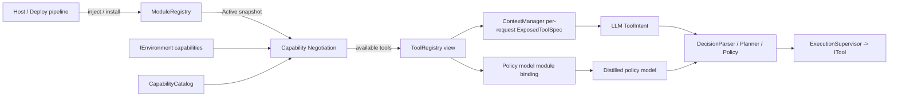
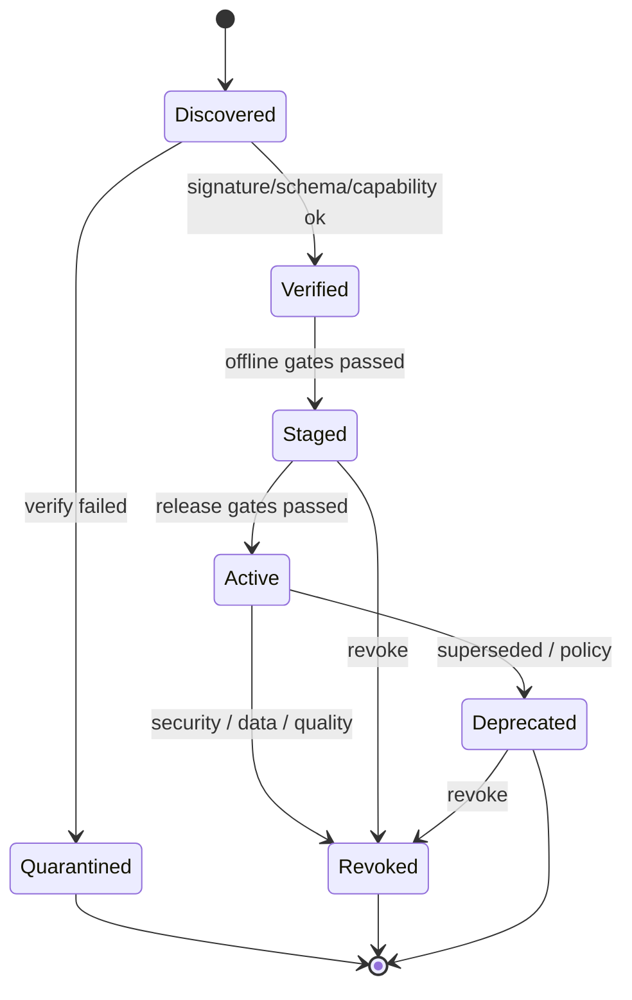

# Mira 工具模组（ToolModule）设计

> 状态：Active（规范草案，尚未实现）  
> 版本：1.0  
> 更新日期：2026-08-31  
> 适用范围：ToolModule manifest、Capability 目录与协商、ModuleRegistry、双消费者投影  
> 上位设计：[Mira Runtime 设计](mira_runtime_design.md)  
> 决策依据：[DEC-009](../decisions/DEC-009-tool-module-boundary.md)

## 1. 背景、目标与非目标

### 1.1 背景

模型层对平台无感：LLM 只能看到每次请求真实暴露的工具 schema（`ExposedToolSpec`），
蒸馏 policy model 只能产出经门禁的候选意图。设备差异必须因此转化为 Runtime 内明确的
“可用性”事实。当前缺三块：

1. `ToolRegistry` 是扁平集合，宿主无法以聚合单元贡献、版本化和撤销一组工具。
2. `CapabilityId` 只是授权字符串；`EnvironmentCapabilities` 只是能力布尔集；两者之间没有
   词汇表、映射和协商机制，`ToolSpec.required_capabilities` 无法被机器判定。
3. LLM（经 `ToolIntent`）与蒸馏 policy model 是工具的两类执行侧消费者，缺少同一份可绑定、
   可校验的工具事实源。

### 1.2 目标

- 宿主/设备以 `ToolModule` 为单位贡献工具：带 ID、版本、来源与签名、成员 `ToolSpec`、
  能力与资源需求、冲突声明。
- 模组可用性由能力协商决定：`EnvironmentCapabilities` 与受治理的 `CapabilityCatalog`
  求交，缺失即整组 fail closed，并留下可观测的理由。
- 单一事实源、三类投影：LLM 按请求暴露、policy model 按包绑定、Replay 按 digest 复现。
- 完全复用既有契约：`ITool`、调用协议、Policy/confirmation、幂等与至多一次派发、Executor
  生命周期。模组只回答“哪些工具存在且可用”，不新增 authority。

### 1.3 非目标

- 不改变单工具契约与调用协议（见
  [Model Provider 与 Tool 扩展设计](model_provider_and_tool_design.md) §7-§9）。
- 不支持运行时动态注册或热插拔；运行中只允许状态降级（含 revoke）。
- 不做跨设备模组分发、远端仓库或云端控制面（总计划 v1 非目标）。
- 不承载模组间依赖图；首期只做互斥（`conflicts_with`）声明。
- 模组准入不是授权：不替代 `CapabilityGrant`、Policy 评估和 Human Confirmation。

## 2. 系统上下文与依赖方向



依赖方向固定为：

```text
Host/Deploy -> ModuleRegistry -> Negotiation -> ToolRegistry view -> Consumers
Consumers -> Decision/Policy -> ITool（既有路径，不变）
```

- `ModuleRegistry`、协商与 `ToolRegistry` 视图位于 Runtime 层，归 `MiraRuntime` 所有。
- 协商只读 `EnvironmentCapabilities`，不反向依赖 Adapter 或平台类型。
- 消费者（ContextManager、policy model loader）只读协商结果与 Registry snapshot，
  不得绕过视图直接访问模组实现。

## 3. 术语与概念关系

| 概念 | 职责 | 与相邻概念的关系 |
| --- | --- | --- |
| `EnvironmentCapabilities` | 设备诚实申报的观察/输入能力（既有） | 派生出 `env.*` 能力，是协商的环境侧输入 |
| `CapabilityDescriptor` | 受治理能力词汇的一条目：ID、说明、类别 | 汇集成 `CapabilityCatalog`；未知 ID 即验证失败 |
| `CapabilityGrant` | 授权语义（`security.hpp`，既有） | 与能力描述正交：协商决定“可用”，Grant 决定“允许” |
| `ToolSpec` / `ITool` | 单工具契约与实现（既有） | 只能作为模组成员进入 Registry |
| `ToolModule` | 工具的聚合定义单元：manifest + 成员工具 | 注册、版本化、启停和撤销都以模组为单位 |
| `ModuleRegistry` | 模组状态机与 snapshot 管理 | 只在初始化/部署时接受注册 |
| 协商（Negotiation） | `Active` snapshot × 环境 × 目录 → 模组可用性 | 纯函数，结果确定性可 Replay |
| `ToolRegistry` 视图 | 协商通过模组的成员工具集合 | LLM 暴露与 policy 绑定的共同上游 |
| `ModuleBinding` | ModelPackage 声明的模组引用 | 约束 policy model 可产出的 ToolIntent 范围 |

必须区分“描述”与“授权”：`CapabilityDescriptor`/协商回答“这台设备有没有这个能力”，
`CapabilityGrant`/Policy 回答“这个主体现在被允许做什么”。两者都通过才可能发生调用；
模组层永不合并这两步。

## 4. Capability 目录

### 4.1 命名空间

- `env.*`：环境能力，由 `IEnvironment::capabilities()` 派生，Adapter 不得申报无法兑现项。
- `host.*`：宿主桥能力（如 `host.bridge.rpc`、`host.process.supervision`），由宿主注入时声明。
- `tool.*`：工具执行前提（如 `tool.fs.root`、`tool.net.egress`），由模组 manifest 声明，
  最终仍由宿主/部署环境兑现。

规则：

1. ID 使用小写点分词汇，一经发布不得改义；语义变更必须新增 ID 并废弃旧 ID。
2. 目录随 Core 构建生成，包含每条能力的单行说明（脱敏安全）。manifest 引用目录外的
   capability 属于验证失败，fail closed。
3. 数值型能力用最小值声明（如 `env.perception.sources >= 1`），不引入范围表达。

### 4.2 `EnvironmentCapabilities` 派生映射

| `EnvironmentCapabilities` 字段 | 能力 ID | 类别 |
| --- | --- | --- |
| `screen_capture` | `env.screen.capture` | Boolean |
| `ui_tree` | `env.ui.tree` | Boolean |
| `foreground_app` | `env.foreground.app` | Boolean |
| `device_state` | `env.device.state` | Boolean |
| `perception_sources >= 1` | `env.perception.sources` | Counted |
| `atomic_observation` | `env.observation.atomic` | Boolean |
| `discrete_input` | `env.input.discrete` | Boolean |
| `input_release` | `env.input.release` | Boolean |
| `epoch_invalidation` | `env.epoch.invalidation` | Boolean |

派生是纯函数；`max_component_skew` 等质量字段不进入首期能力目录，由 Observation 质量语义
表达。目录扩展（如连续控制能力）必须同步更新本表并经过评审。

### 4.3 规范接口草案

```cpp
// 规范接口草案，未实现。命名与字段布局可在实现时调整，
// 但词汇治理和 fail closed 语义不得改变。
enum class CapabilityKind : std::uint8_t { Boolean, Counted };

struct CapabilityDescriptor final {
    CapabilityId id;        // e.g. "env.screen.capture"
    CapabilityKind kind = CapabilityKind::Boolean;
    std::string summary;    // 单行说明，脱敏安全
};

// 由 EnvironmentCapabilities 派生环境侧能力集；纯函数。
[[nodiscard]] std::vector<CapabilityId>
derive_environment_capabilities(const EnvironmentCapabilities &capabilities);
```

`CapabilityId` 复用 `security.hpp` 的字符串别名；目录是它的受治理取值域，不新增类型。
`ModuleId` 与 `ToolId` 同型，按 `MIRA_DEFINE_MODEL_ID` 模式在公共契约中定义。

## 5. ToolModule manifest

### 5.1 示例

```yaml
schema_version: 1.0
module_id: host.android.media-control
version: 1.3.0
origin:
  isolation: host_provided        # built_in | host_provided | out_of_process
  signer: "android-host-release-2026"
  signature_algorithm: "ed25519"
  signature: "..."
min_mira_module_abi: 1
required_capabilities:
  - env.input.discrete
  - env.foreground.app
infra_capabilities:               # 模组级基础设施需求，不绑定单个工具
  - host.bridge.rpc
tools:
  - name: media.play_pause        # 模组内唯一，进入 wire 命名空间
    version: 1.1.0
    description: "Play or pause the current media session."
    arguments_schema: { /* JSON Schema */ }
    result_schema: { /* JSON Schema */ }
    required_capabilities: [env.input.discrete]
    side_effect: user_visible
    data_access: { reads: [], writes: ["media.session"] }
conflicts_with: []                # 同清单内互斥的 module_id
resources:
  max_total_concurrent_invocations: 2
  max_total_result_bytes: 1048576
```

OutOfProcess 模组的包结构与签名沿用 `ModelPackage` 模式：manifest、成员 spec、签名、
许可证和资源声明共同构成不可变 package，校验 digest 而不是信任本地散文件。

### 5.2 字段语义

- `module_id`：稳定标识，建议 `<来源>.<域>.<名称>` 层次（如 `host.android.*`、`builtin.fs.*`）。
  跨版本不变。
- `version`：模组级 SemanticVersion。Major：成员集合、能力需求或冲突语义破坏性变化；
  Minor：向后兼容地新增成员或元数据；Patch：成员内不改变契约的修复。成员工具各自保有
  `ToolSpec` 版本，沿用既有 Tool 版本规则。
- `origin.isolation`：对应 Tool 隔离模型三档；`BuiltIn` 由构建产物 digest 锁定，
  `HostProvided` 首期以“宿主显式注入 + allowlist”为受信依据，`OutOfProcess` 必须包签名。
- `required_capabilities`：模组级硬需求，通常为成员需求的并集基线；协商按
  `模组需求 ∪ 各成员工具需求` 求值。
- `infra_capabilities`：模组自身运行所需（进程监督、桥接），不附加到任何单工具。
- `conflicts_with`：互斥模组清单。同时 Active 时协商判 `Conflict`，不做自动仲裁。
- `resources`：模组聚合上限，是成员 `ToolLimits` 之上的第二层预算，防止单模组耗尽全局
  配额。

### 5.3 校验规则（注册时）

1. schema/digest/签名与 `origin` 声明一致；`BuiltIn` 校验构建 digest，`HostProvided` 校验
   allowlist 条目，`OutOfProcess` 校验包签名。
2. 引用的 capability 全部存在于 `CapabilityCatalog`；未知 ID → 验证失败。
3. 成员工具 name 在模组内唯一；`ToolId` 在 Active 集内全局唯一，冲突时后注册者被拒绝并
   记录事件，不抢占已 Active 的模组。
4. 成员 schema 大小/深度、聚合资源上限满足全局约束。
5. `min_mira_module_abi` 不高于当前 Runtime ABI。

校验失败进入 `Quarantined`，不产生部分注册。

## 6. ModuleRegistry 状态机



- `Verified`：结构与来源校验通过，未获得运行资格。
- `Staged`：可被测试 harness 与 shadow 验证使用，不进入生产 `ToolRegistry` 视图。
- `Active`：参与协商，其成员可进入视图。
- `Deprecated`：不接受新 Task/ModelPackage 绑定；在途 invocation 正常结算。
- `Revoked`：立即停止新调用；在途结果标记 revoked，不得开启后续动作。digest 进 tombstone
  防止重装加载（同 `ModelPackage` 撤销语义）。
- 注册只发生在 Runtime/Session 初始化或显式部署动作；运行中任何时刻都不得新增模组。
- Registry 以不可变 snapshot 对外发布；在途请求与 invocation 固定 snapshot，状态变化只影响
  下一次快照读取（沿用 Tool 版本既有规则）。

## 7. 能力协商

### 7.1 触发时机

Session 建立、`EnvironmentCapabilities` 变化（含 epoch invalidation 后的重新申报）、
模组状态变化、Task/ModelPackage 绑定解析。协商结果变化产生事件并使下一次请求使用新的
`tool_snapshot_digest`；在途请求按其 snapshot 继续结算。

### 7.2 规范接口草案

```cpp
// 规范接口草案，未实现。协商必须是纯函数：同输入同输出 digest。
struct ModuleSnapshot final {
    ModuleId module_id;
    SemanticVersion version;
    Hash module_digest{};
    std::vector<ToolSpec> tools;             // 成员契约
    std::vector<CapabilityId> required;      // 模组 ∪ 成员需求
    std::vector<ModuleId> conflicts_with;
};

enum class ModuleStatus : std::uint8_t {
    Available, Unavailable, Conflict, Revoked
};

struct ModuleAvailability final {
    ModuleId module;
    SemanticVersion version;
    Hash module_digest{};
    ModuleStatus status = ModuleStatus::Unavailable;
    std::vector<CapabilityId> missing;       // Unavailable 时的缺失清单
    ModuleId conflicting_with;               // Conflict 时的对端
};

[[nodiscard]] std::vector<ModuleAvailability>
negotiate_modules(std::span<const ModuleSnapshot> active,
                  const EnvironmentCapabilities &environment,
                  const CapabilityCatalog &catalog);
```

### 7.3 不变量

1. fail closed：未知 capability、缺失 capability、ToolId 冲突都判不可用，绝不降级为“部分
   成员可用”。
2. 确定性：协商不执行 I/O、不读时钟，输出可序列化并可 digest，供 Replay 与测试。
3. 可用性结论只依赖 `EnvironmentCapabilities`、Active snapshot 与目录，不依赖平台名、
   设备型号或宿主自称。
4. 协商通过仅代表“存在且环境可支撑”，调用仍需 Policy/Grant/confirmation（见 §3）。

## 8. 投影：单一事实源，三类消费者

### 8.1 LLM（既有路径的收敛）

ContextManager 在组装 `ModelRequest` 时，从协商通过的 `ToolRegistry` 视图出发，按 Task
policy、风险与预算筛选，产出 `ExposedToolSpec` 集合（类型不变）。排除理由记录区分两级：

- 模组级：`Unavailable`（附 missing 清单）、`Conflict`、`Revoked`、未注册。
- 任务级：policy 排除、预算排除、confirmation 不可用。

`PromptProvenance.tool_snapshot_digest`（既有字段）扩展为绑定“本次视图涉及的 module
digest 集合 + ToolSpec digest 集合”的合成 digest，保证请求与协商版本可追溯。

### 8.2 蒸馏 policy model（DEC-006 的 policy candidate 路径）

ModelPackage manifest 增加绑定声明：

```yaml
bindings:
  tool_modules:
    - module_id: host.android.media-control
      version_range: ">=1.0.0 <2.0.0"
```

运行时强制：

1. 绑定的模组必须处于 Active 且协商 `Available`；否则模型按其 manifest 的 fallback 语义
   降级（abstain/VLM），不得照常运行。
2. policy model 产出的 `ToolIntent` 候选只能引用绑定模组的成员；越权候选按
   `InvalidModelOutput`/越权拒绝，与 LLM 侧 `resolve_tool_calls` 的 fail closed 语义对齐。
3. policy model 没有独立调用通道：候选经同一 DecisionParser、Planner、Policy 和
   ExecutionSupervisor 执行（DEC-006 既定边界不变）。

### 8.3 Replay

Replay 使用事件中记录的 module digest、ToolSpec digest 与 recorded result，不加载真实
模组、不启动 OOP 进程（扩展既有“Replay 使用 recorded ToolSpec digest”规则）。

### 8.4 一致性不变量

- 同一 Task 生命周期内：policy 绑定集 ⊆ Session 协商通过集 ⊆ Active 模组成员。
- LLM 暴露集与 policy 绑定集必须源自同一 Registry snapshot；跨 snapshot 的迟到结果按
  task epoch 拒绝，不得复活已结算调用。
- 同一 ToolId 在一个 snapshot 内至多出现一次；跨模组重复即注册失败（§5.3）。

## 9. 调用与执行

单工具调用协议完全沿用
[Model Provider 与 Tool 扩展设计](model_provider_and_tool_design.md) §8：DecisionParser
只接受当前暴露的 Tool ID/version → schema/policy 校验 → intent logging →
ExecutionSupervisor 调度 → result 校验 → Verify。补充两点：

- 模组状态不影响在途 invocation 的执行语义；`Revoked` 到达时在途调用完成结算但结果标
  revoked，不开启后续动作（与 Tool revocation 既有规则一致）。
- 模组聚合 `resources` 上限由 ExecutionSupervisor 在调度层强制：超限提交转化为明确拒绝
  结果与事件，不排队等待。

## 10. 所有权、Executor 与生命周期

- 归属：`ModuleRegistry`、协商与 `ToolRegistry` 视图由 `MiraRuntime` 持有；Session 只读
  snapshot，Task 与 ModelPackage 只持有绑定引用。
- 发现/验证/安装（OOP 包校验）：普通有限任务 `submit_auto()`，future 必须消费；失败分类
  记录，不静默重试。
- 协商：串行控制面内的同步纯计算，有界、无 I/O，不产生异步任务；结论作为事件提交。
- OOP 模组进程监督：Executor blocking I/O worker 生命周期能力；进程退出/信号转稳定
  Error，副作用按 receipt 分类（沿用 Tool 隔离设计）。
- 取消：注册/验证/安装任务协作取消（轮询 `cancelled()`）；协商本身同步幂等，无需取消。
- shutdown 顺序：
  1. 停止任务与模型请求 producer（不再产生新 ToolIntent）；
  2. 模组状态降级：停止新 invocation 接受；
  3. 对在途 invocation 发出协作取消，等待有界结算；
  4. 终止并回收 OOP 模组进程（deadline 后由 Host 终止并记录不安全结算）；
  5. 关闭 ModuleRegistry 与 ToolRegistry 视图；
  6. 最后由非 worker 线程执行 Executor `shutdown(true)`。

## 11. 错误处理与降级

| 故障 | 默认处理 |
| --- | --- |
| manifest 签名/digest/schema 失败 | `Quarantined`，不注册 |
| 引用未知 capability | 验证失败，`Quarantined` |
| 协商缺失 capability | 模组 `Unavailable`，附 missing 清单与事件 |
| 跨模组 ToolId 冲突 | 后注册者拒绝并记录，先注册者不受影响 |
| `conflicts_with` 同时 Active | 协商判 `Conflict`，双方可配置互斥策略 |
| 模组 revoke 时存在在途调用 | 在途结算完成，结果标 revoked，不开启后续 |
| epoch 失效 / 能力变化 | 重新协商；在途请求按旧 snapshot 结算，新请求用新 digest |
| HostProvided 桥断开 | Adapter 汇报能力丢失，模组转 `Unavailable`，恢复后自动重协商 |
| OOP 进程 crash | 按既有 Tool 隔离规则转稳定 Error，副作用不确定时 `ExecutionUncertain` |
| 聚合资源超限 | 提交拒绝 + 明确结果与事件，不无限排队 |

## 12. 安全与隐私

- 来源信任分级：`BuiltIn` 由构建签名链锁定；`HostProvided` 首期为宿主显式注入 +
  allowlist（暂定默认值，最迟 M7 冻结 attestation 方案）；`OutOfProcess` 必须包签名，
  单独 OS identity/sandbox。
- 模组级 `data_access` 汇总仅用于 policy 提示与宿主展示，不替代成员
  `DataAccessDeclaration` 的逐调用校验。
- `CapabilityCatalog` 是受治理词汇：模组不得私造 capability 绕过检查；目录变更走评审并
  同步 §4.2 映射表。
- 撤销传播：Revoked digest 进 tombstone；重新分发必须换版本并重过发布门禁。
- manifest 与事件不含 secret；成员参数/结果的脱敏规则沿用 Tool 可观测性既有约束。

## 13. 可观测性

事件（版本化、脱敏、带 module digest/version）：

- 生命周期：`ModuleDiscovered` / `ModuleVerified` / `ModuleStaged` / `ModuleActivated` /
  `ModuleDeprecated` / `ModuleRevoked` / `ModuleQuarantined`。
- 协商：`ModuleNegotiationDecided`（含 missing/conflict 与结论 digest）、
  `ModuleAvailabilityChanged`。
- 投影：per-request 工具暴露决策记录模组级与任务级排除理由（扩展 ContextManager 既有
  “记录选择/排除理由”）。

## 14. 兼容性与迁移

- M3 现状不变：无注册模组时视图为空 allowlist，`resolve_tool_calls` 与
  `is_known_hosted_tool_name` 的 fail closed 行为保留。
- `ToolSpec`/`ITool`/`ExposedToolSpec` 类型不变；`ToolRegistry` 从“扁平注册表”演进为
  “协商结果填充的视图”，对调用协议透明。
- Simulator 提供参考模组（契约测试与 golden 协商用例的基准）；Android Host 是首个真实
  `HostProvided` 模组目标，随 M7 Adapter 工作交付。
- 平台兼容性声明遵循总计划 `RULE-10`：未在目标环境验证的模组能力不得宣称支持。

## 15. 分阶段实施

| 阶段 | 内容 | 对齐里程碑 |
| --- | --- | --- |
| TM0 | 契约：`CapabilityCatalog`、manifest schema、协商纯函数、fake 模组与 fail closed 契约测试 | M7 前置（可与 M4 并行设计冻结） |
| TM1 | Registry 生命周期：状态机、签名/digest 验证、事件、shutdown 顺序测试 | M7 |
| TM2 | 投影：LLM 暴露集成（两级排除理由、`tool_snapshot_digest` 绑定 module digest） | M7 |
| TM3 | 宿主集成：Simulator 参考模组、Android Host 首个 `HostProvided` 模组 | M7 |
| TM4 | policy 绑定：ModelPackage `bindings.tool_modules`、越权 ToolIntent 门禁与测试 | M5 policy candidate / M6 |

落地时在对应里程碑文件中立稳定编号工作项；本表不替代里程碑计划。

## 16. 测试策略

- manifest 校验矩阵：缺字段、坏签名、digest 不符、未知 capability、模组内重名、跨模组
  ToolId 冲突、聚合资源超限、ABI 过高。
- 协商 golden：`EnvironmentCapabilities` 全组合（含逐项缺失）的期望结论；同输入同输出
  digest；epoch 变化后重协商。
- 投影一致性：policy 绑定 ⊆ 协商通过 ⊆ Active；LLM 暴露与 policy 绑定同 snapshot；越权
  `ToolIntent` 候选被拒；跨 snapshot 迟到结果不复活。
- 生命周期：注册/验证/安装取消、shutdown 六步顺序、revoke 在途结算、`Deprecated` 不接受
  新绑定、tombstone 阻止重载。
- 安全：未签名 OOP 包 quarantine；Grant 缺失时协商通过但仍被调用层拒绝；模组级
  `data_access` 不影响逐调用校验。
- Replay：不加载真实模组、不启动进程，仅用记录 digest 与结果。

## 17. 已知限制与开放问题

- 模组间依赖与组合（module A 扩展 module B）首期不做，仅 `conflicts_with`。
- `wire_name` 跨模组命名规范（前缀约定 vs 全局命名机构）留待 TM2 细化。
- `HostProvided` attestation 为暂定默认值（负责人：Mira Maintainers，最迟 M7 冻结）。
- 远端模组分发与 MCP 式动态发现明确不在 v1；如引入需新 DEC。

## 18. 关联文档

- [DEC-009：工具模组边界与能力协商](../decisions/DEC-009-tool-module-boundary.md)
- [Mira Runtime 设计](mira_runtime_design.md)
- [Model Provider 与 Tool 扩展设计](model_provider_and_tool_design.md)
- [本地感知与任务 ONNX 模型设计](local_perception_and_task_models.md)
- [威胁模型与权限确认协议](../security/threat_model_and_confirmation.md)
- [Mira 实施总计划](../plans/mira-implementation-plan.md)
